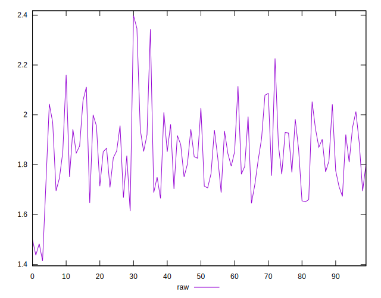
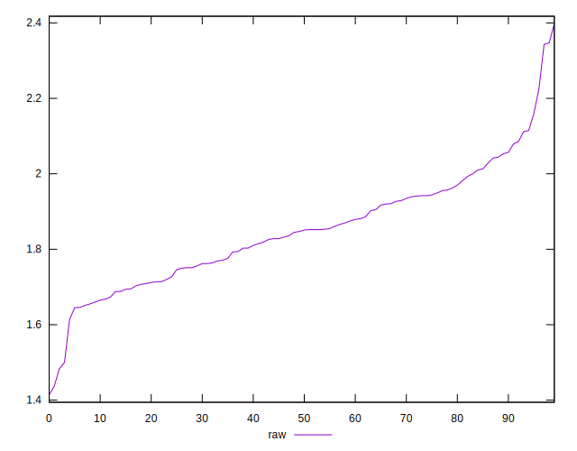
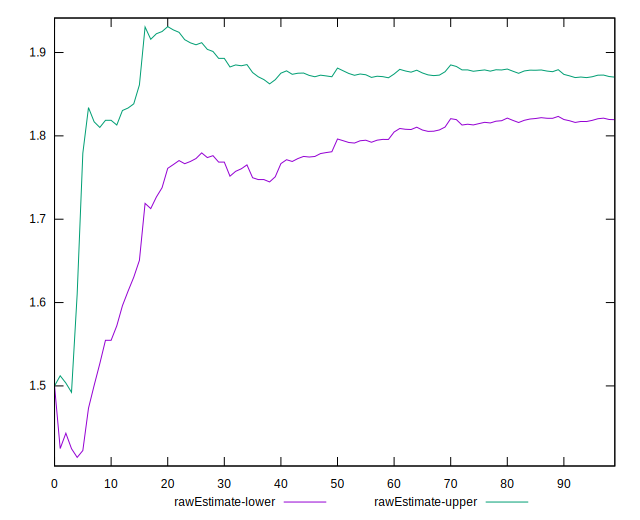

# //server-response-time/samples/pages+cached+noexternal+nojs

[→ Parent](../..)


## Raw


```yaml
p90min: 1.614
p90max: 2.115
p90range: 0.5010000000000001
p90mean: 1.8449340659340654
p90median: 1.8469999999999998
p90stdev: 0.12414266891808609
p90skewness: 0.19908700729085535
p90eccentricity: 1
p90discretization: 1.0224719101123596
outlandishness: 1.0076418453032936
confidence: 0.06845946201867203
p90confidence: 0.051012718559572345

```


## Score


```yaml
p90min: 1
p90max: 1
p90range: 0
p90mean: 1
p90median: 1
p90stdev: 0
p90skewness: .nan
p90eccentricity: .nan
p90discretization: 91
outlandishness: 1
confidence: 0
p90confidence: 0

```


## Raw Estimate


## Score Estimate


## P Score


```yaml
p90min: 1
p90max: 1
p90range: 0
p90mean: 1
p90median: 1
p90stdev: 0
p90skewness: .nan
p90eccentricity: .nan
p90discretization: 91
outlandishness: 1
confidence: 0
p90confidence: 0

```


## Score Difference


```yaml
p90min: 0
p90max: 0
p90range: 0
p90mean: 0
p90median: 0
p90stdev: 0
p90skewness: .nan
p90eccentricity: .nan
p90discretization: 91
outlandishness: .nan
confidence: 0
p90confidence: 0

```


## P Score Difference


```yaml
p90min: 0
p90max: 0
p90range: 0
p90mean: 0
p90median: 0
p90stdev: 0
p90skewness: .nan
p90eccentricity: .nan
p90discretization: 91
outlandishness: .nan
confidence: 0
p90confidence: 0

```

