# //speed-index/samples/pages+cached+noexternal+nofonts+nosvg+noimg

[→ Parent](../..)


## Raw


```yaml
p90min: 1508.0034
p90max: 2117.3809500000007
p90range: 609.3775500000006
p90mean: 1571.7963252747245
p90median: 1510.3378
p90stdev: 159.99083897558123
p90skewness: 2.512672186359603
p90eccentricity: 1
p90discretization: 1
outlandishness: 1.0637104652967722
confidence: 85.7609710460797
p90confidence: 65.74345236734416

```

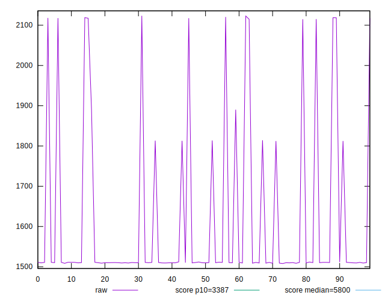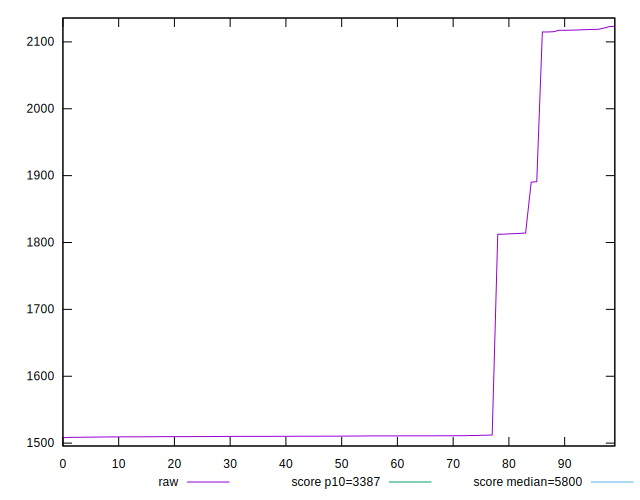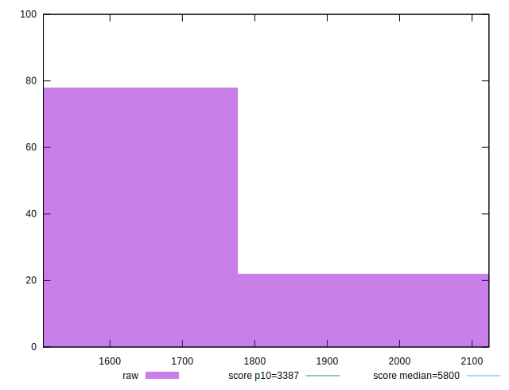
## Score


```yaml
p90min: 0.9918190789734574
p90max: 0.9993347129089063
p90range: 0.007515633935448851
p90mean: 0.9987075898681655
p90median: 0.9993261350851389
p90stdev: 0.0017873710558435872
p90skewness: -3.159144597267269
p90eccentricity: 1
p90discretization: 1
outlandishness: 0.9987490241345371
confidence: 0.0010263549318660914
p90confidence: 0.0007344667021251805

```

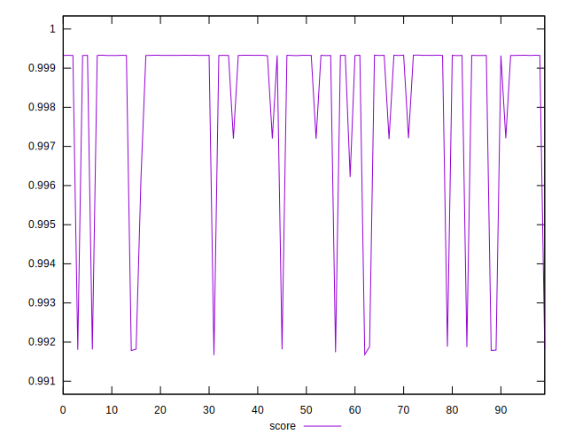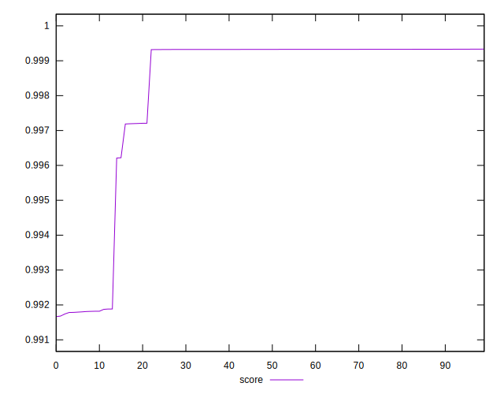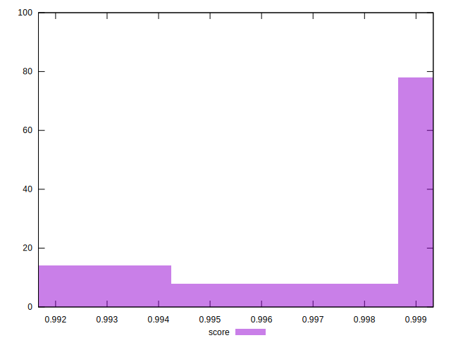
## Raw Estimate

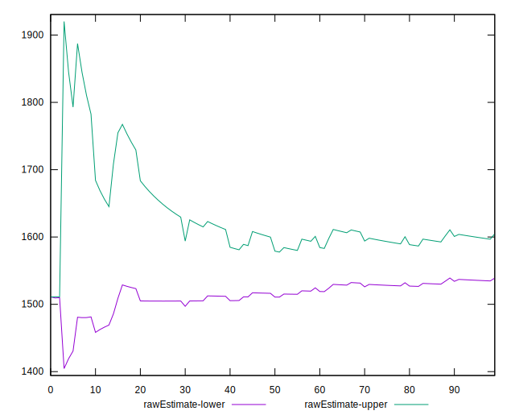
## Score Estimate

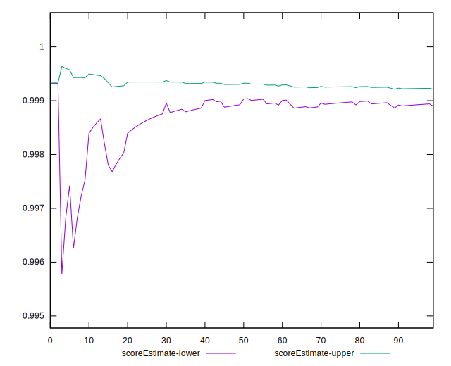
## P Score


```yaml
p90min: 0.9918190789734574
p90max: 0.9993347129089063
p90range: 0.007515633935448851
p90mean: 0.9987075898681655
p90median: 0.9993261350851389
p90stdev: 0.0017873710558435872
p90skewness: -3.159144597267269
p90eccentricity: 1
p90discretization: 1
outlandishness: 0.9987490241345371
confidence: 0.0010263549318660914
p90confidence: 0.0007344667021251805

```

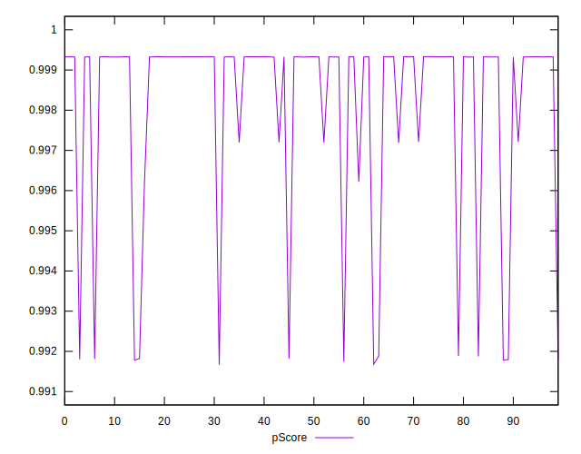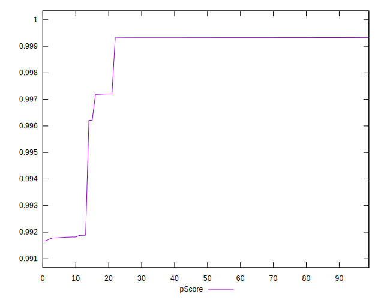
## Score Difference


```yaml
p90min: -0.0018013989785298223
p90max: 0.0028125837096664164
p90range: 0.004613982688196239
p90mean: 0.000627075922209284
p90median: 0.0006732110633042021
p90stdev: 0.0008650318746976835
p90skewness: -0.553798959133564
p90eccentricity: 1.0000000000000002
p90discretization: 1
outlandishness: 0.6804869417578049
confidence: 0.0004462125408429559
p90confidence: 0.00035545898886811544

```

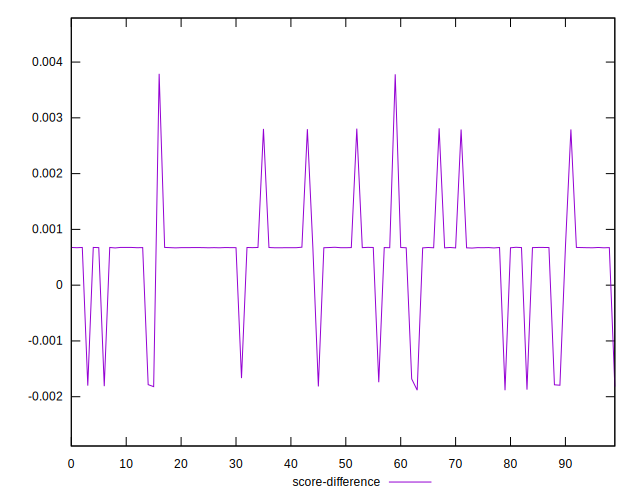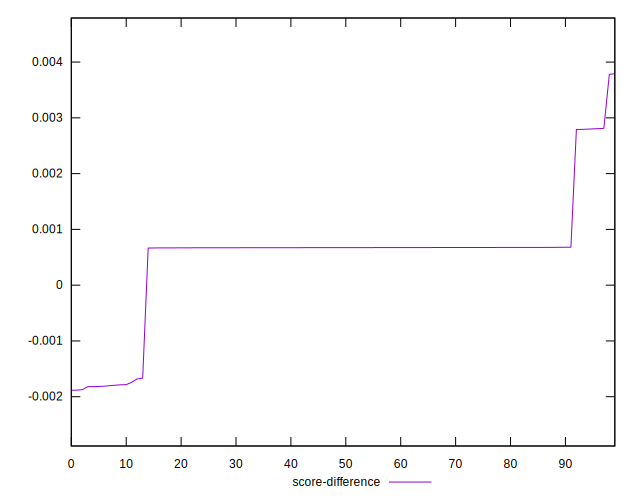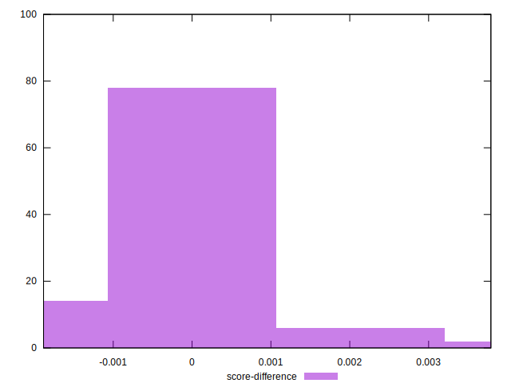
## P Score Difference


```yaml
p90min: 0
p90max: 0
p90range: 0
p90mean: 0
p90median: 0
p90stdev: 0
p90skewness: .nan
p90eccentricity: .nan
p90discretization: 91
outlandishness: .nan
confidence: 0
p90confidence: 0

```

