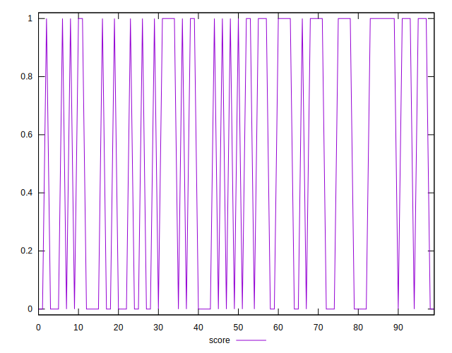
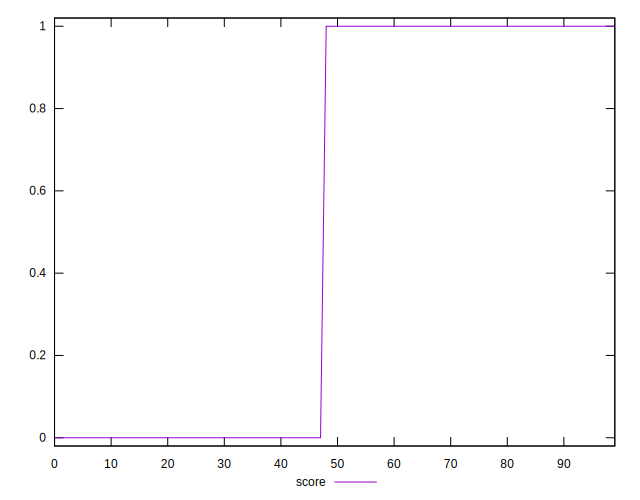
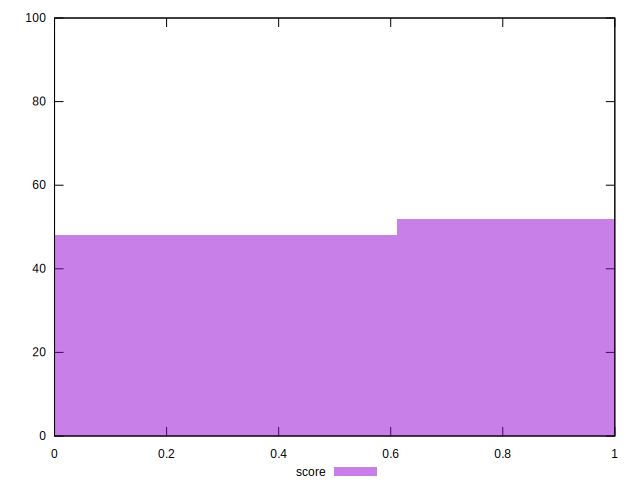

# //third-party-summary/samples/pages+cached

[→ Parent](../..)


## Raw


```yaml
p90range: 0
confidence: .nan
p90confidence: .nan

```


## Score


```yaml
p90min: 0
p90max: 1
p90range: 1
p90mean: 0.5714285714285714
p90median: 1
p90stdev: 0.49487165930539395
p90skewness: -0.2886751345948111
p90eccentricity: 0.9999999999999983
p90discretization: 45.5
outlandishness: 0.8281000000000001
confidence: 0.1958395385661693
p90confidence: 0.2033527142542102

```

