# //total-blocking-time/samples/pages+cached

[→ Parent](../..)


## Raw


```yaml
p90min: 267.9999999999982
p90max: 308.9999999999982
p90range: 41
p90mean: 284.0879120879116
p90median: 280
p90stdev: 12.91021262977945
p90skewness: 0.24760238444137392
p90eccentricity: 1.0000000000000007
p90discretization: 1.378787878787879
outlandishness: 1.011362764042942
confidence: 8.889003864757797
p90confidence: 5.305065930729484

```

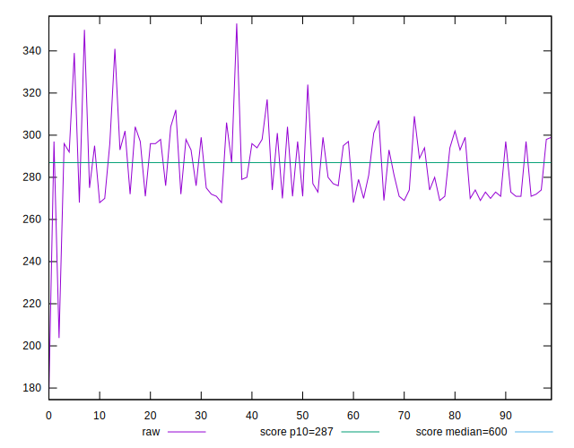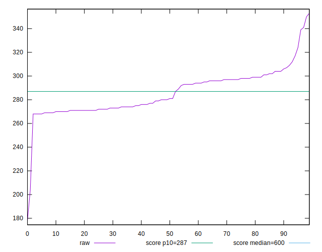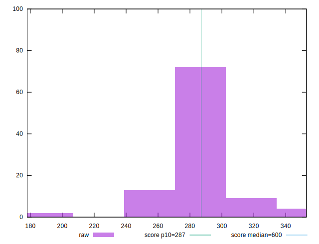
## Score


```yaml
p90min: 0.8755853285196531
p90max: 0.91933069384378
p90range: 0.04374536532412687
p90mean: 0.9026912022074481
p90median: 0.9073252563220249
p90stdev: 0.013626167865116013
p90skewness: -0.2790437412758378
p90eccentricity: 1.0000000000000002
p90discretization: 1.378787878787879
outlandishness: 0.9944245009959857
confidence: 0.008961037864223087
p90confidence: 0.005599266331282937

```

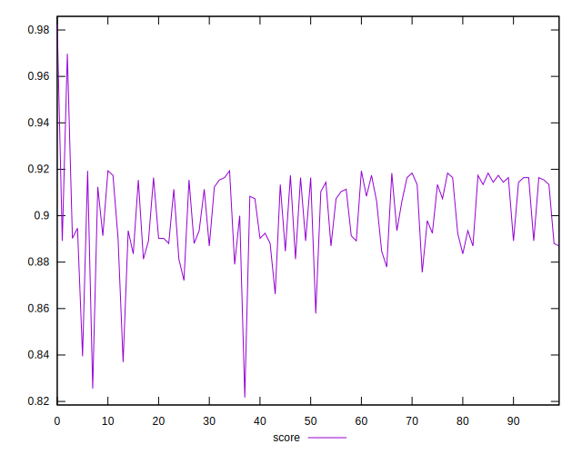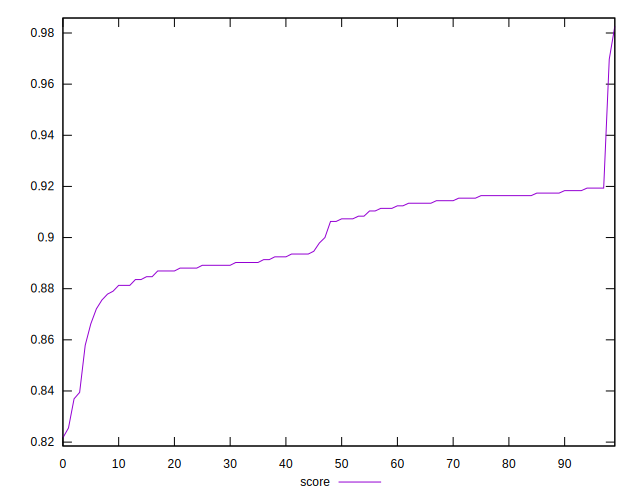
## Raw Estimate

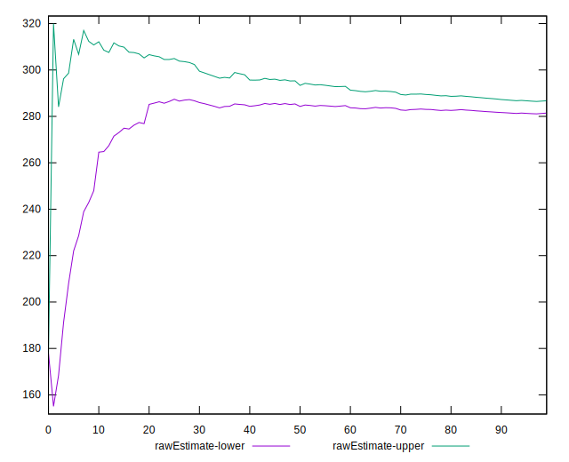
## Score Estimate

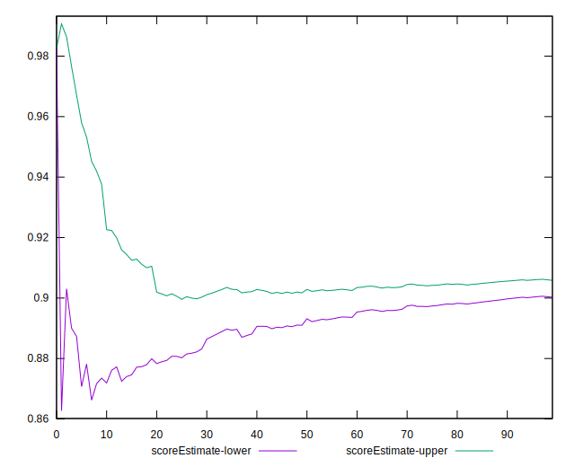
## P Score


```yaml
p90min: 0.8755853285196531
p90max: 0.91933069384378
p90range: 0.04374536532412687
p90mean: 0.9026912022074481
p90median: 0.9073252563220249
p90stdev: 0.013626167865116013
p90skewness: -0.2790437412758378
p90eccentricity: 1.0000000000000002
p90discretization: 1.378787878787879
outlandishness: 0.9944245009959857
confidence: 0.008961037864223087
p90confidence: 0.005599266331282937

```

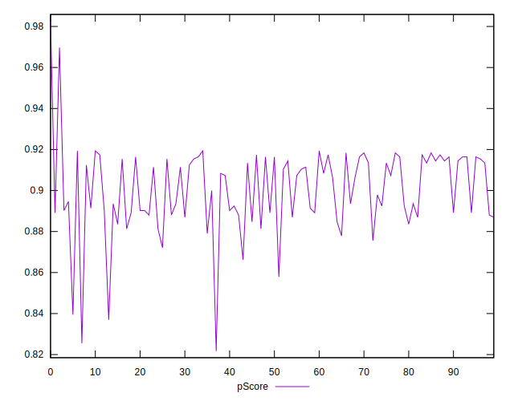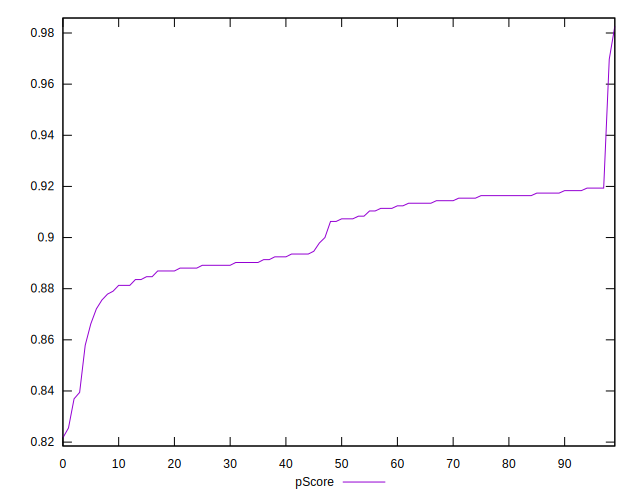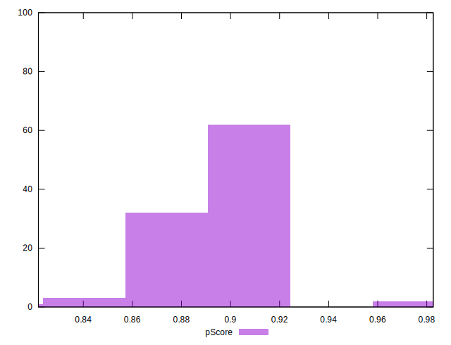
## Score Difference


```yaml
p90min: -0.0035688966472443573
p90max: 0.004590888503433255
p90range: 0.008159785150677612
p90mean: 0.0007184538280526178
p90median: 0.0008479559937660808
p90stdev: 0.0024692195306095822
p90skewness: -0.32794702072895404
p90eccentricity: 1.0000000000000007
p90discretization: 1.318840579710145
outlandishness: 0.3562017460194461
confidence: 0.0010870832716740263
p90confidence: 0.0010146519490401794

```

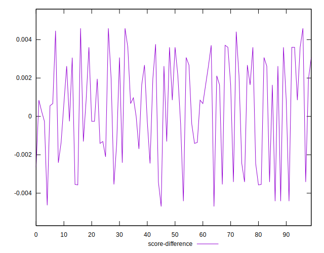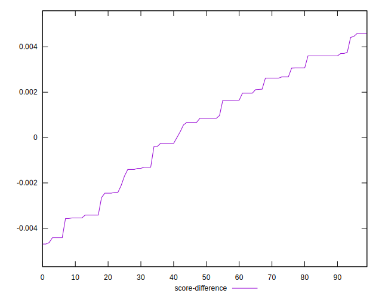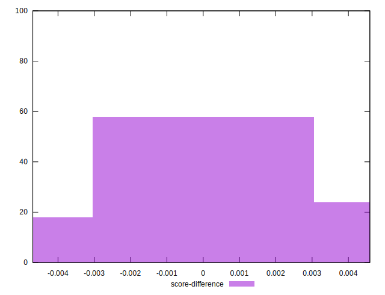
## P Score Difference


```yaml
p90min: 0
p90max: 0
p90range: 0
p90mean: 0
p90median: 0
p90stdev: 0
p90skewness: .nan
p90eccentricity: .nan
p90discretization: 91
outlandishness: .nan
confidence: 0
p90confidence: 0

```

