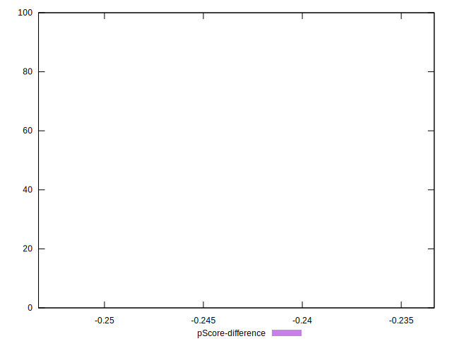

# //total-byte-weight/samples/empty

[→ Parent](../..)


## Raw


```yaml
p90min: 292
p90max: 292
p90range: 0
p90mean: 292
p90median: 292
p90stdev: 0
p90skewness: .nan
p90eccentricity: .nan
p90discretization: 91
outlandishness: 1
confidence: 0
p90confidence: 0

```


## Score


```yaml
p90min: 1
p90max: 1
p90range: 0
p90mean: 1
p90median: 1
p90stdev: 0
p90skewness: .nan
p90eccentricity: .nan
p90discretization: 91
outlandishness: 1
confidence: 0
p90confidence: 0

```


## Raw Estimate


## Score Estimate


## P Score


```yaml
p90min: 0.7566666666666666
p90max: 0.7566666666666666
p90range: 0
p90mean: 0.7566666666666668
p90median: 0.7566666666666666
p90stdev: 2.220446049250313e-16
p90skewness: -1
p90eccentricity: 1
p90discretization: 91
outlandishness: 0.9999999999999984
confidence: 2.220446049250313e-16
p90confidence: 0

```


## Score Difference


```yaml
p90min: -0.24
p90max: -0.24
p90range: 0
p90mean: -0.2399999999999997
p90median: -0.24
p90stdev: 2.7755575615628914e-16
p90skewness: -1
p90eccentricity: 1
p90discretization: 91
outlandishness: 0.9999999999999991
confidence: 1.6653345369377348e-16
p90confidence: 1.1102230246251565e-16

```


## P Score Difference


```yaml
p90min: -0.2433333333333334
p90max: -0.2433333333333334
p90range: 0
p90mean: -0.24333333333333326
p90median: -0.2433333333333334
p90stdev: 1.3877787807814457e-16
p90skewness: -1
p90eccentricity: 1
p90discretization: 91
outlandishness: 0.9999999999999993
confidence: 1.1102230246251565e-16
p90confidence: 5.551115123125783e-17

```

