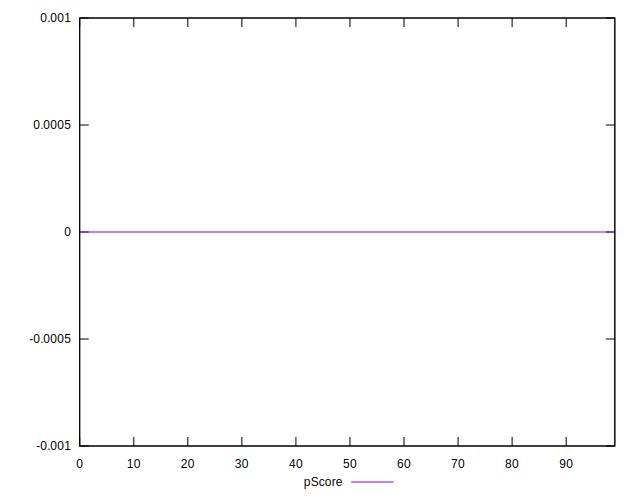

# //total-byte-weight/samples/pages+cached+noexternal+nojs

[→ Parent](../..)


## Raw


```yaml
p90min: 455574
p90max: 455608
p90range: 34
p90mean: 455582.5494505495
p90median: 455583
p90stdev: 5.976627988731314
p90skewness: 1.0345752163173054
p90eccentricity: 0.9999999999999999
p90discretization: 5.352941176470588
outlandishness: 1.0009114828496173
confidence: 572.3364354568766
p90confidence: 2.4559166012331843

```


## Score


```yaml
p90min: 0.9999999999980747
p90max: 0.999999999998078
p90range: 3.3306690738754696e-15
p90mean: 0.9999999999980776
p90median: 0.9999999999980771
p90stdev: 7.757605495710442e-16
p90skewness: -1.832266828804419
p90eccentricity: 1.0000000000000002
p90discretization: 6.5
outlandishness: 0.9999999999999503
confidence: 6.905587213168474e-14
p90confidence: 2.220446049250313e-16

```


## Raw Estimate


## Score Estimate


## P Score


```yaml
p90min: 0
p90max: 0
p90range: 0
p90mean: 0
p90median: 0
p90stdev: 0
p90skewness: .nan
p90eccentricity: .nan
p90discretization: 91
outlandishness: .nan
confidence: 0
p90confidence: 0

```


## Score Difference


```yaml
p90min: -0.999999999998078
p90max: -0.9999999999980747
p90range: 3.3306690738754696e-15
p90mean: -0.9999999999980776
p90median: -0.9999999999980771
p90stdev: 7.757605495710442e-16
p90skewness: 1.832266828804419
p90eccentricity: 1.0000000000000002
p90discretization: 6.5
outlandishness: 0.9999999999999503
confidence: 6.905587213168474e-14
p90confidence: 2.220446049250313e-16

```


## P Score Difference


```yaml
p90min: -0.999999999998078
p90max: -0.9999999999980747
p90range: 3.3306690738754696e-15
p90mean: -0.9999999999980776
p90median: -0.9999999999980771
p90stdev: 7.757605495710442e-16
p90skewness: 1.832266828804419
p90eccentricity: 1.0000000000000002
p90discretization: 6.5
outlandishness: 0.9999999999999503
confidence: 6.905587213168474e-14
p90confidence: 2.220446049250313e-16

```

