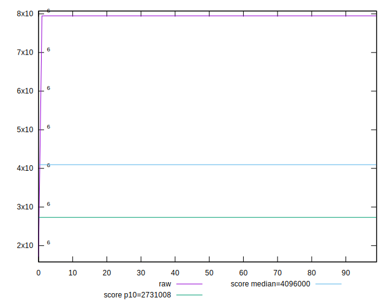
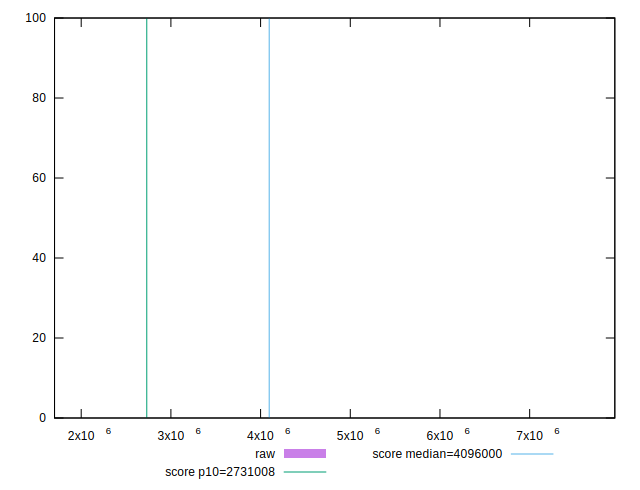
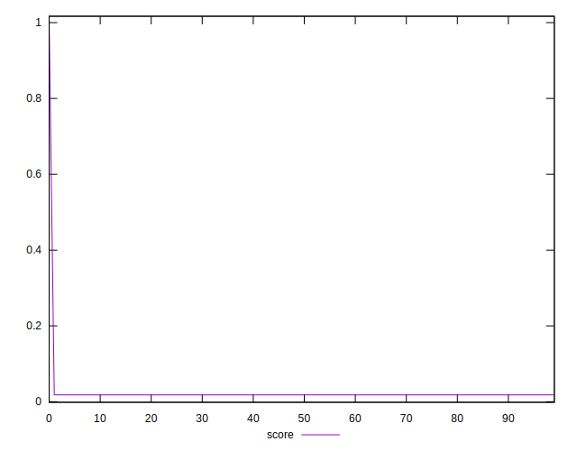
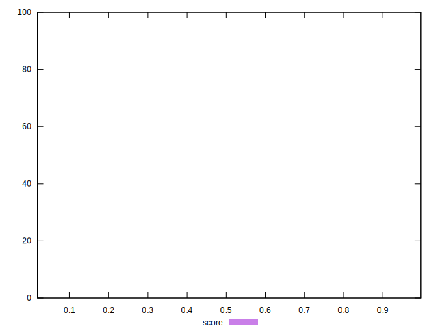
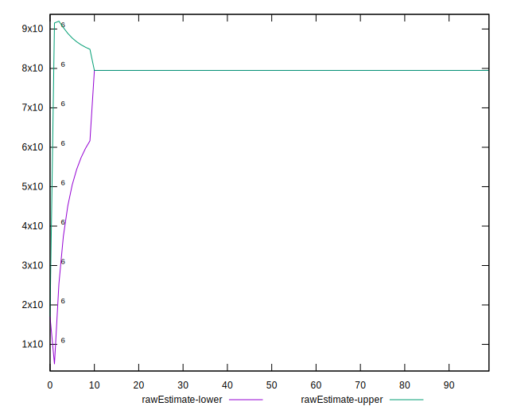
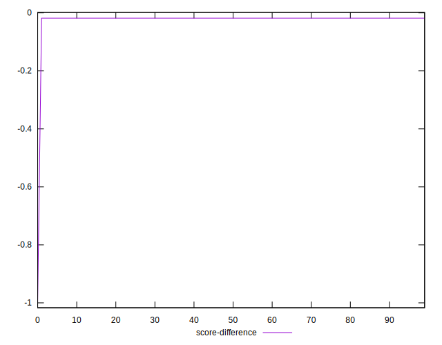
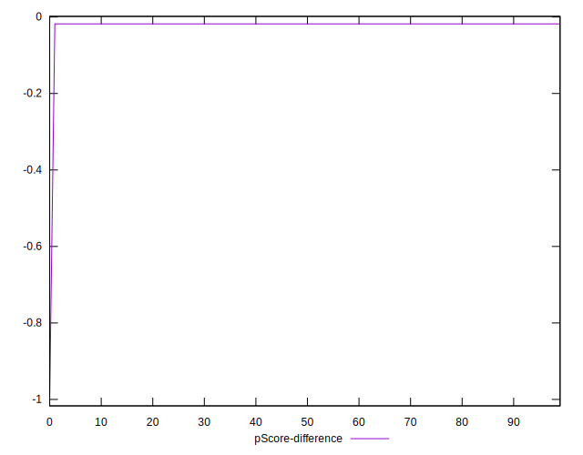
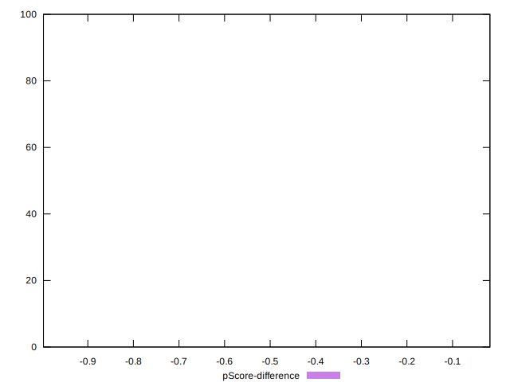

# //total-byte-weight/samples/pages+cached

[→ Parent](../..)


## Raw


```yaml
p90min: 7947982
p90max: 7949464
p90range: 1482
p90mean: 7949430.824175824
p90median: 7949449
p90stdev: 153.11351771035572
p90skewness: -9.307730607103652
p90eccentricity: 0.9999999999999999
p90discretization: 2.2195121951219514
outlandishness: 0.9843460709741229
confidence: 243644.2357299067
p90confidence: 62.91742279008031

```


## Score


```yaml
p90min: 0.018019620247257784
p90max: 0.01804575571487238
p90range: 0.000026135467614596397
p90mean: 0.018020205103527514
p90median: 0.018019884590132207
p90stdev: 0.000002700210261228926
p90skewness: 9.30783299506709
p90eccentricity: 0.9999999999999992
p90discretization: 2.2195121951219514
outlandishness: 2.382084534355835
confidence: 0.038192466311354346
p90confidence: 0.0000011095706843461395

```


## Raw Estimate


## Score Estimate


## P Score


```yaml
p90min: 0
p90max: 0
p90range: 0
p90mean: 0
p90median: 0
p90stdev: 0
p90skewness: .nan
p90eccentricity: .nan
p90discretization: 91
outlandishness: .nan
confidence: 0
p90confidence: 0

```


## Score Difference


```yaml
p90min: -0.01804575571487238
p90max: -0.018019620247257784
p90range: 0.000026135467614596397
p90mean: -0.018020205103527514
p90median: -0.018019884590132207
p90stdev: 0.000002700210261228926
p90skewness: -9.30783299506709
p90eccentricity: 0.9999999999999992
p90discretization: 2.2195121951219514
outlandishness: 2.382084534355835
confidence: 0.03819246631135434
p90confidence: 0.0000011095706843461395

```


## P Score Difference


```yaml
p90min: -0.01804575571487238
p90max: -0.018019620247257784
p90range: 0.000026135467614596397
p90mean: -0.018020205103527514
p90median: -0.018019884590132207
p90stdev: 0.000002700210261228926
p90skewness: -9.30783299506709
p90eccentricity: 0.9999999999999992
p90discretization: 2.2195121951219514
outlandishness: 2.382084534355835
confidence: 0.03819246631135434
p90confidence: 0.0000011095706843461395

```

