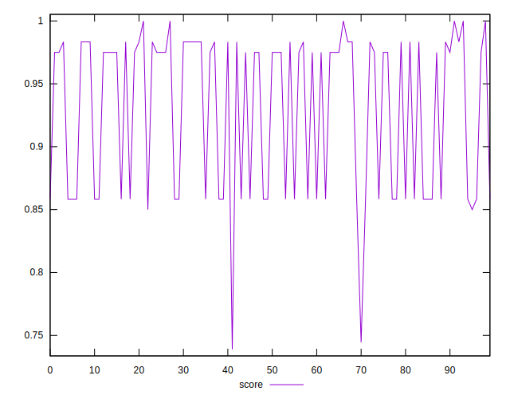

# //uses-http2/samples/pages+cached+noadtech

[→ Parent](../..)


## Raw


```yaml
p90min: 0
p90max: 170
p90range: 170
p90mean: 72.96703296703296
p90median: 30
p90stdev: 70.1253901361423
p90skewness: 0.6365434129367417
p90eccentricity: 0.9999999999999993
p90discretization: 22.75
outlandishness: 1.3506360284511538
confidence: 30.882863365753906
p90confidence: 28.815932685124224

```


## Score


```yaml
p90min: 0.8583333333333334
p90max: 1
p90range: 0.1416666666666666
p90mean: 0.9391941391941396
p90median: 0.975
p90stdev: 0.058437825113451865
p90skewness: -0.6365434129367418
p90eccentricity: 1.0000000000000007
p90discretization: 22.75
outlandishness: 0.9792873954922847
confidence: 0.02564053633112473
p90confidence: 0.024013277237603603

```


## Raw Estimate


## Score Estimate


## P Score


```yaml
p90min: 0.8583333333333334
p90max: 1
p90range: 0.1416666666666666
p90mean: 0.9391941391941396
p90median: 0.975
p90stdev: 0.058437825113451865
p90skewness: -0.6365434129367418
p90eccentricity: 1.0000000000000007
p90discretization: 22.75
outlandishness: 0.9792873954922847
confidence: 0.02564053633112473
p90confidence: 0.024013277237603603

```


## Score Difference


```yaml
p90min: -0.0033333333333332993
p90max: 0.0050000000000000044
p90range: 0.008333333333333304
p90mean: 0.0016422466422466209
p90median: 0.0016666666666665941
p90stdev: 0.002908303420879441
p90skewness: -0.4609054057647904
p90eccentricity: 0.9999999999999984
p90discretization: 18.2
outlandishness: 0.5192032849186702
confidence: 0.0012294694285650653
p90confidence: 0.0011950803473788525

```


## P Score Difference


```yaml
p90min: 0
p90max: 0
p90range: 0
p90mean: 0
p90median: 0
p90stdev: 0
p90skewness: .nan
p90eccentricity: .nan
p90discretization: 91
outlandishness: .nan
confidence: 0
p90confidence: 0

```

