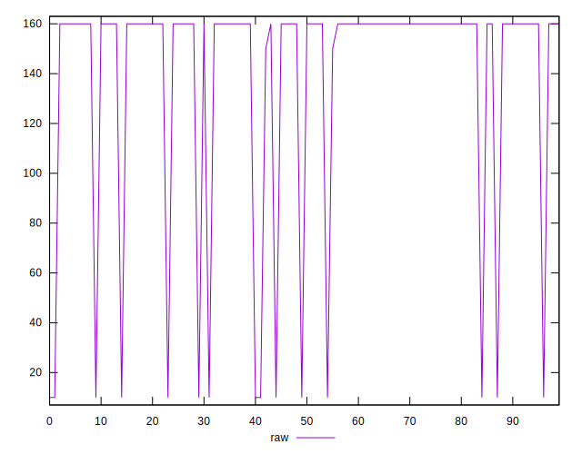
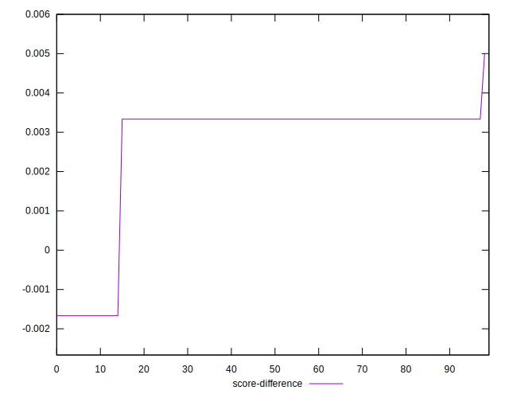

# //uses-http2/samples/pages+cached+noexternal+nojs

[→ Parent](../..)


## Raw


```yaml
p90min: 10
p90max: 160
p90range: 150
p90mean: 149.8901098901099
p90median: 160
p90stdev: 37.19548907704044
p90skewness: -3.4892043891349283
p90eccentricity: 0.9999999999999981
p90discretization: 30.333333333333332
outlandishness: 0.8390640586703761
confidence: 20.969636259857822
p90confidence: 15.284374280890574

```


## Score


```yaml
p90min: 0.8666666666666667
p90max: 0.9916666666666667
p90range: 0.125
p90mean: 0.8750915750915741
p90median: 0.8666666666666667
p90stdev: 0.030996240897533636
p90skewness: 3.4892043891350544
p90eccentricity: 1.0000000000000022
p90discretization: 30.333333333333332
outlandishness: 1.0241223960955137
confidence: 0.017474696883214902
p90confidence: 0.012736978567408741

```


## Raw Estimate


## Score Estimate


## P Score


```yaml
p90min: 0.8666666666666667
p90max: 0.9916666666666667
p90range: 0.125
p90mean: 0.8750915750915741
p90median: 0.8666666666666667
p90stdev: 0.030996240897533636
p90skewness: 3.4892043891350544
p90eccentricity: 1.0000000000000022
p90discretization: 30.333333333333332
outlandishness: 1.0241223960955137
confidence: 0.017474696883214902
p90confidence: 0.012736978567408741

```


## Score Difference


```yaml
p90min: -0.0016666666666667052
p90max: 0.0050000000000000044
p90range: 0.00666666666666671
p90mean: 0.0030402930402930067
p90median: 0.0033333333333332993
p90stdev: 0.0012741778117894603
p90skewness: -3.232793363364298
p90eccentricity: 0.9999999999999977
p90discretization: 30.333333333333332
outlandishness: 0.7407401981419626
confidence: 0.000711220613406169
p90confidence: 0.0005235852803402857

```


## P Score Difference


```yaml
p90min: 0
p90max: 0
p90range: 0
p90mean: 0
p90median: 0
p90stdev: 0
p90skewness: .nan
p90eccentricity: .nan
p90discretization: 91
outlandishness: .nan
confidence: 0
p90confidence: 0

```

