# //uses-http2/samples/pages+cached+noexternal+nosvg

[→ Parent](../..)


## Raw


```yaml
p90min: 160
p90max: 310
p90range: 150
p90mean: 178.6813186813187
p90median: 160
p90stdev: 46.31969156668156
p90skewness: 2.458616704249171
p90eccentricity: 0.9999999999999983
p90discretization: 30.333333333333332
outlandishness: 1.140245699268801
confidence: 22.988831905551535
p90confidence: 19.033692526913853

```

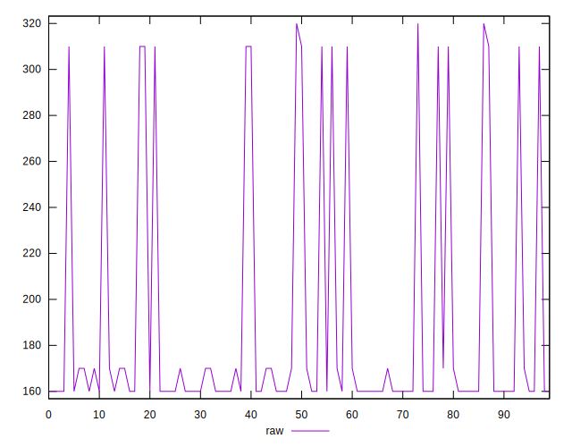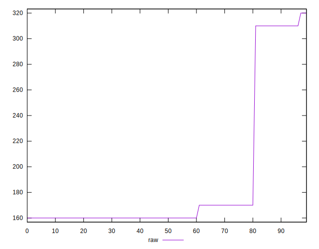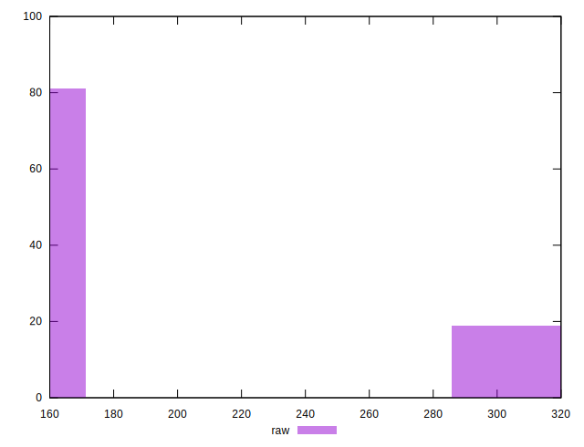
## Score


```yaml
p90min: 0.7444444444444445
p90max: 0.8666666666666667
p90range: 0.12222222222222223
p90mean: 0.8514041514041509
p90median: 0.8666666666666667
p90stdev: 0.03773441998174849
p90skewness: -2.4569679398662285
p90eccentricity: 1.0000000000000002
p90discretization: 30.333333333333332
outlandishness: 0.9771278554115088
confidence: 0.018660035941025166
p90confidence: 0.015505831824896399

```

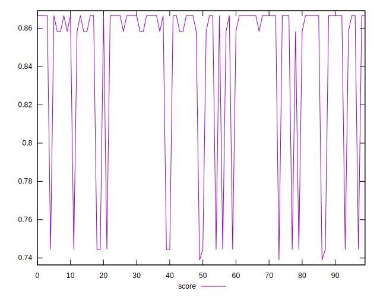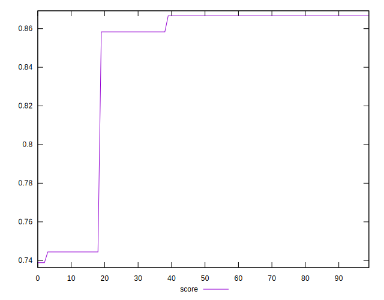
## Raw Estimate

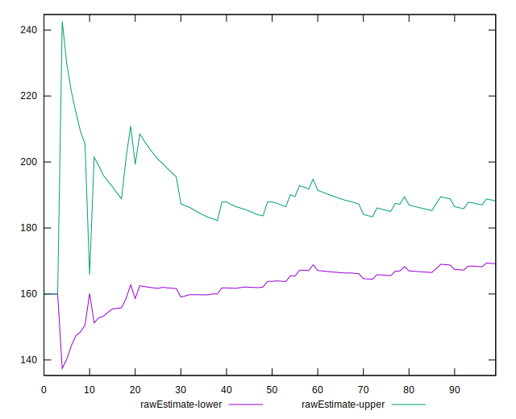
## Score Estimate

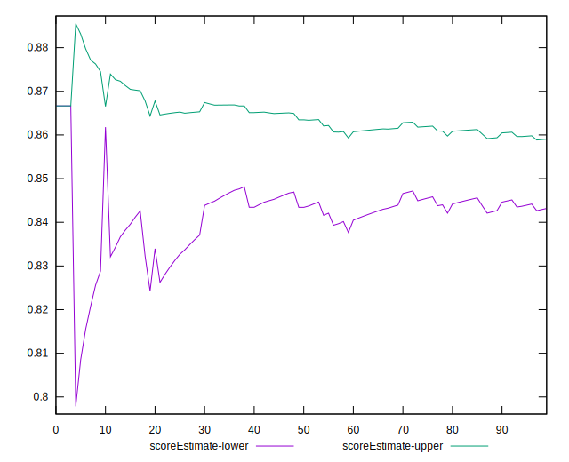
## P Score


```yaml
p90min: 0.7444444444444445
p90max: 0.8666666666666667
p90range: 0.12222222222222223
p90mean: 0.8514041514041509
p90median: 0.8666666666666667
p90stdev: 0.03773441998174849
p90skewness: -2.4569679398662285
p90eccentricity: 1.0000000000000002
p90discretization: 30.333333333333332
outlandishness: 0.9771278554115088
confidence: 0.018660035941025166
p90confidence: 0.015505831824896399

```

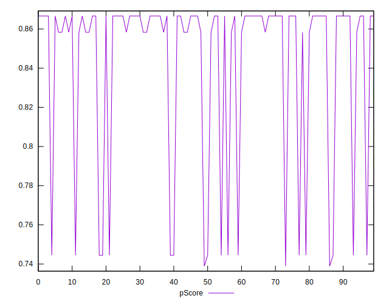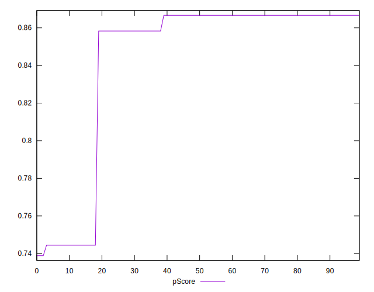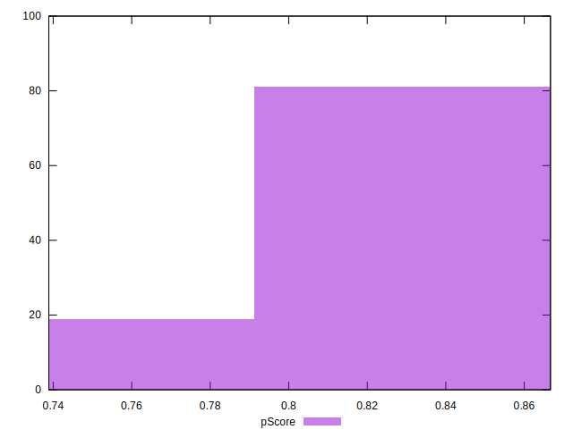
## Score Difference


```yaml
p90min: -0.004444444444444473
p90max: 0.0033333333333332993
p90range: 0.007777777777777772
p90mean: 0.002295482295482253
p90median: 0.0033333333333332993
p90stdev: 0.0020855544386494196
p90skewness: -2.5257688333063597
p90eccentricity: 0.9999999999999986
p90discretization: 22.75
outlandishness: 0.5413202354006273
confidence: 0.0010862175232029011
p90confidence: 0.0008569962491276023

```

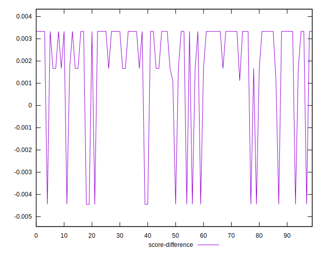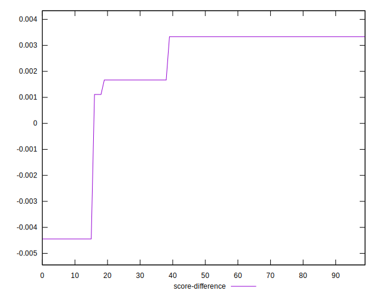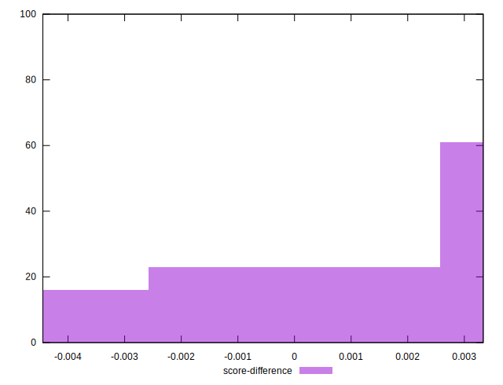
## P Score Difference


```yaml
p90min: 0
p90max: 0
p90range: 0
p90mean: 0
p90median: 0
p90stdev: 0
p90skewness: .nan
p90eccentricity: .nan
p90discretization: 91
outlandishness: .nan
confidence: 0
p90confidence: 0

```

