# //uses-http2/samples/pages

[→ Parent](../..)


## Raw


```yaml
p90min: 180
p90max: 400
p90range: 220
p90mean: 283.7362637362637
p90median: 310
p90stdev: 56.542279263238854
p90skewness: -0.02758182363057681
p90eccentricity: 0.9999999999999997
p90discretization: 5.6875
outlandishness: 1.054749683292724
confidence: 35.283794027069575
p90confidence: 23.234359337606634

```

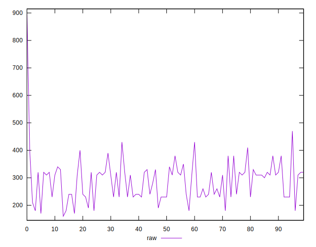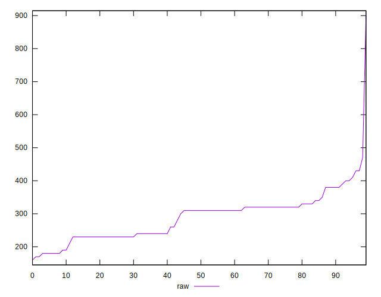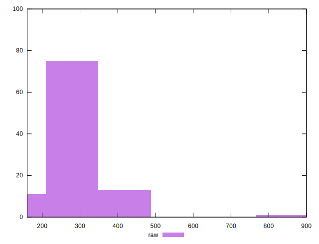
## Score


```yaml
p90min: 0.6888888888888889
p90max: 0.85
p90range: 0.1611111111111111
p90mean: 0.7662393162393161
p90median: 0.7444444444444445
p90stdev: 0.04172040303081416
p90skewness: 0.2622083678359559
p90eccentricity: 1.0000000000000002
p90discretization: 5.352941176470588
outlandishness: 0.996887043049795
confidence: 0.02174852358513335
p90confidence: 0.01714375239835686

```

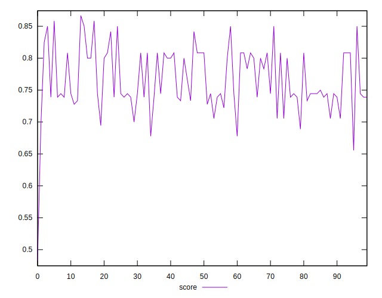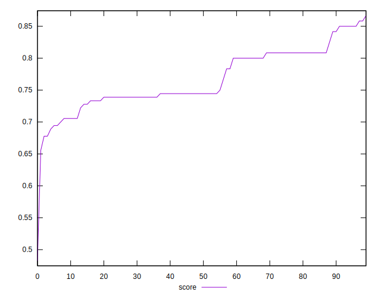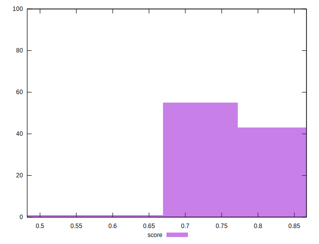
## Raw Estimate

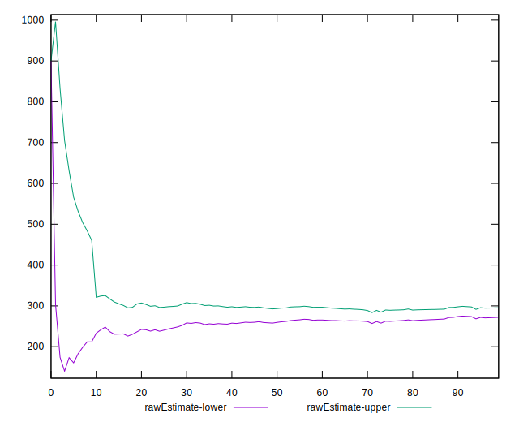
## Score Estimate

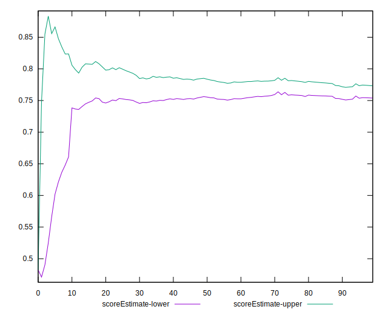
## P Score


```yaml
p90min: 0.6888888888888889
p90max: 0.85
p90range: 0.1611111111111111
p90mean: 0.7662393162393161
p90median: 0.7444444444444445
p90stdev: 0.04172040303081416
p90skewness: 0.2622083678359559
p90eccentricity: 1.0000000000000002
p90discretization: 5.352941176470588
outlandishness: 0.996887043049795
confidence: 0.02174852358513335
p90confidence: 0.01714375239835686

```

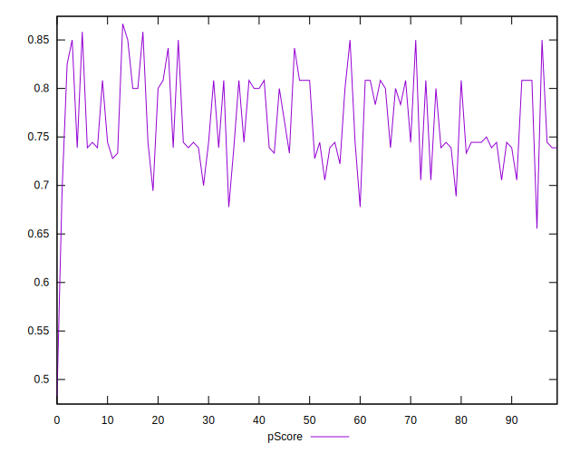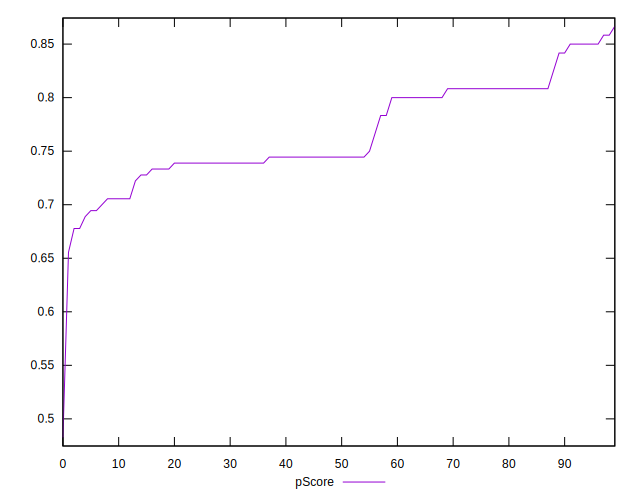
## Score Difference


```yaml
p90min: -0.004444444444444473
p90max: 0.0033333333333334103
p90range: 0.007777777777777883
p90mean: -0.0004104718810601182
p90median: 1.1102230246251565e-16
p90stdev: 0.002448257765222207
p90skewness: -0.6873388248142563
p90eccentricity: 1.0000000000000009
p90discretization: 6.066666666666666
outlandishness: 0.12608401828162422
confidence: 0.0010675480210258713
p90confidence: 0.001006038338204057

```

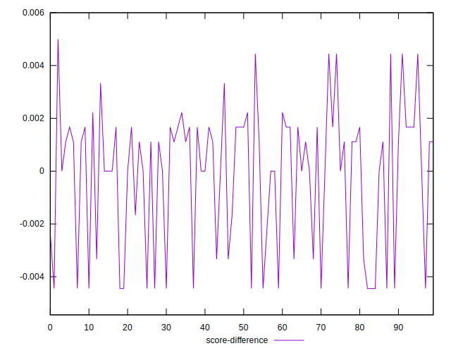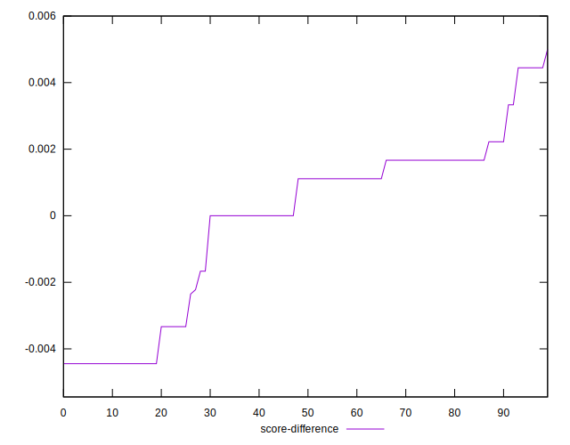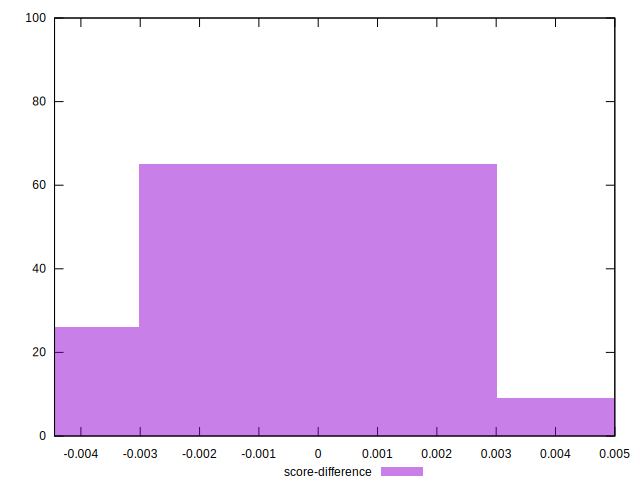
## P Score Difference


```yaml
p90min: 0
p90max: 0
p90range: 0
p90mean: 0
p90median: 0
p90stdev: 0
p90skewness: .nan
p90eccentricity: .nan
p90discretization: 91
outlandishness: .nan
confidence: 0
p90confidence: 0

```

