# //uses-rel-preload/samples/pages+cached+noadtech

[→ Parent](../..)


## Raw


```yaml
p90min: 454
p90max: 456
p90range: 2
p90mean: 454.97802197802196
p90median: 455
p90stdev: 0.5340704562735323
p90skewness: -0.020750182332689868
p90eccentricity: 1.0000000000000009
p90discretization: 30.333333333333332
outlandishness: 1.026379474429238
confidence: 11.549071106307338
p90confidence: 0.21946028802426554

```

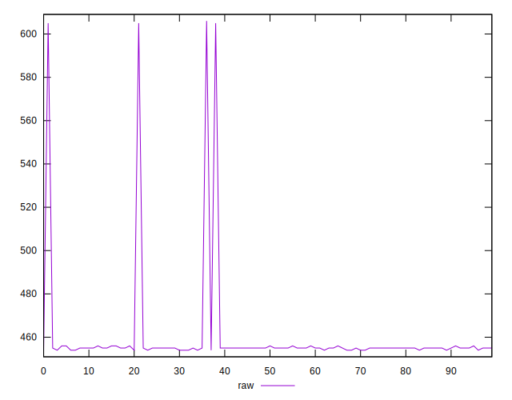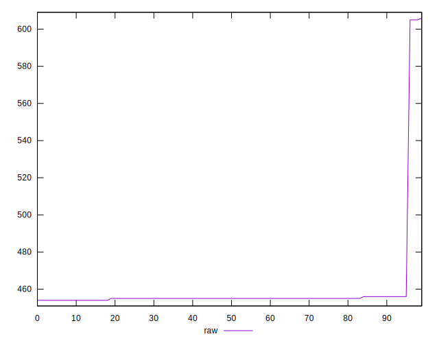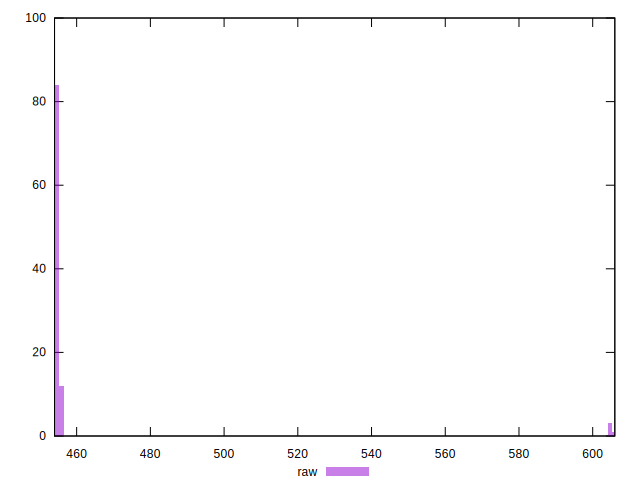
## Score


```yaml
p90min: 0.6633333333333333
p90max: 0.6644444444444444
p90range: 0.0011111111111110628
p90mean: 0.6639010989010994
p90median: 0.6638888888888889
p90stdev: 0.00029670580904083864
p90skewness: 0.020750182325395453
p90eccentricity: 0.9999999999999988
p90discretization: 30.333333333333332
outlandishness: 0.9900468678504389
confidence: 0.006416150614615201
p90confidence: 0.00012192238223573959

```

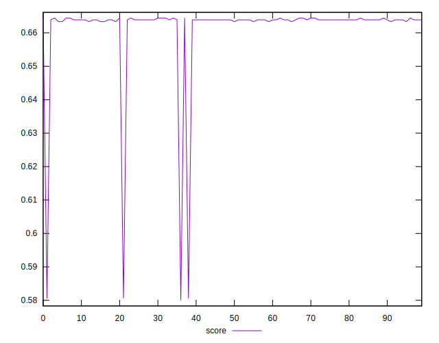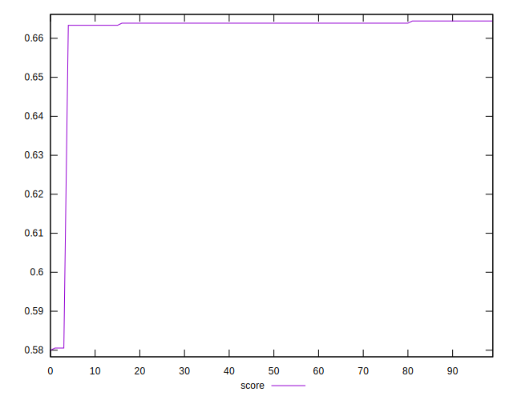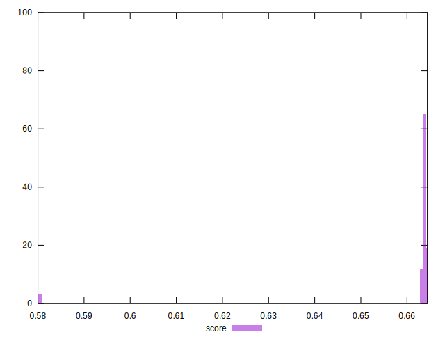
## Raw Estimate

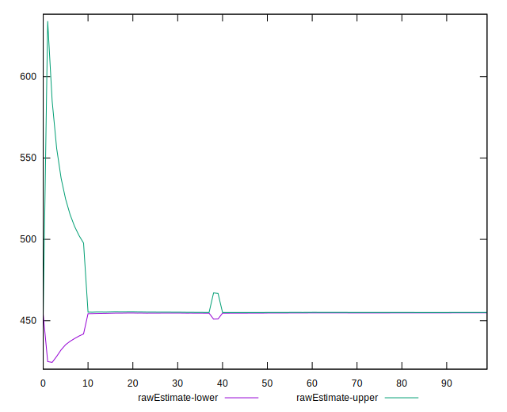
## Score Estimate

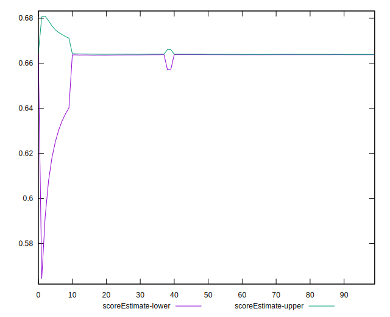
## P Score


```yaml
p90min: 0.6633333333333333
p90max: 0.6644444444444444
p90range: 0.0011111111111110628
p90mean: 0.6639010989010994
p90median: 0.6638888888888889
p90stdev: 0.00029670580904083864
p90skewness: 0.020750182325395453
p90eccentricity: 0.9999999999999988
p90discretization: 30.333333333333332
outlandishness: 0.9900468678504389
confidence: 0.006416150614615201
p90confidence: 0.00012192238223573959

```

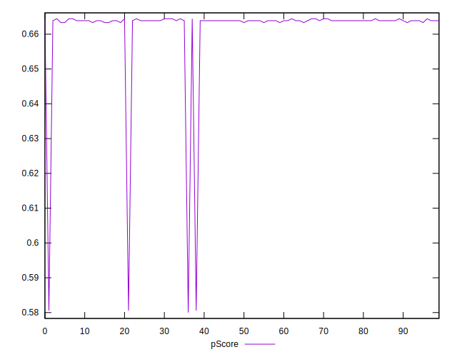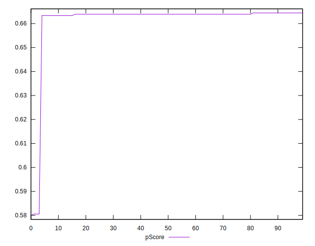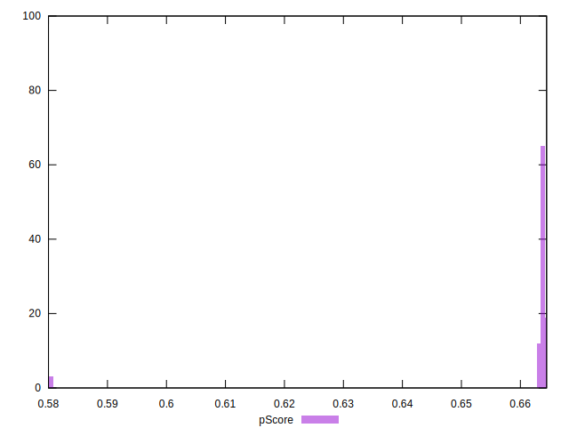
## Score Difference


```yaml
p90min: -0.004444444444444362
p90max: -0.0033333333333332993
p90range: 0.0011111111111110628
p90mean: -0.0039010989010988422
p90median: -0.0038888888888888307
p90stdev: 0.0002967058090408387
p90skewness: -0.0207501823328102
p90eccentricity: 0.999999999999998
p90discretization: 30.333333333333332
outlandishness: 0.9432999635091012
confidence: 0.00029601216435453173
p90confidence: 0.00012192238223569709

```

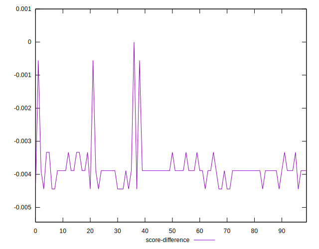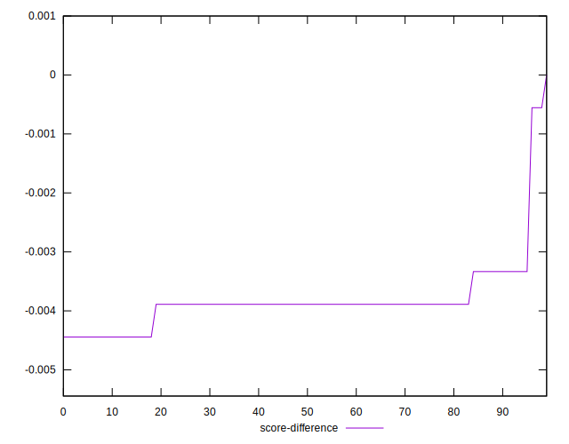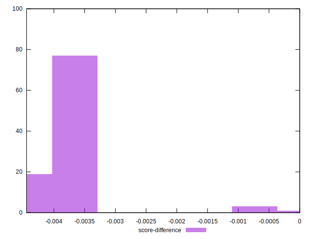
## P Score Difference


```yaml
p90min: 0
p90max: 0
p90range: 0
p90mean: 0
p90median: 0
p90stdev: 0
p90skewness: .nan
p90eccentricity: .nan
p90discretization: 91
outlandishness: .nan
confidence: 0
p90confidence: 0

```

