# //uses-rel-preload/samples/pages+cached+noexternal+nocss

[→ Parent](../..)


## Raw


```yaml
p90min: 754
p90max: 755
p90range: 1
p90mean: 754.6483516483516
p90median: 755
p90stdev: 0.4774848567560532
p90skewness: -0.6213878670813777
p90eccentricity: 1.0000000000000018
p90discretization: 45.5
outlandishness: 1.0000573741719854
confidence: 0.21509655979684794
p90confidence: 0.19620812752327765

```

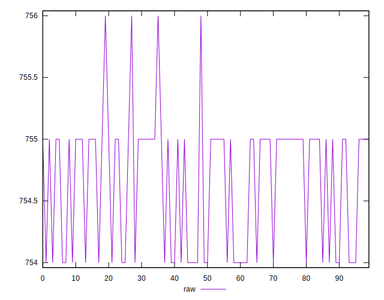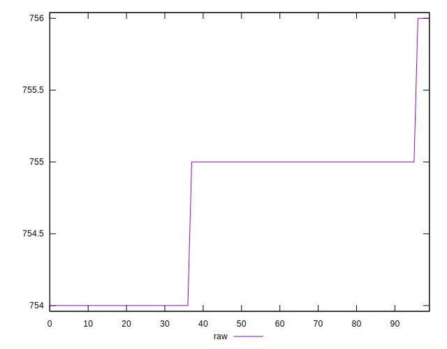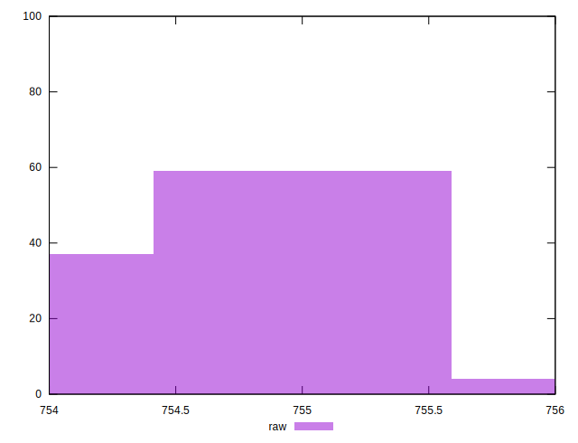
## Score


```yaml
p90min: 0.49941176470588233
p90max: 0.4995294117647059
p90range: 0.00011764705882355564
p90mean: 0.4994531351001939
p90median: 0.49941176470588233
p90stdev: 0.000056174689030136456
p90skewness: 0.6213878670819863
p90eccentricity: 1.0000000000000002
p90discretization: 45.5
outlandishness: 0.9999898014118755
confidence: 0.000025305477623138728
p90confidence: 0.00002308330912037526

```

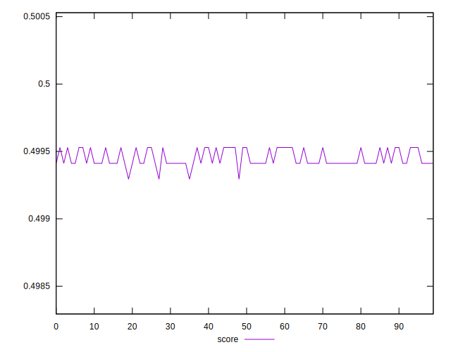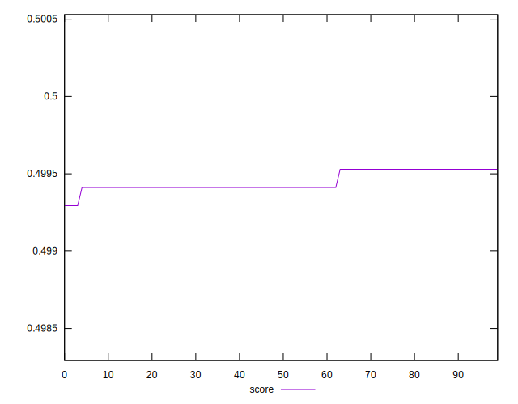
## Raw Estimate

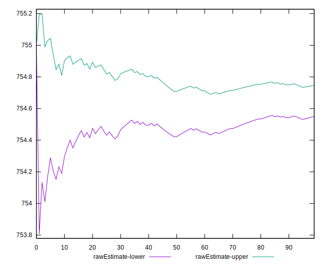
## Score Estimate

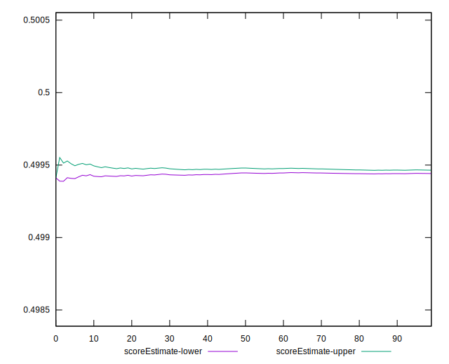
## P Score


```yaml
p90min: 0.49941176470588233
p90max: 0.4995294117647059
p90range: 0.00011764705882355564
p90mean: 0.4994531351001939
p90median: 0.49941176470588233
p90stdev: 0.000056174689030136456
p90skewness: 0.6213878670819863
p90eccentricity: 1.0000000000000002
p90discretization: 45.5
outlandishness: 0.9999898014118755
confidence: 0.000025305477623138728
p90confidence: 0.00002308330912037526

```

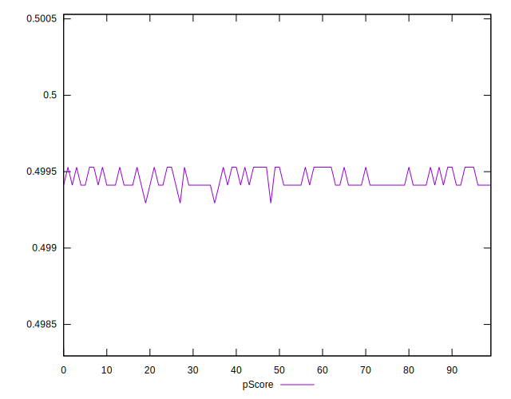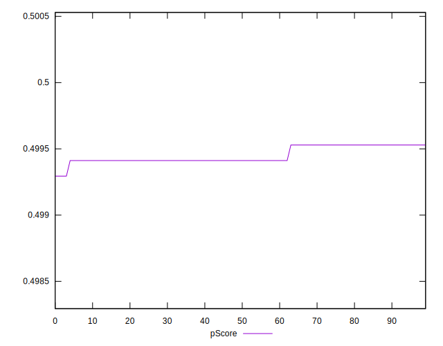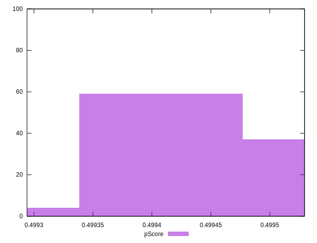
## Score Difference


```yaml
p90min: 0.00047058823529411153
p90max: 0.0005882352941176672
p90range: 0.00011764705882355564
p90mean: 0.0005468648998060872
p90median: 0.0005882352941176672
p90stdev: 0.00005617468903013643
p90skewness: -0.6213878670813685
p90eccentricity: 1
p90discretization: 45.5
outlandishness: 1.0093361104125036
confidence: 0.000025305477623162364
p90confidence: 0.000023083309120385453

```

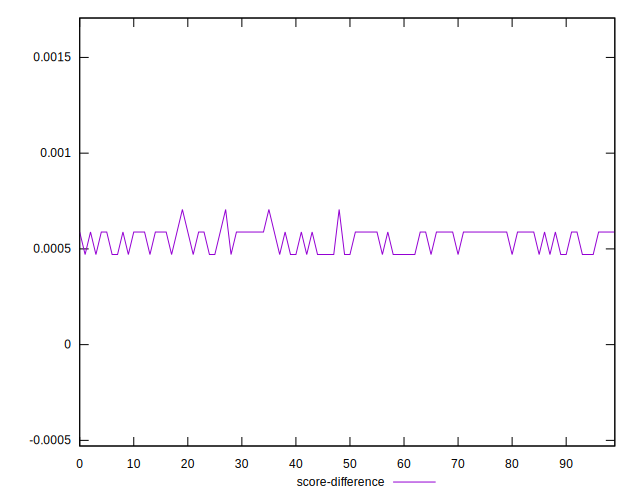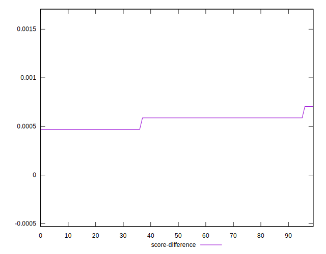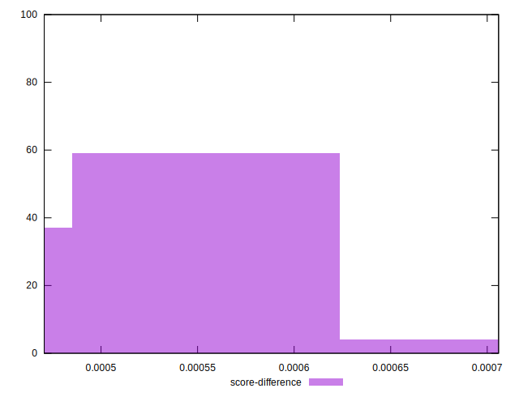
## P Score Difference


```yaml
p90min: 0
p90max: 0
p90range: 0
p90mean: 0
p90median: 0
p90stdev: 0
p90skewness: .nan
p90eccentricity: .nan
p90discretization: 91
outlandishness: .nan
confidence: 0
p90confidence: 0

```

