# //uses-rel-preload/samples/pages+cached+noexternal+nofonts+nosvg+noimg+nocss

[→ Parent](../..)


## Raw


```yaml
p90min: 605
p90max: 606
p90range: 1
p90mean: 605.5714285714286
p90median: 606
p90stdev: 0.4948716593053937
p90skewness: -0.288675134594714
p90eccentricity: 0.9999999999999999
p90discretization: 45.5
outlandishness: 1.000358607279677
confidence: 0.25930849426390523
p90confidence: 0.20335271425415158

```

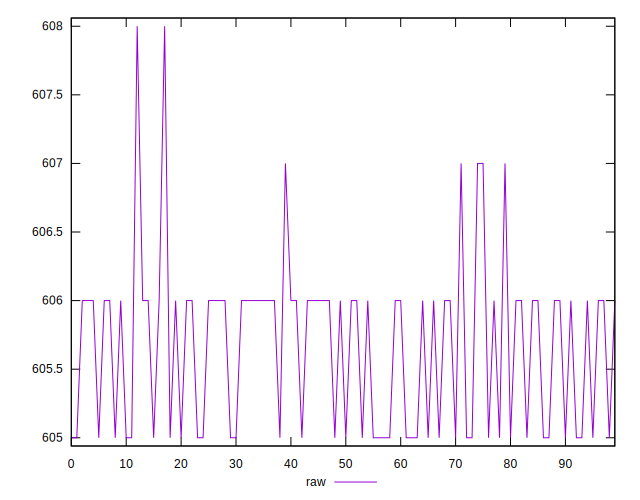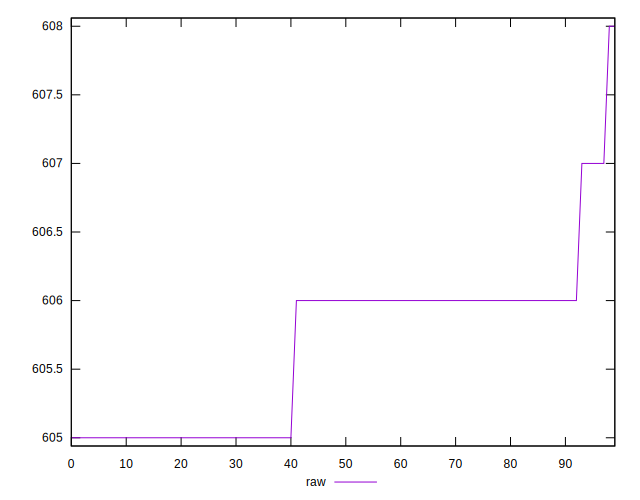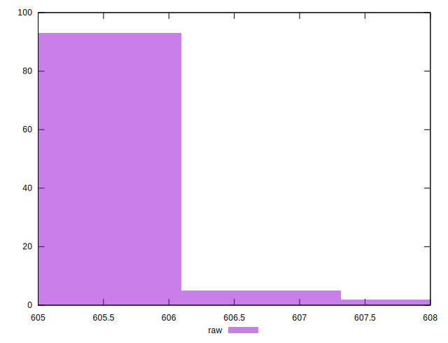
## Score


```yaml
p90min: 0.58
p90max: 0.5805555555555555
p90range: 0.0005555555555555314
p90mean: 0.5802380952380947
p90median: 0.58
p90stdev: 0.0002749286996140955
p90skewness: 0.28867513460173533
p90eccentricity: 1.0000000000000004
p90discretization: 45.5
outlandishness: 0.9997921049109896
confidence: 0.000144060274591018
p90confidence: 0.00011297373014129697

```

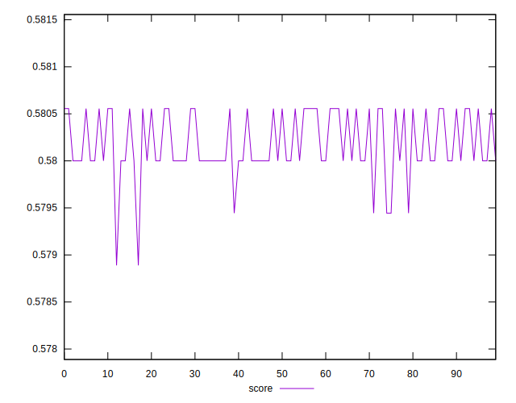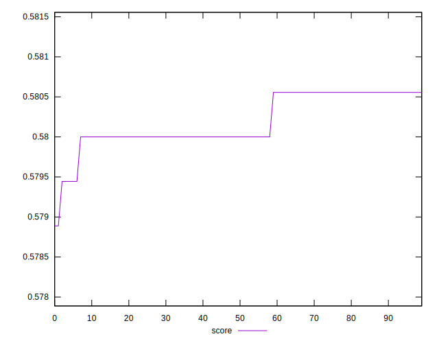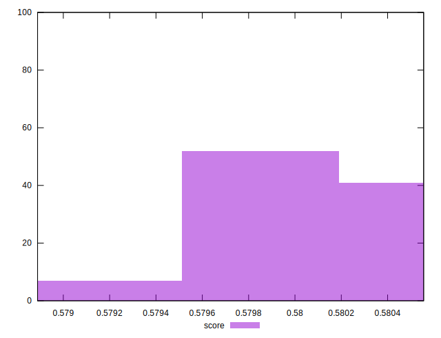
## Raw Estimate

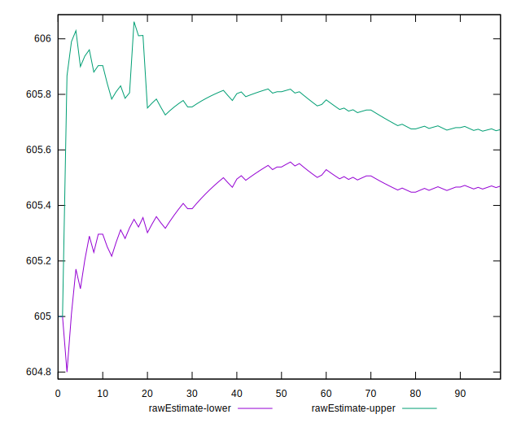
## Score Estimate

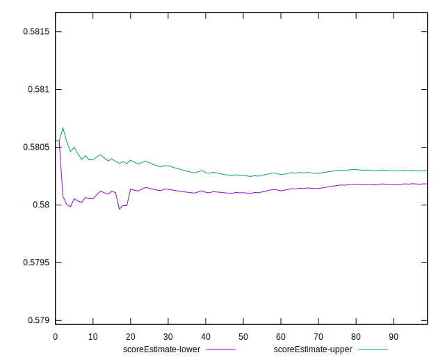
## P Score


```yaml
p90min: 0.58
p90max: 0.5805555555555555
p90range: 0.0005555555555555314
p90mean: 0.5802380952380947
p90median: 0.58
p90stdev: 0.0002749286996140955
p90skewness: 0.28867513460173533
p90eccentricity: 1.0000000000000004
p90discretization: 45.5
outlandishness: 0.9997921049109896
confidence: 0.000144060274591018
p90confidence: 0.00011297373014129697

```

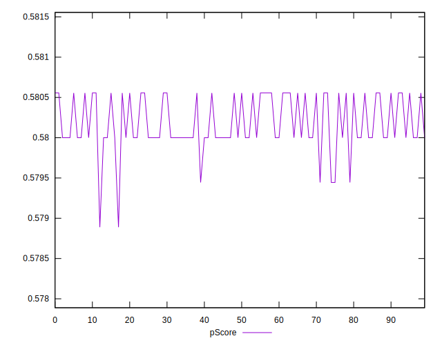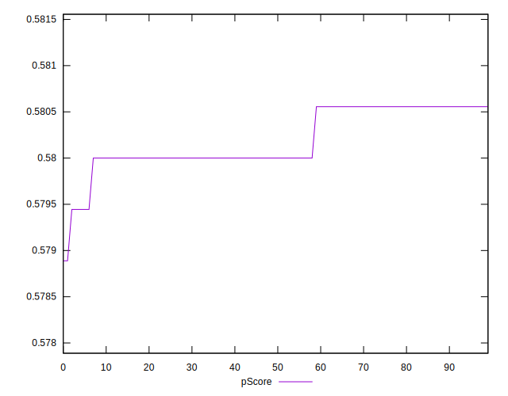
## Score Difference


```yaml
p90min: -0.0005555555555555314
p90max: 0
p90range: 0.0005555555555555314
p90mean: -0.00023809523809522774
p90median: 0
p90stdev: 0.00027492869961409563
p90skewness: -0.28867513459481264
p90eccentricity: 0.9999999999999996
p90discretization: 45.5
outlandishness: 0.557511111111111
confidence: 0.0001440602745910695
p90confidence: 0.00011297373014122292

```

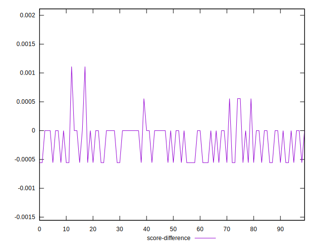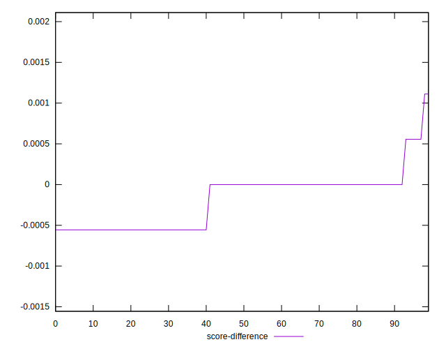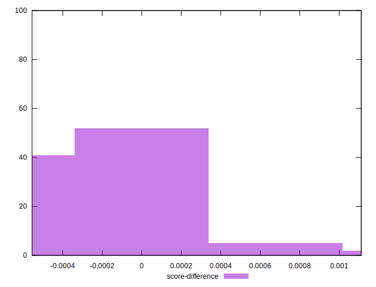
## P Score Difference


```yaml
p90min: 0
p90max: 0
p90range: 0
p90mean: 0
p90median: 0
p90stdev: 0
p90skewness: .nan
p90eccentricity: .nan
p90discretization: 91
outlandishness: .nan
confidence: 0
p90confidence: 0

```

