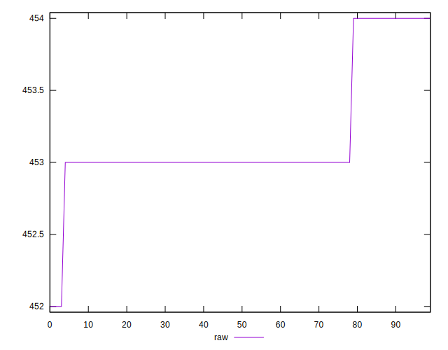

# //uses-rel-preload/samples/pages+cached+noexternal+nofonts+nosvg+noimg

[→ Parent](../..)


## Raw


```yaml
p90min: 453
p90max: 454
p90range: 1
p90mean: 453.1758241758242
p90median: 453
p90stdev: 0.3806705071579952
p90skewness: 1.7031832941093996
p90eccentricity: 0.9999999999999993
p90discretization: 45.5
outlandishness: 0.9999742963411218
confidence: 0.18431999840015578
p90confidence: 0.15642516481091207

```


## Score


```yaml
p90min: 0.6644444444444444
p90max: 0.665
p90range: 0.0005555555555556424
p90mean: 0.6649023199023191
p90median: 0.665
p90stdev: 0.000211483615087808
p90skewness: -1.7031832940989082
p90eccentricity: 1.0000000000000002
p90discretization: 45.5
outlandishness: 1.0000097327412223
confidence: 0.00010239999911121345
p90confidence: 0.00008690286933932256

```


## Raw Estimate


## Score Estimate


## P Score


```yaml
p90min: 0.6644444444444444
p90max: 0.665
p90range: 0.0005555555555556424
p90mean: 0.6649023199023191
p90median: 0.665
p90stdev: 0.000211483615087808
p90skewness: -1.7031832940989082
p90eccentricity: 1.0000000000000002
p90discretization: 45.5
outlandishness: 1.0000097327412223
confidence: 0.00010239999911121345
p90confidence: 0.00008690286933932256

```


## Score Difference


```yaml
p90min: -0.004444444444444362
p90max: 0.0050000000000000044
p90range: 0.009444444444444366
p90mean: 0.003730158730158746
p90median: 0.0050000000000000044
p90stdev: 0.0031880058958466246
p90skewness: -2.1706413541791174
p90eccentricity: 1.000000000000001
p90discretization: 30.333333333333332
outlandishness: 0.6444331824354952
confidence: 0.0015040255394288072
p90confidence: 0.0013100157177899033

```


## P Score Difference


```yaml
p90min: 0
p90max: 0
p90range: 0
p90mean: 0
p90median: 0
p90stdev: 0
p90skewness: .nan
p90eccentricity: .nan
p90discretization: 91
outlandishness: .nan
confidence: 0
p90confidence: 0

```

