# //uses-rel-preload/samples/pages+cached+noexternal+nofonts

[→ Parent](../..)


## Raw


```yaml
p90min: 600
p90max: 600
p90range: 0
p90mean: 600
p90median: 600
p90stdev: 0
p90skewness: .nan
p90eccentricity: .nan
p90discretization: 91
outlandishness: 1.00040004
confidence: 0.2731602023229698
p90confidence: 0

```

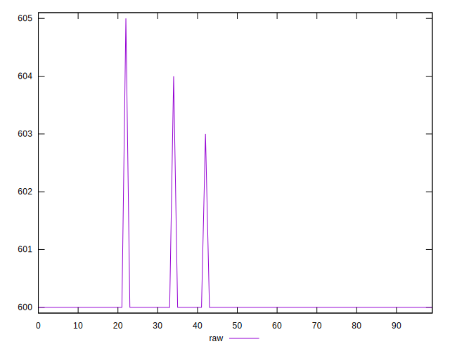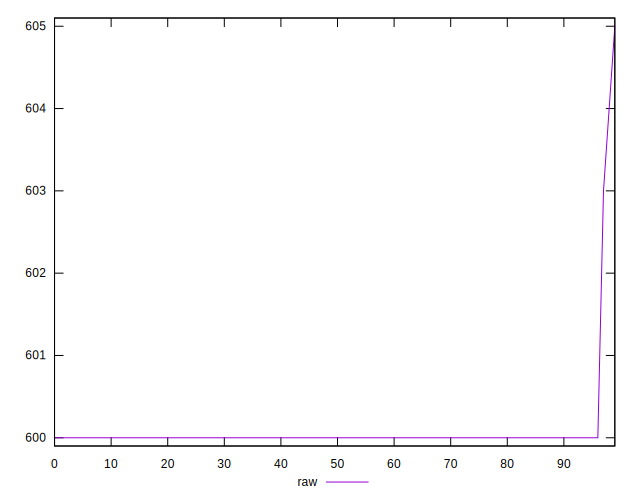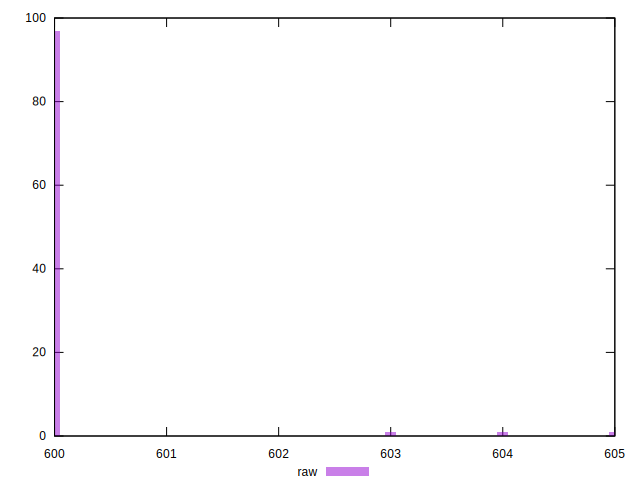
## Score


```yaml
p90min: 0.5833333333333334
p90max: 0.5833333333333334
p90range: 0
p90mean: 0.583333333333334
p90median: 0.5833333333333334
p90stdev: 6.661338147750939e-16
p90skewness: -1
p90eccentricity: 1
p90discretization: 91
outlandishness: 0.9997714416326534
confidence: 0.00015175566795733175
p90confidence: 2.220446049250313e-16

```

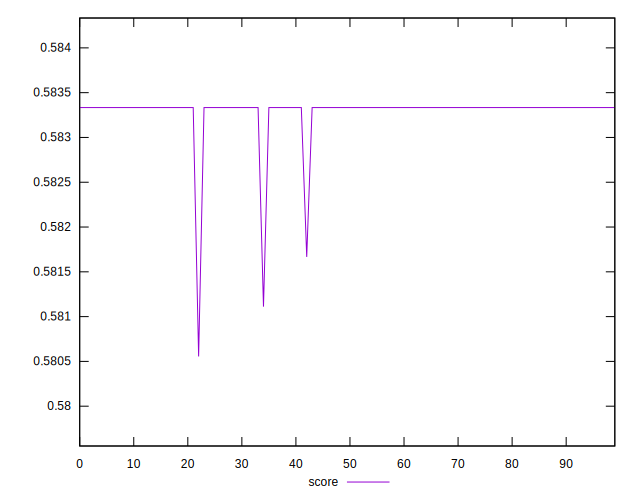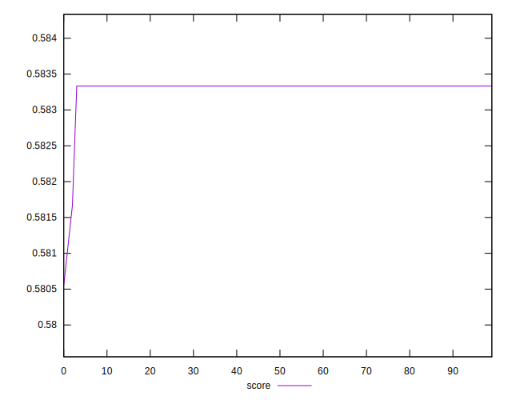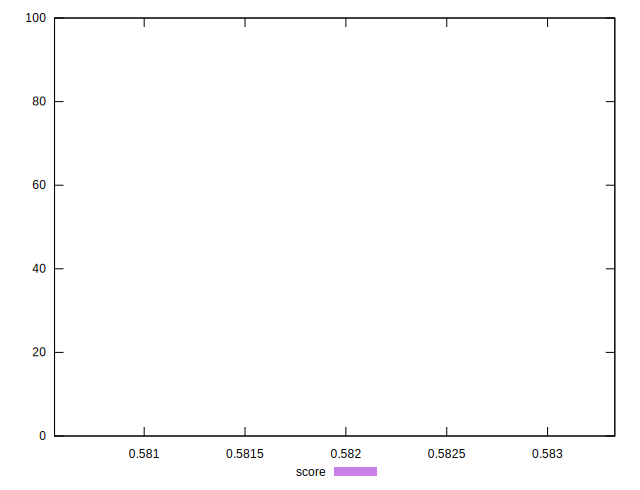
## Raw Estimate

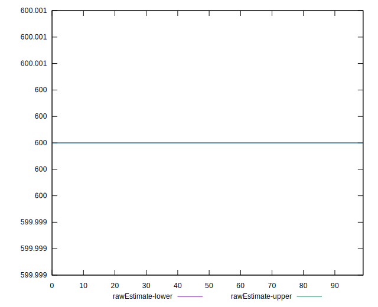
## Score Estimate

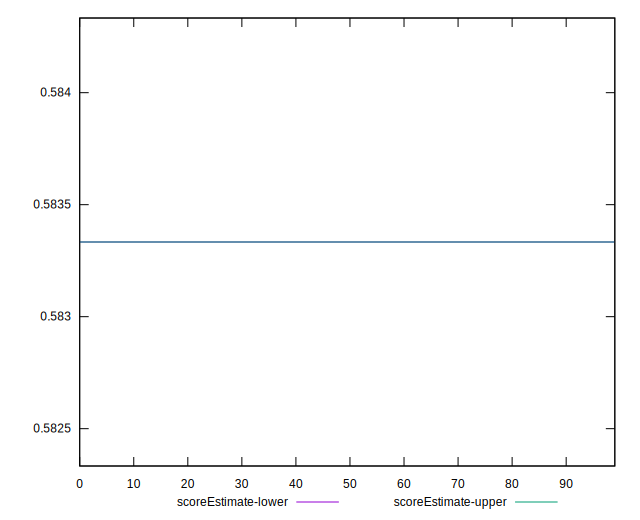
## P Score


```yaml
p90min: 0.5833333333333334
p90max: 0.5833333333333334
p90range: 0
p90mean: 0.583333333333334
p90median: 0.5833333333333334
p90stdev: 6.661338147750939e-16
p90skewness: -1
p90eccentricity: 1
p90discretization: 91
outlandishness: 0.9997714416326534
confidence: 0.00015175566795733175
p90confidence: 2.220446049250313e-16

```

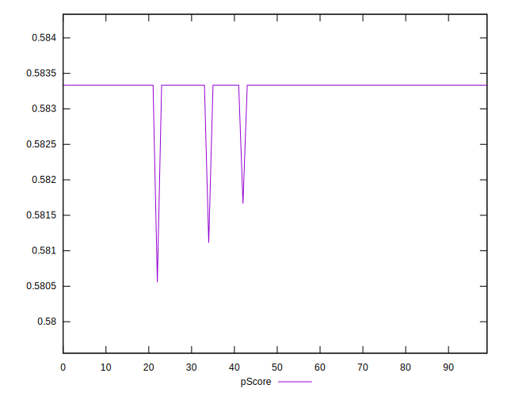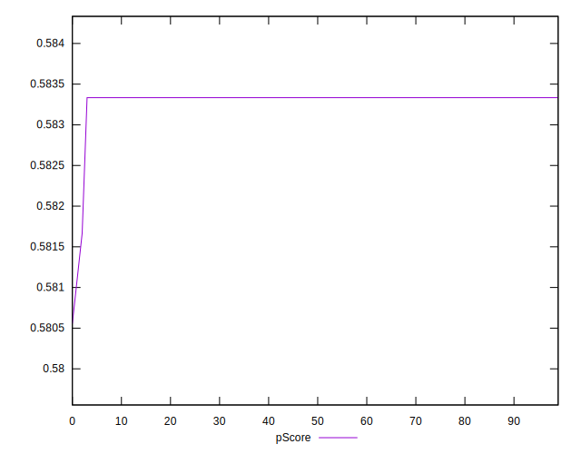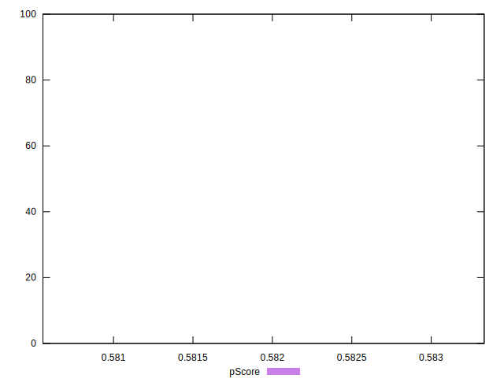
## Score Difference


```yaml
p90min: -0.0033333333333334103
p90max: -0.0033333333333334103
p90range: 0
p90mean: -0.0033333333333334103
p90median: -0.0033333333333334103
p90stdev: 0
p90skewness: .nan
p90eccentricity: .nan
p90discretization: 91
outlandishness: 0.9604000000000001
confidence: 0.00015175566795724675
p90confidence: 0

```

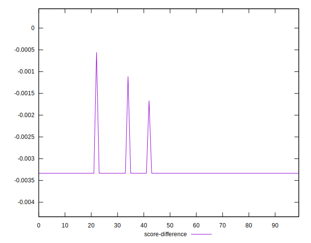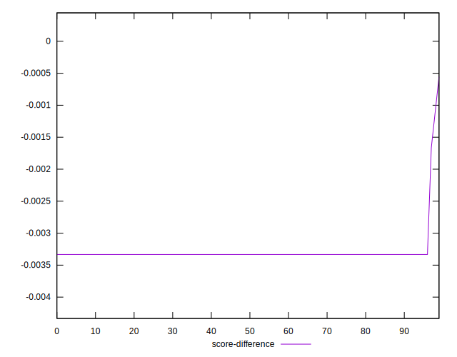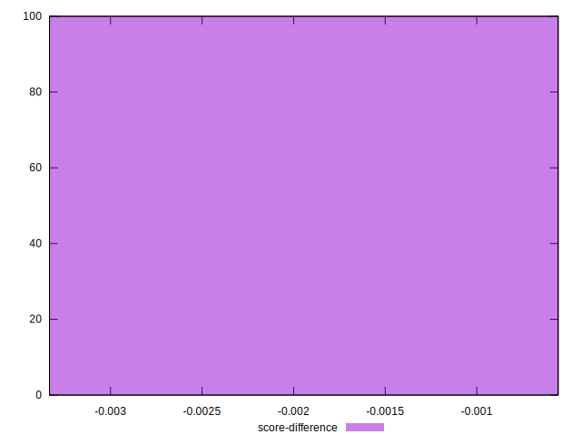
## P Score Difference


```yaml
p90min: 0
p90max: 0
p90range: 0
p90mean: 0
p90median: 0
p90stdev: 0
p90skewness: .nan
p90eccentricity: .nan
p90discretization: 91
outlandishness: .nan
confidence: 0
p90confidence: 0

```

