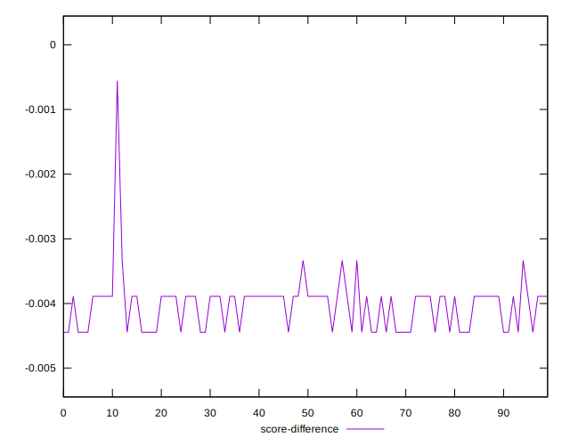

# //uses-rel-preload/samples/pages+cached+noexternal+nosvg

[→ Parent](../..)


## Raw


```yaml
p90min: 454
p90max: 456
p90range: 2
p90mean: 454.75824175824175
p90median: 455
p90stdev: 0.5414806591101059
p90skewness: -0.09433373333266833
p90eccentricity: 1.0000000000000007
p90discretization: 30.333333333333332
outlandishness: 1.0063508192827342
confidence: 5.866287130656474
p90confidence: 0.22250528935273906

```


## Score


```yaml
p90min: 0.6633333333333333
p90max: 0.6644444444444444
p90range: 0.0011111111111110628
p90mean: 0.664023199023199
p90median: 0.6638888888888889
p90stdev: 0.00030082258839449026
p90skewness: 0.09433373332534183
p90eccentricity: 1.0000000000000004
p90discretization: 30.333333333333332
outlandishness: 0.9975889585974272
confidence: 0.003259048405920284
p90confidence: 0.0001236140496403415

```


## Raw Estimate


## Score Estimate


## P Score


```yaml
p90min: 0.6633333333333333
p90max: 0.6644444444444444
p90range: 0.0011111111111110628
p90mean: 0.664023199023199
p90median: 0.6638888888888889
p90stdev: 0.00030082258839449026
p90skewness: 0.09433373332534183
p90eccentricity: 1.0000000000000004
p90discretization: 30.333333333333332
outlandishness: 0.9975889585974272
confidence: 0.003259048405920284
p90confidence: 0.0001236140496403415

```


## Score Difference


```yaml
p90min: -0.004444444444444362
p90max: -0.0038888888888888307
p90range: 0.0005555555555555314
p90mean: -0.004084249084249017
p90median: -0.0038888888888888307
p90stdev: 0.0002652693648644624
p90skewness: -0.621387867081371
p90eccentricity: 1.0000000000000004
p90discretization: 45.5
outlandishness: 0.9698569482148806
confidence: 0.00018251469332548724
p90confidence: 0.00010900451529067927

```


## P Score Difference


```yaml
p90min: 0
p90max: 0
p90range: 0
p90mean: 0
p90median: 0
p90stdev: 0
p90skewness: .nan
p90eccentricity: .nan
p90discretization: 91
outlandishness: .nan
confidence: 0
p90confidence: 0

```

