# //uses-rel-preload/samples/pages+cached

[→ Parent](../..)


## Raw


```yaml
p90min: 605
p90max: 607
p90range: 2
p90mean: 605.9230769230769
p90median: 606
p90stdev: 0.4741856925360753
p90skewness: -0.2305251773962362
p90eccentricity: 1.0000000000000004
p90discretization: 30.333333333333332
outlandishness: 0.9804469140240157
confidence: 23.63807281018876
p90confidence: 0.19485243461531354

```

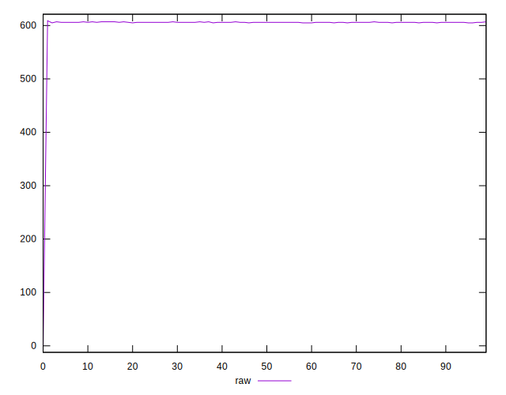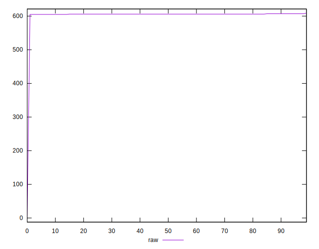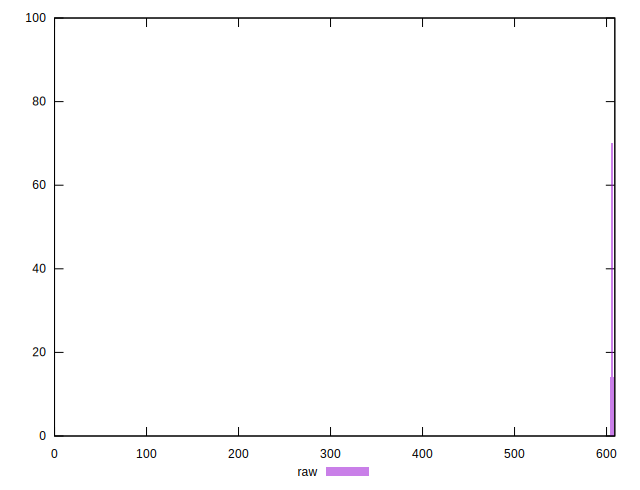
## Score


```yaml
p90min: 0.5794444444444444
p90max: 0.5805555555555555
p90range: 0.0011111111111110628
p90mean: 0.5800427350427342
p90median: 0.58
p90stdev: 0.00026343649585336377
p90skewness: 0.2305251774069474
p90eccentricity: 0.9999999999999997
p90discretization: 30.333333333333332
outlandishness: 1.0143278304812768
confidence: 0.016382363014391554
p90confidence: 0.00010825135256409268

```

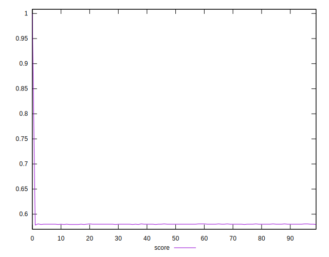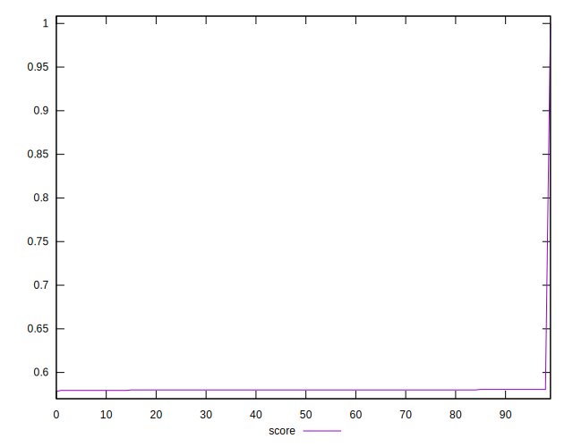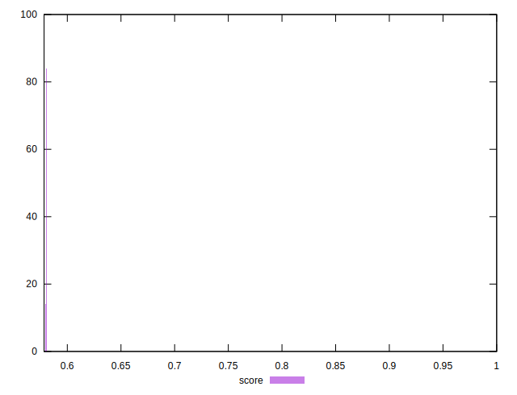
## Raw Estimate

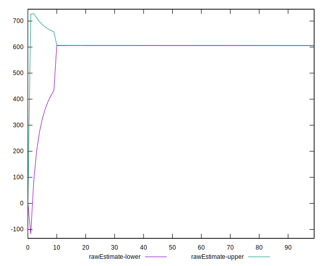
## Score Estimate

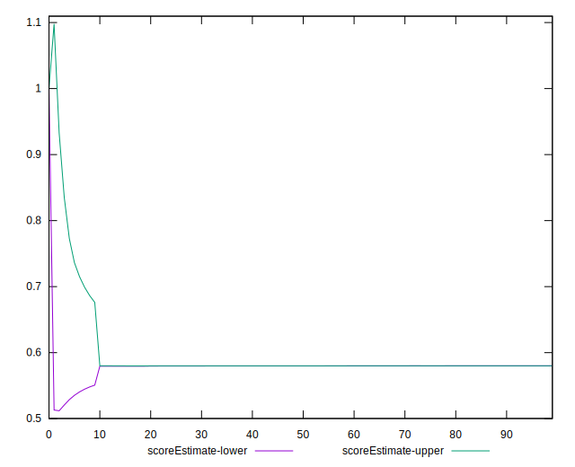
## P Score


```yaml
p90min: 0.5794444444444444
p90max: 0.5805555555555555
p90range: 0.0011111111111110628
p90mean: 0.5800427350427342
p90median: 0.58
p90stdev: 0.00026343649585336377
p90skewness: 0.2305251774069474
p90eccentricity: 0.9999999999999997
p90discretization: 30.333333333333332
outlandishness: 1.0143278304812768
confidence: 0.016382363014391554
p90confidence: 0.00010825135256409268

```

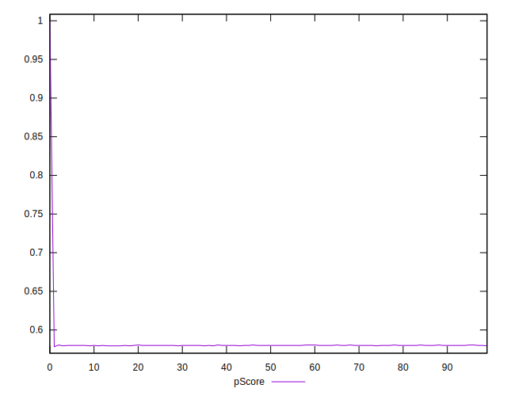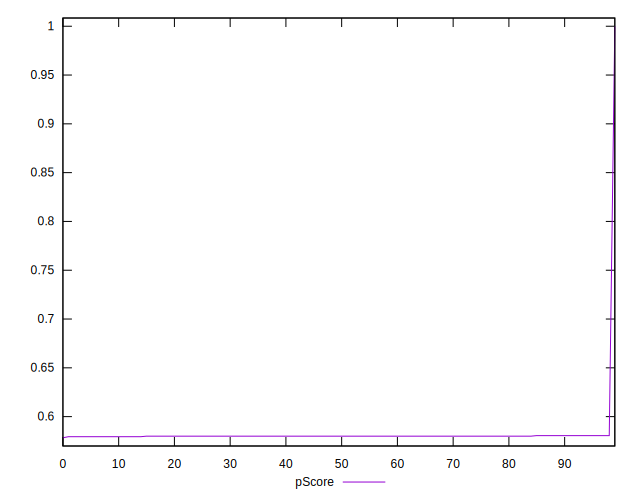
## Score Difference


```yaml
p90min: -0.0005555555555555314
p90max: 0.0005555555555555314
p90range: 0.0011111111111110628
p90mean: 0.00004884004884004671
p90median: 0
p90stdev: 0.0002558281665415879
p90skewness: 0.32061068513780394
p90eccentricity: 0.9999999999999989
p90discretization: 30.333333333333332
outlandishness: 0.11645156250000004
confidence: 0.0001323054103723784
p90confidence: 0.00010512493708354698

```

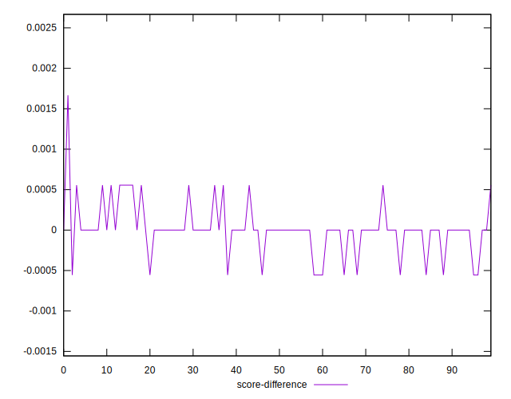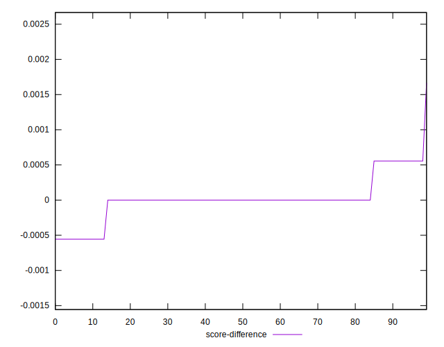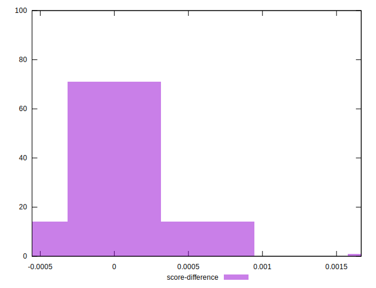
## P Score Difference


```yaml
p90min: 0
p90max: 0
p90range: 0
p90mean: 0
p90median: 0
p90stdev: 0
p90skewness: .nan
p90eccentricity: .nan
p90discretization: 91
outlandishness: .nan
confidence: 0
p90confidence: 0

```

