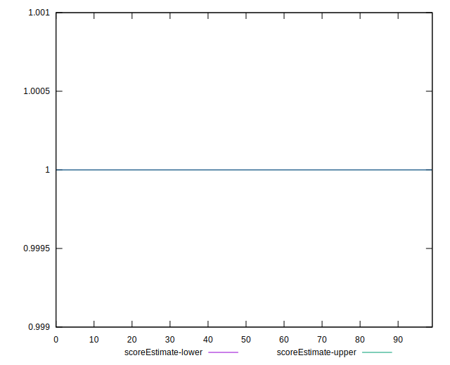

# //speed-index/samples/empty

[→ Parent](../..)


## Raw


```yaml
p90min: 625.20675
p90max: 631.29395
p90range: 6.087199999999939
p90mean: 628.121121978022
p90median: 628.20435
p90stdev: 1.3320611023920694
p90skewness: -0.08782431916081142
p90eccentricity: 1
p90discretization: 1
outlandishness: 1.0011125661661102
confidence: 0.8043109651684972
p90confidence: 0.5473706881984981

```


## Score


```yaml
p90min: 0.9999999366375946
p90max: 0.999999944155025
p90range: 7.517430455905583e-9
p90mean: 0.9999999406411408
p90median: 0.9999999405587603
p90stdev: 1.6393376499562578e-9
p90skewness: 0.004041434027677047
p90eccentricity: 0.9999999999999313
p90discretization: 1
outlandishness: 0.9999999990793758
confidence: 1.0246350434783835e-9
p90confidence: 6.736367019755107e-10

```


## Raw Estimate


## Score Estimate


## P Score


```yaml
p90min: 0.9999999366375946
p90max: 0.999999944155025
p90range: 7.517430455905583e-9
p90mean: 0.9999999406411408
p90median: 0.9999999405587603
p90stdev: 1.6393376499562578e-9
p90skewness: 0.004041434027677047
p90eccentricity: 0.9999999999999313
p90discretization: 1
outlandishness: 0.9999999990793758
confidence: 1.0246350434783835e-9
p90confidence: 6.736367019755107e-10

```


## Score Difference


```yaml
p90min: 5.584497497768126e-8
p90max: 6.336240543358684e-8
p90range: 7.517430455905583e-9
p90mean: 5.935885904418458e-8
p90median: 5.944123970813564e-8
p90stdev: 1.639337649956197e-9
p90skewness: -0.004040610177869547
p90eccentricity: 1.0000000000000002
p90discretization: 1
outlandishness: 1.0155696053641257
confidence: 1.0246350284999955e-9
p90confidence: 6.736367994191207e-10

```


## P Score Difference


```yaml
p90min: 0
p90max: 0
p90range: 0
p90mean: 0
p90median: 0
p90stdev: 0
p90skewness: .nan
p90eccentricity: .nan
p90discretization: 91
outlandishness: .nan
confidence: 0
p90confidence: 0

```

