# //speed-index/samples/pages+cached+noexternal+nofonts+nosvg+noimg+nocss+nojs

[→ Parent](../..)


## Raw


```yaml
p90min: 1507.6709999999998
p90max: 1510.3714
p90range: 2.7004000000001724
p90mean: 1509.0685252747253
p90median: 1509.1147999999998
p90stdev: 0.6229805780038024
p90skewness: -0.28001023305962347
p90eccentricity: 0.9999999999999997
p90discretization: 1.011111111111111
outlandishness: 0.9998261926829626
confidence: 0.30867238888367865
p90confidence: 0.2559952445903946

```

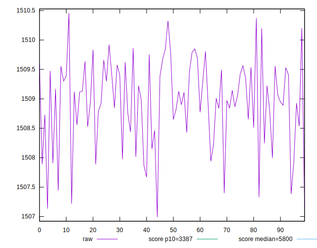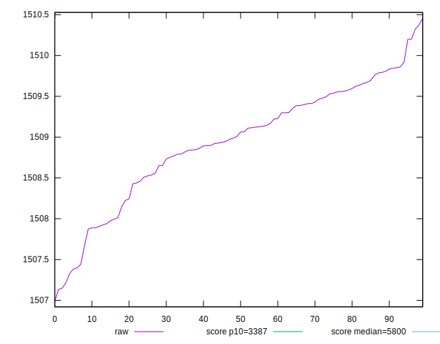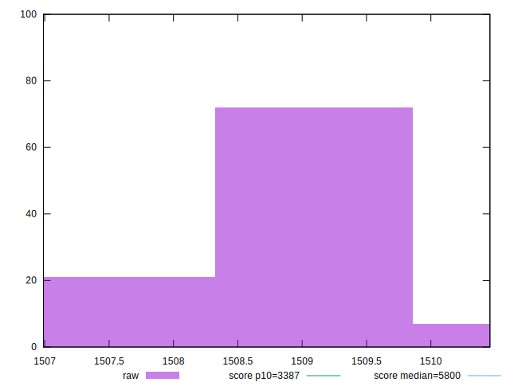
## Score


```yaml
p90min: 0.9993260109768084
p90max: 0.9993359271671491
p90range: 0.00000991619034074187
p90mean: 0.9993308068668261
p90median: 0.9993306400248232
p90stdev: 0.000002287255603499902
p90skewness: 0.2741354734503172
p90eccentricity: 0.9999999999999993
p90discretization: 1.011111111111111
outlandishness: 1.0000009600107433
confidence: 0.0000011319598627324012
p90confidence: 9.398793130444005e-7

```

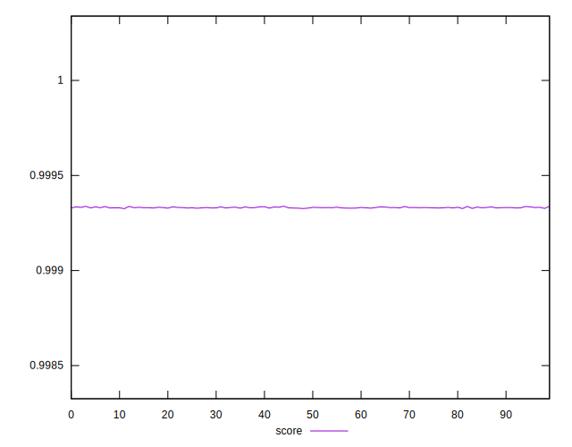
## Raw Estimate

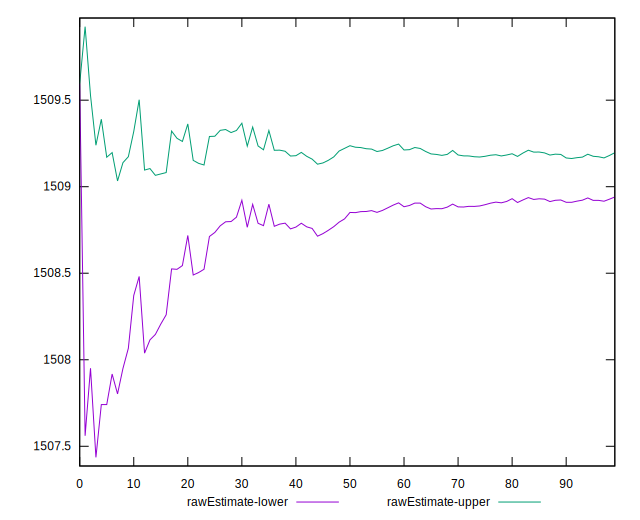
## Score Estimate

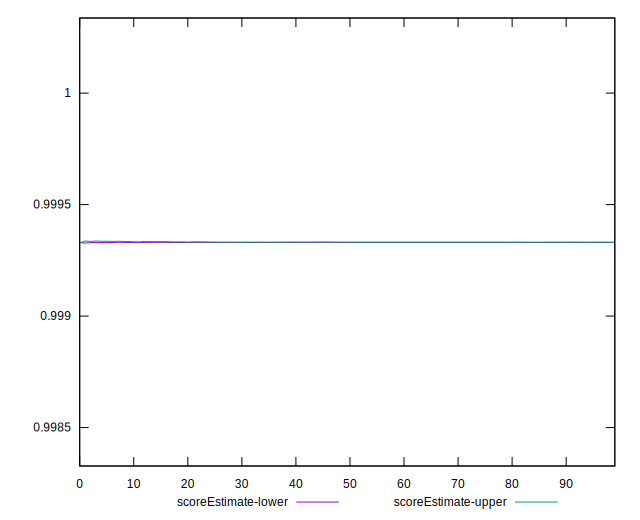
## P Score


```yaml
p90min: 0.9993260109768084
p90max: 0.9993359271671491
p90range: 0.00000991619034074187
p90mean: 0.9993308068668261
p90median: 0.9993306400248232
p90stdev: 0.000002287255603499902
p90skewness: 0.2741354734503172
p90eccentricity: 0.9999999999999993
p90discretization: 1.011111111111111
outlandishness: 1.0000009600107433
confidence: 0.0000011319598627324012
p90confidence: 9.398793130444005e-7

```

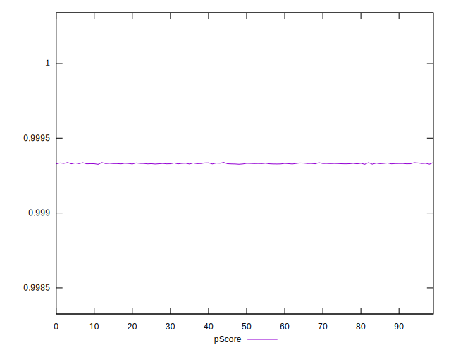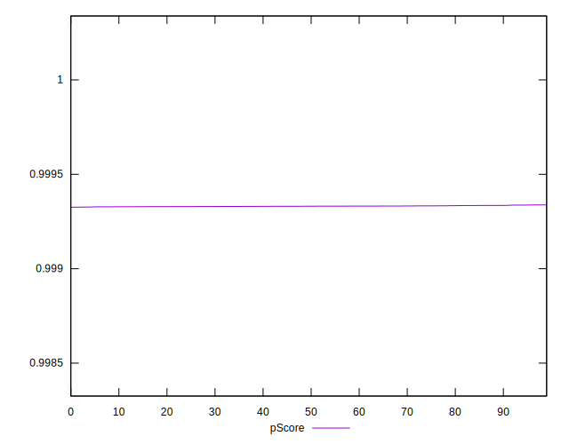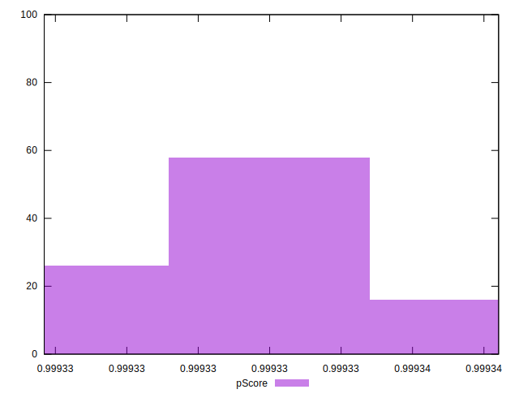
## Score Difference


```yaml
p90min: 0.0006640728328508594
p90max: 0.0006739890231916013
p90range: 0.00000991619034074187
p90mean: 0.0006691931331736225
p90median: 0.0006693599751768087
p90stdev: 0.0000022872556034999016
p90skewness: -0.2741354731943473
p90eccentricity: 1.0000000000000009
p90discretization: 1.011111111111111
outlandishness: 0.9985668946809982
confidence: 0.0000011319598627005257
p90confidence: 9.398793129873715e-7

```

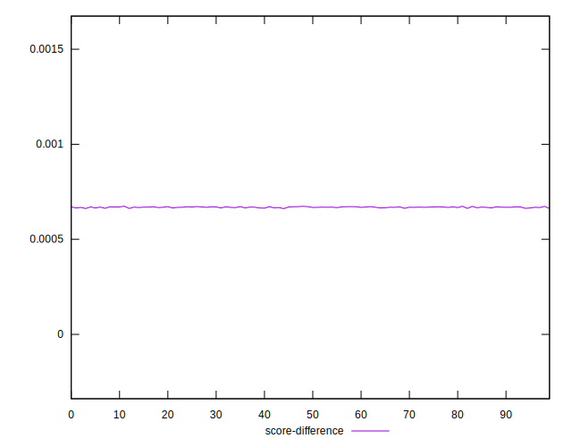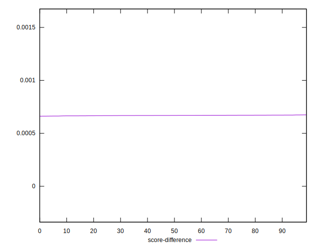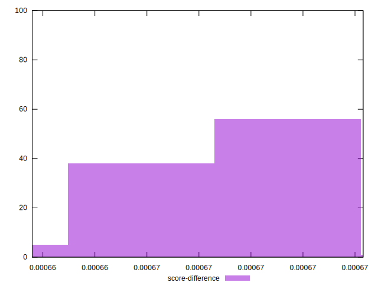
## P Score Difference


```yaml
p90min: 0
p90max: 0
p90range: 0
p90mean: 0
p90median: 0
p90stdev: 0
p90skewness: .nan
p90eccentricity: .nan
p90discretization: 91
outlandishness: .nan
confidence: 0
p90confidence: 0

```

