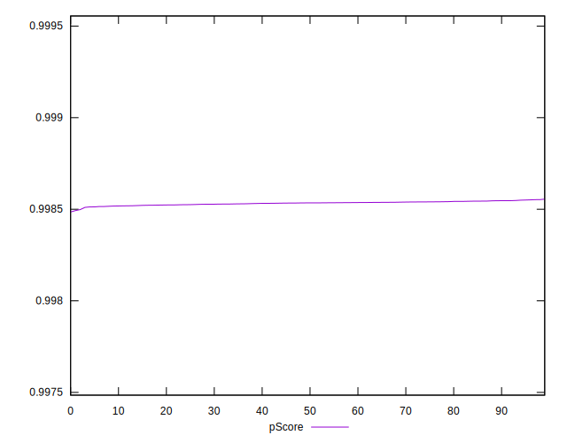

# //speed-index/samples/pages+cached+noexternal+nofonts+nosvg+noimg+nocss

[→ Parent](../..)


## Raw


```yaml
p90min: 1661.4770999999996
p90max: 1666.7752999999998
p90range: 5.298200000000179
p90mean: 1664.0525714285716
p90median: 1663.8876999999995
p90stdev: 1.3076139932898474
p90skewness: 0.2108333066678027
p90eccentricity: 1
p90discretization: 1
outlandishness: 1.0002272876698834
confidence: 0.6997314791556164
p90confidence: 0.5373248795567633

```


## Score


```yaml
p90min: 0.9985149823756971
p90max: 0.9985512461881152
p90range: 0.000036263812418058095
p90mean: 0.9985336846024262
p90median: 0.9985348338212888
p90stdev: 0.000008952123867252013
p90skewness: -0.2196212925785364
p90eccentricity: 1.0000000000000004
p90discretization: 1
outlandishness: 0.9999973702777336
confidence: 0.000004807351856372932
p90confidence: 0.0000036786076804684598

```


## Raw Estimate


## Score Estimate


## P Score


```yaml
p90min: 0.9985149823756971
p90max: 0.9985512461881152
p90range: 0.000036263812418058095
p90mean: 0.9985336846024262
p90median: 0.9985348338212888
p90stdev: 0.000008952123867252013
p90skewness: -0.2196212925785364
p90eccentricity: 1.0000000000000004
p90discretization: 1
outlandishness: 0.9999973702777336
confidence: 0.000004807351856372932
p90confidence: 0.0000036786076804684598

```


## Score Difference


```yaml
p90min: 0.0014487538118848065
p90max: 0.0014850176243028645
p90range: 0.000036263812418058095
p90mean: 0.0014663153975734138
p90median: 0.0014651661787111747
p90stdev: 0.000008952123867252013
p90skewness: 0.2196212926345627
p90eccentricity: 1
p90discretization: 1
outlandishness: 1.0017915951725256
confidence: 0.000004807351856269716
p90confidence: 0.0000036786076804250917

```


## P Score Difference


```yaml
p90min: 0
p90max: 0
p90range: 0
p90mean: 0
p90median: 0
p90stdev: 0
p90skewness: .nan
p90eccentricity: .nan
p90discretization: 91
outlandishness: .nan
confidence: 0
p90confidence: 0

```

