# //speed-index/samples/pages+cached+noexternal+nofonts

[→ Parent](../..)


## Raw


```yaml
p90min: 1510.4286000000002
p90max: 2121.58605
p90range: 611.1574499999997
p90mean: 1636.5479159340653
p90median: 1512.6099999999997
p90stdev: 214.9186381226493
p90skewness: 1.3820440854927267
p90eccentricity: 0.9999999999999999
p90discretization: 1
outlandishness: 1.0545006188147241
confidence: 97.2999925587942
p90confidence: 88.31438936592758

```

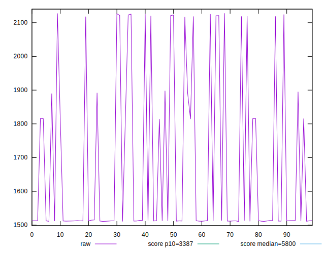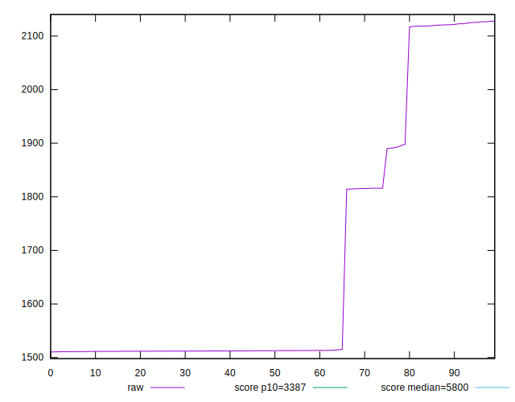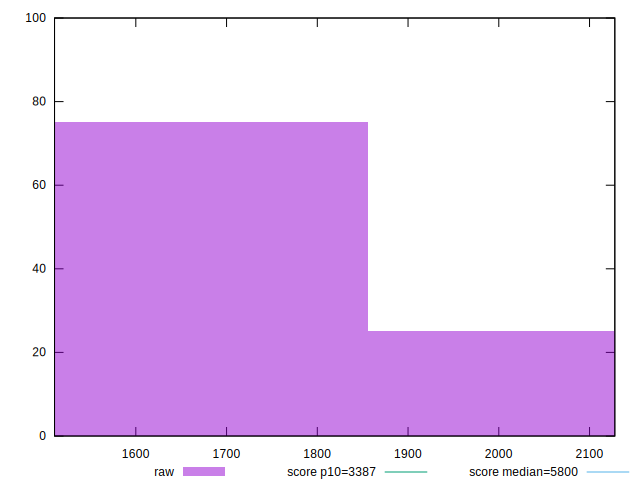
## Score


```yaml
p90min: 0.9917128118411545
p90max: 0.9993257996549971
p90range: 0.007612987813842675
p90mean: 0.998021266865594
p90median: 0.9993177008809642
p90stdev: 0.0024921832996294925
p90skewness: -1.8361961998079868
p90eccentricity: 1.0000000000000002
p90discretization: 1
outlandishness: 0.9988445895962037
confidence: 0.001176976439101196
p90confidence: 0.0010240882234193727

```

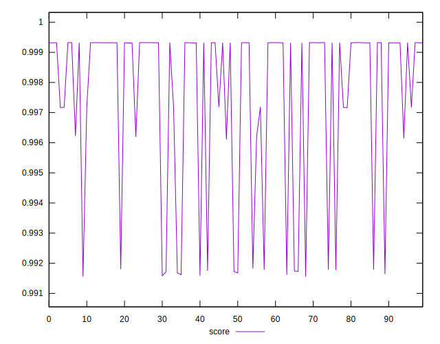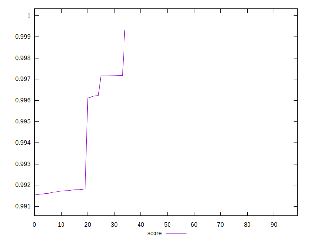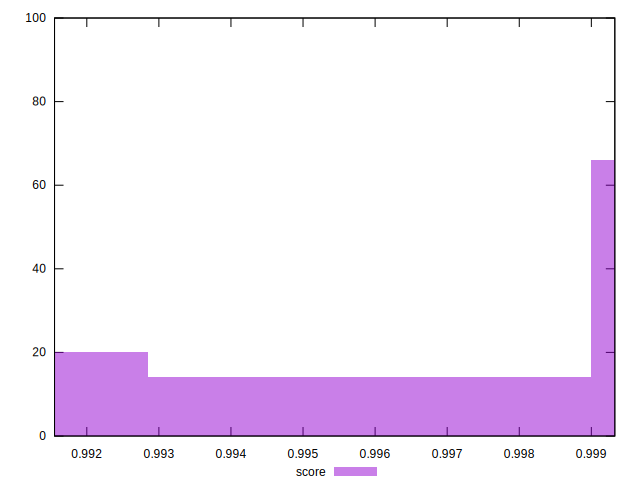
## Raw Estimate

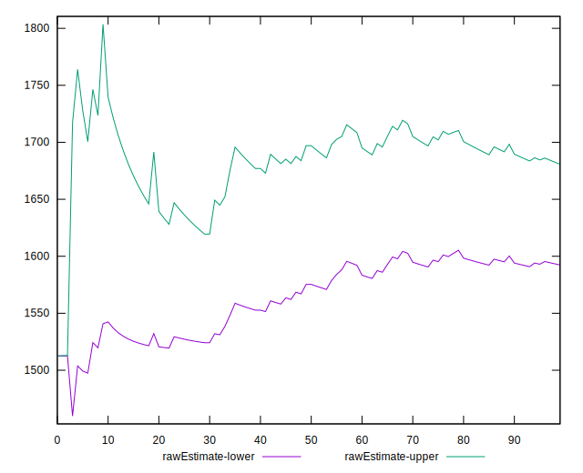
## Score Estimate

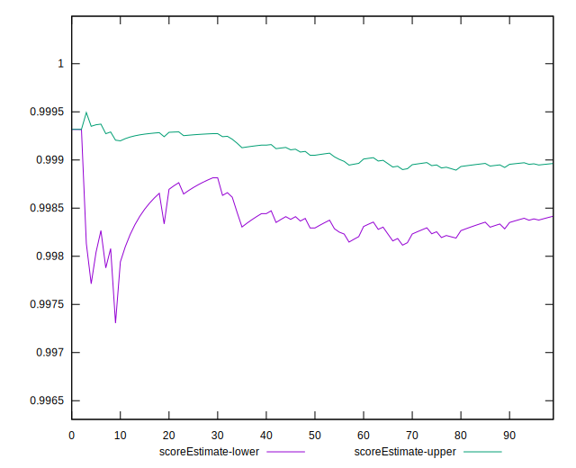
## P Score


```yaml
p90min: 0.9917128118411545
p90max: 0.9993257996549971
p90range: 0.007612987813842675
p90mean: 0.998021266865594
p90median: 0.9993177008809642
p90stdev: 0.0024921832996294925
p90skewness: -1.8361961998079868
p90eccentricity: 1.0000000000000002
p90discretization: 1
outlandishness: 0.9988445895962037
confidence: 0.001176976439101196
p90confidence: 0.0010240882234193727

```

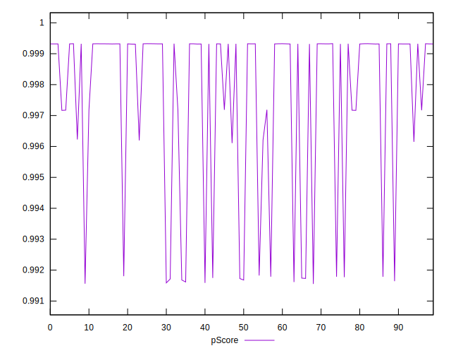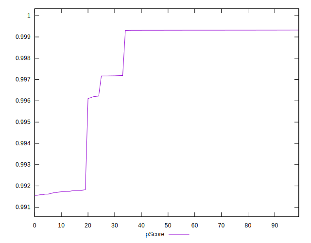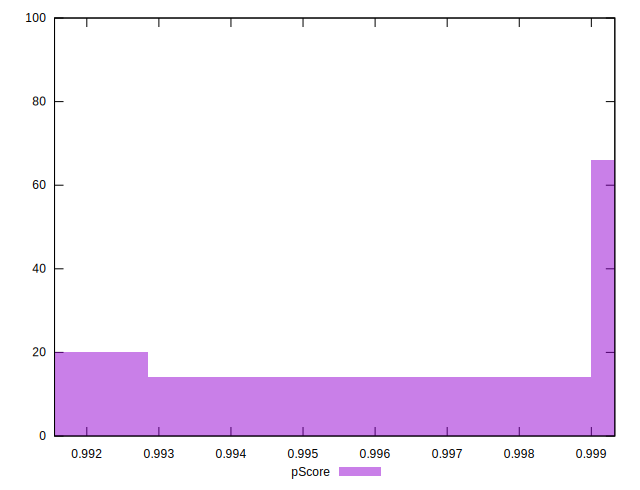
## Score Difference


```yaml
p90min: -0.001783708965336528
p90max: 0.0028328232690497668
p90range: 0.004616532234386295
p90mean: 0.0004794901097068358
p90median: 0.0006802859477343937
p90stdev: 0.0011779750910851459
p90skewness: -0.28850461758054424
p90eccentricity: 1.0000000000000002
p90discretization: 1
outlandishness: 1.341989645275995
confidence: 0.0005576601273997932
p90confidence: 0.0004840536482372855

```

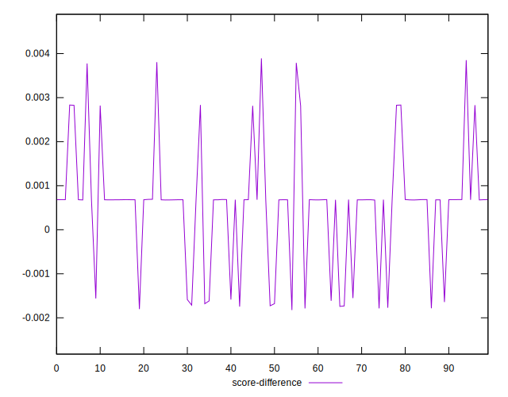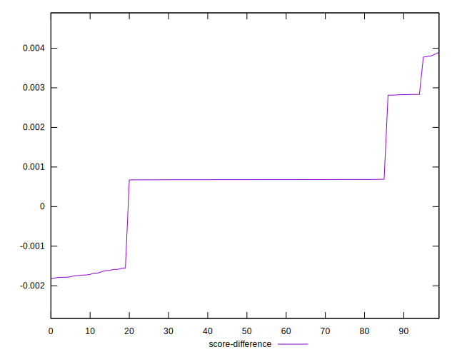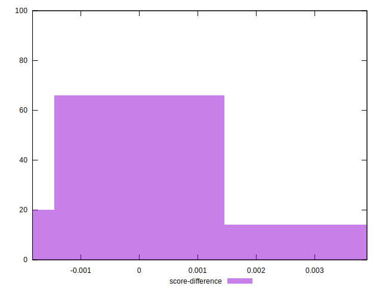
## P Score Difference


```yaml
p90min: 0
p90max: 0
p90range: 0
p90mean: 0
p90median: 0
p90stdev: 0
p90skewness: .nan
p90eccentricity: .nan
p90discretization: 91
outlandishness: .nan
confidence: 0
p90confidence: 0

```

