# //speed-index/samples/pages+cached+nointeractive

[→ Parent](../..)


## Raw


```yaml
p90min: 3938.9428152764967
p90max: 4902.347383797047
p90range: 963.4045685205501
p90mean: 4383.458840771123
p90median: 4300.021521658002
p90stdev: 229.6150216344016
p90skewness: 1.3970957275912768
p90eccentricity: 1.0000000000000002
p90discretization: 1
outlandishness: 1.0173930483273022
confidence: 106.07016964714057
p90confidence: 94.35342882320947

```

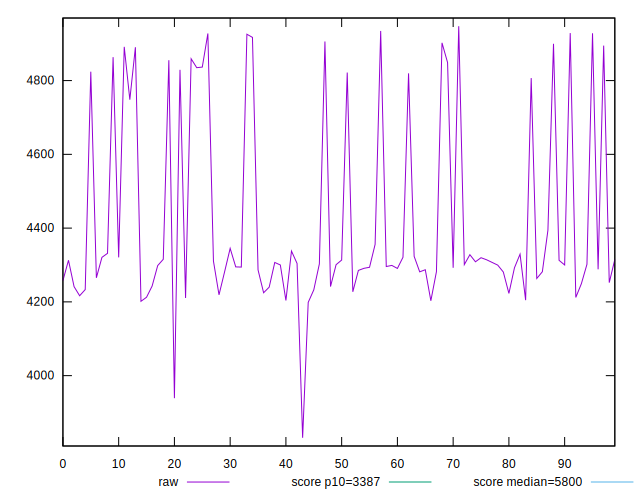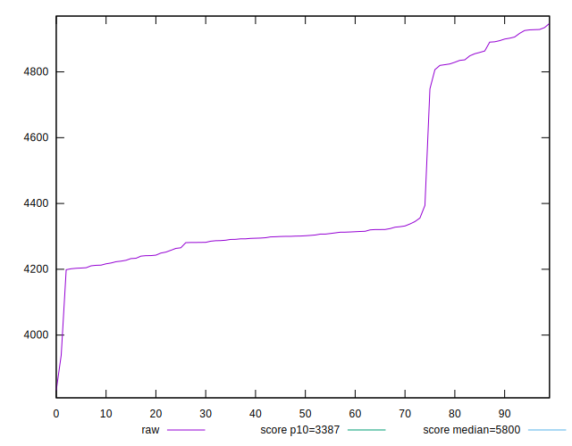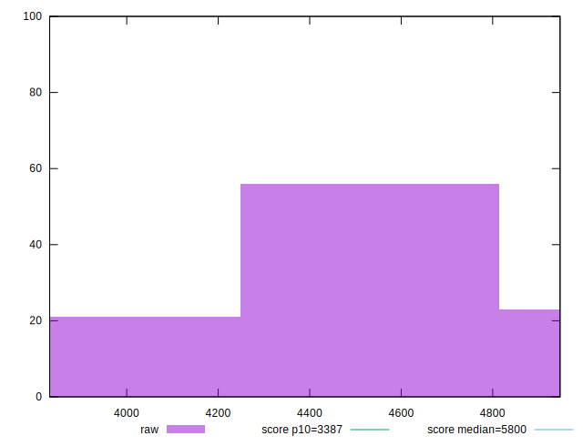
## Score


```yaml
p90min: 0.6556404551172301
p90max: 0.821704009727414
p90range: 0.16606355461018385
p90mean: 0.7471847123347853
p90median: 0.7620522110683144
p90stdev: 0.04035232845578759
p90skewness: -1.4203773913266244
p90eccentricity: 0.9999999999999999
p90discretization: 1
outlandishness: 0.9819786506100353
confidence: 0.01861777230021322
p90confidence: 0.0165815830501983

```

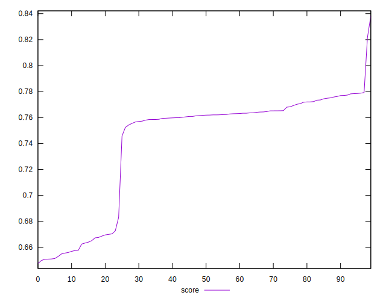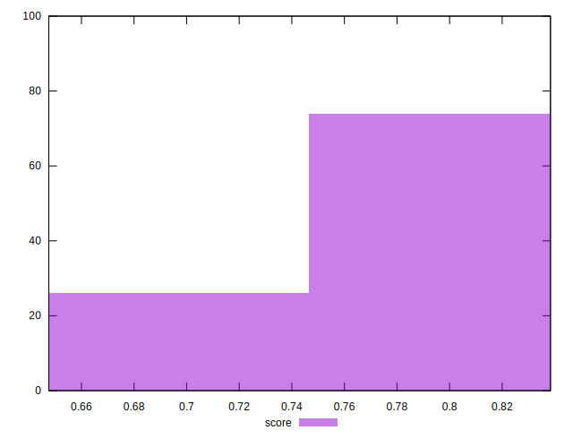
## Raw Estimate

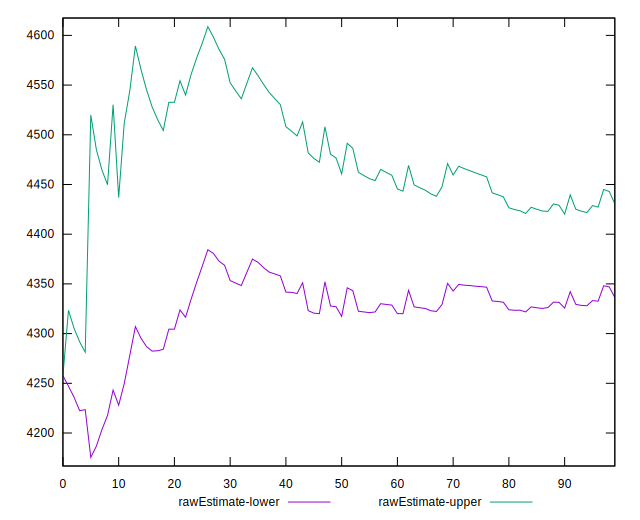
## Score Estimate

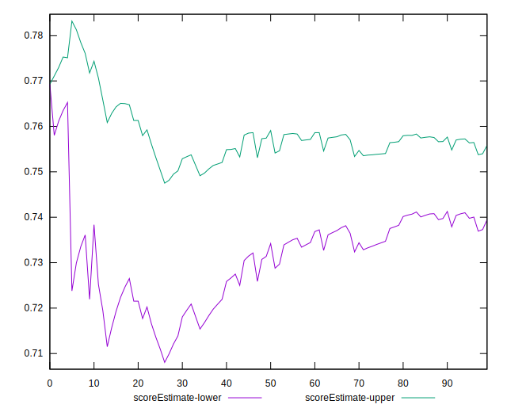
## P Score


```yaml
p90min: 0.6556404551172301
p90max: 0.821704009727414
p90range: 0.16606355461018385
p90mean: 0.7471847123347853
p90median: 0.7620522110683144
p90stdev: 0.04035232845578759
p90skewness: -1.4203773913266244
p90eccentricity: 0.9999999999999999
p90discretization: 1
outlandishness: 0.9819786506100353
confidence: 0.01861777230021322
p90confidence: 0.0165815830501983

```

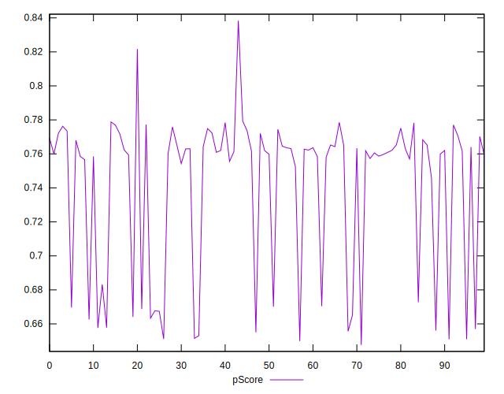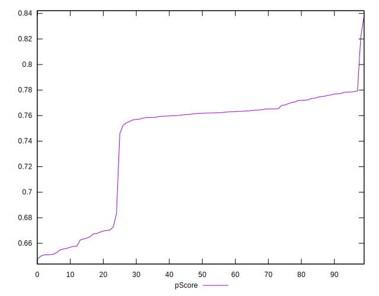
## Score Difference


```yaml
p90min: -0.004571259250826021
p90max: 0.004438866798015084
p90range: 0.009010126048841105
p90mean: -0.0003924837067768967
p90median: -0.0005635899070979278
p90stdev: 0.002500316012627235
p90skewness: 0.15951526242975198
p90eccentricity: 0.9999999999999997
p90discretization: 1
outlandishness: 0.09577606194189434
confidence: 0.0011018259365315325
p90confidence: 0.0010274301186992032

```

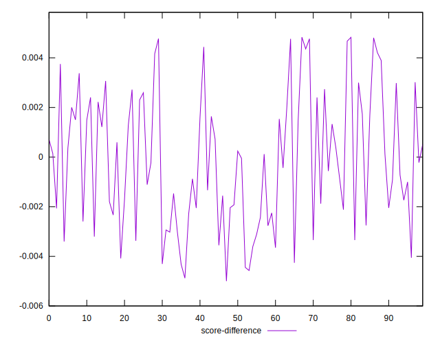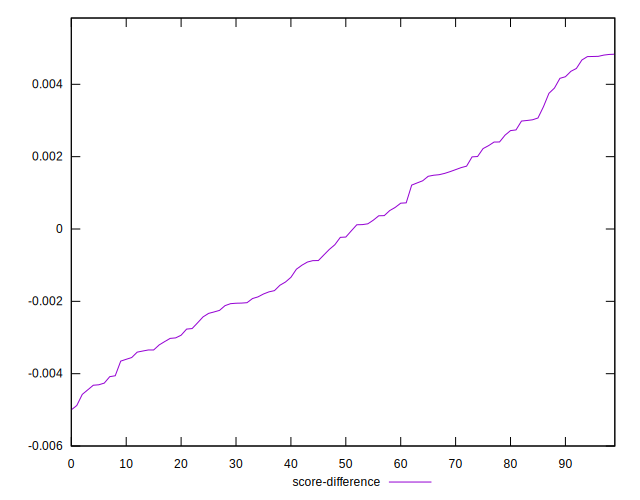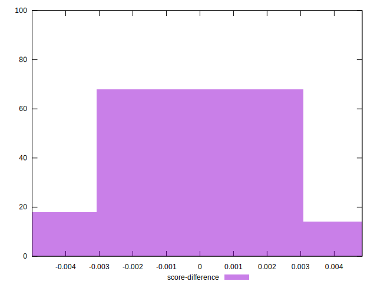
## P Score Difference


```yaml
p90min: 0
p90max: 0
p90range: 0
p90mean: 0
p90median: 0
p90stdev: 0
p90skewness: .nan
p90eccentricity: .nan
p90discretization: 91
outlandishness: .nan
confidence: 0
p90confidence: 0

```

