# //speed-index/samples/pages+cached

[→ Parent](../..)


## Raw


```yaml
p90min: 4185.297575146969
p90max: 4906.536446078288
p90range: 721.2388709313182
p90mean: 4377.55989609782
p90median: 4253.485344472458
p90stdev: 253.6723897941683
p90skewness: 1.3415847393734117
p90eccentricity: 1.0000000000000004
p90discretization: 1
outlandishness: 1.0309832985568559
confidence: 130.91917292545077
p90confidence: 104.23908507591841

```

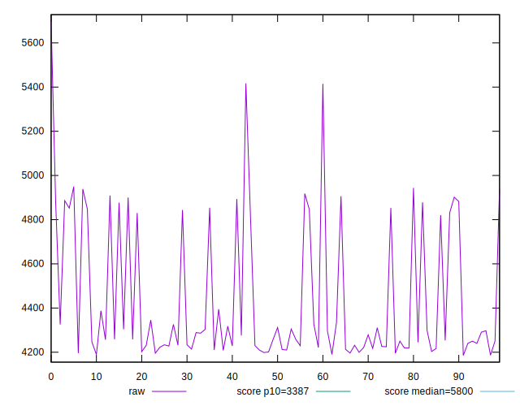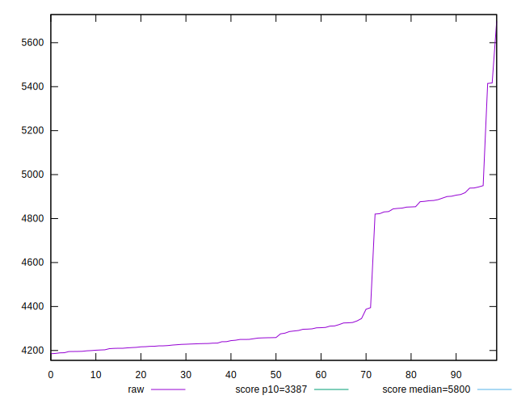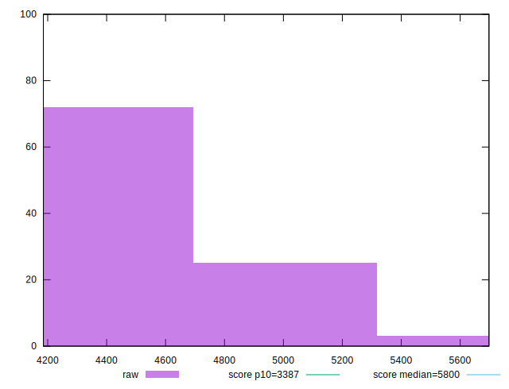
## Score


```yaml
p90min: 0.654890920913918
p90max: 0.7815227336199034
p90range: 0.12663181270598545
p90mean: 0.7481051512059675
p90median: 0.769999026634016
p90stdev: 0.04460288363703897
p90skewness: -1.347676260070554
p90eccentricity: 1.0000000000000002
p90discretization: 1
outlandishness: 0.9685579700374084
confidence: 0.02303167462241351
p90confidence: 0.018328221632023745

```

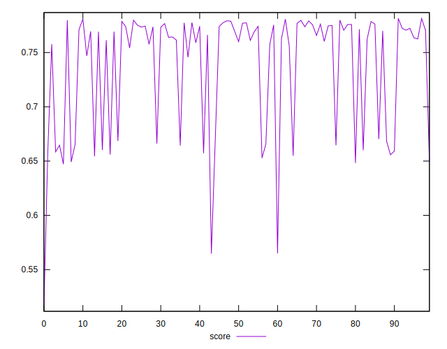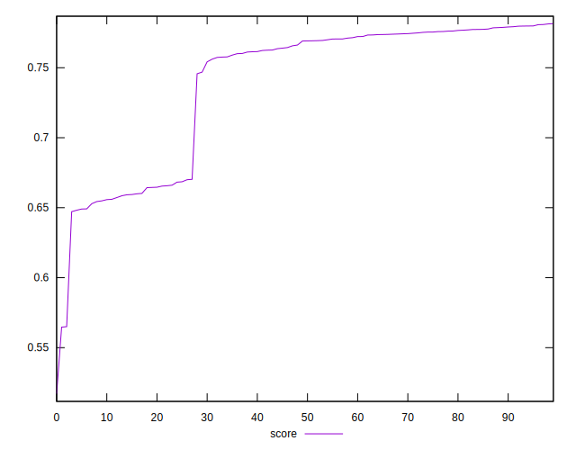
## Raw Estimate

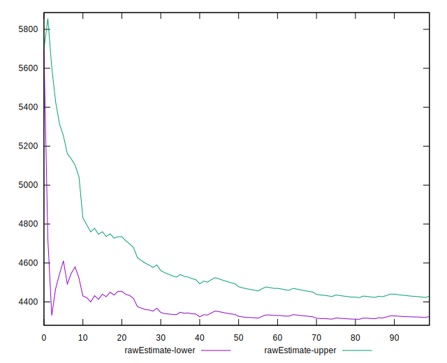
## Score Estimate

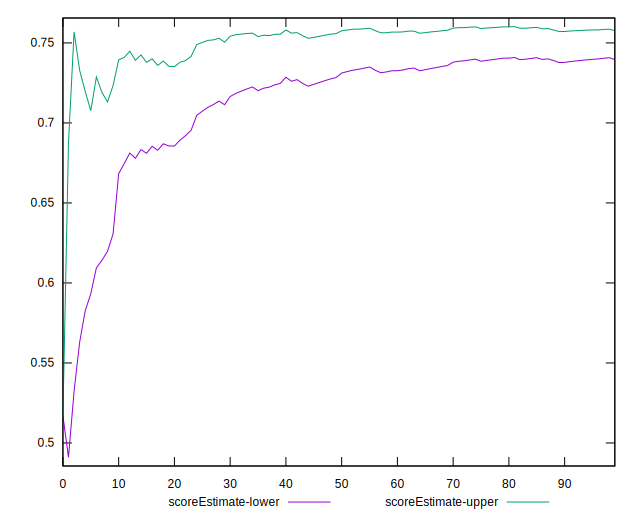
## P Score


```yaml
p90min: 0.654890920913918
p90max: 0.7815227336199034
p90range: 0.12663181270598545
p90mean: 0.7481051512059675
p90median: 0.769999026634016
p90stdev: 0.04460288363703897
p90skewness: -1.347676260070554
p90eccentricity: 1.0000000000000002
p90discretization: 1
outlandishness: 0.9685579700374084
confidence: 0.02303167462241351
p90confidence: 0.018328221632023745

```

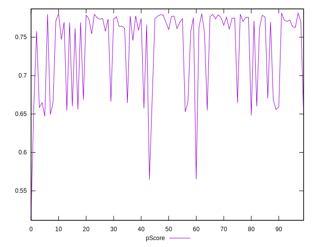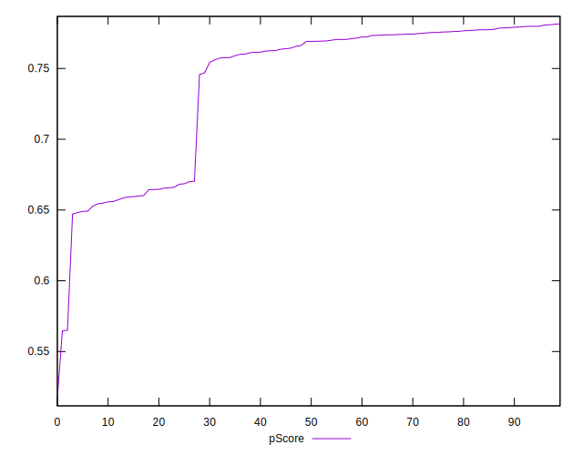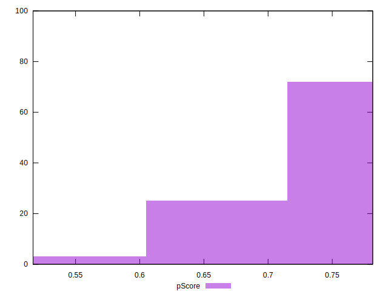
## Score Difference


```yaml
p90min: -0.0043845388041448
p90max: 0.0045620684637746045
p90range: 0.008946607267919404
p90mean: 0.00041641752978464636
p90median: 0.0006572432298406206
p90stdev: 0.00267048203126774
p90skewness: -0.22123875947869026
p90eccentricity: 1.0000000000000002
p90discretization: 1
outlandishness: 0.12932445565201237
confidence: 0.0011507204200634708
p90confidence: 0.0010973547569638987

```

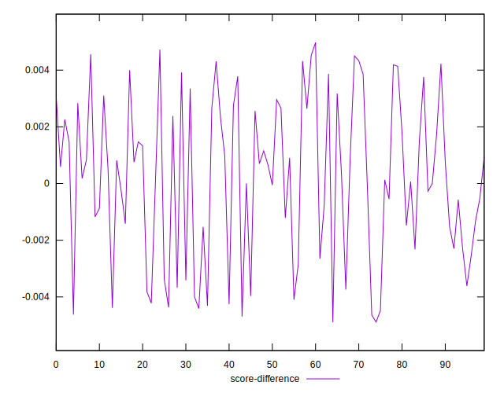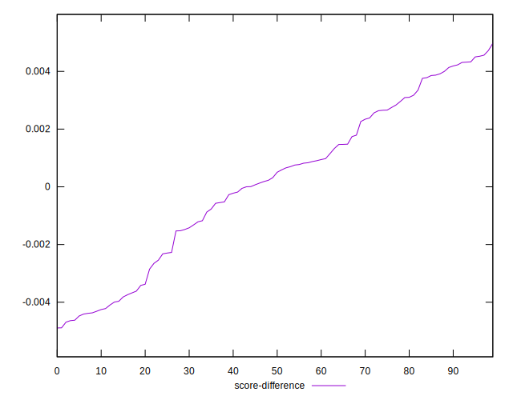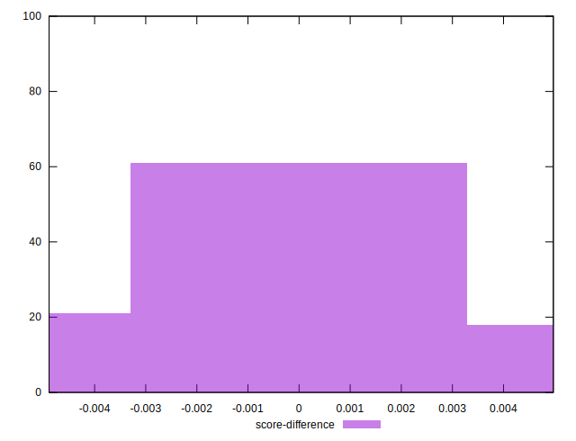
## P Score Difference


```yaml
p90min: 0
p90max: 0
p90range: 0
p90mean: 0
p90median: 0
p90stdev: 0
p90skewness: .nan
p90eccentricity: .nan
p90discretization: 91
outlandishness: .nan
confidence: 0
p90confidence: 0

```

