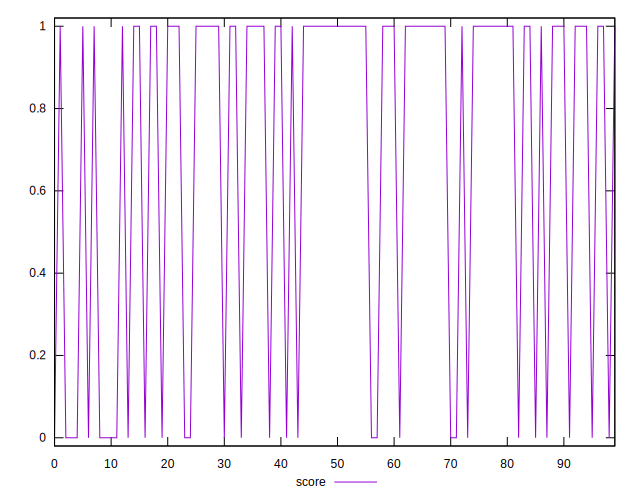
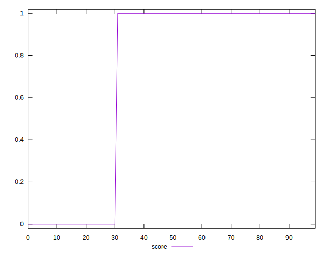
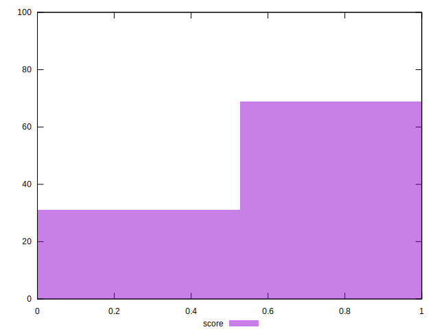

# //third-party-summary/samples/pages+cached+nointeractive

[→ Parent](../..)


## Raw


```yaml
p90range: 0
confidence: .nan
p90confidence: .nan

```


## Score


```yaml
p90min: 0
p90max: 1
p90range: 1
p90mean: 0.7582417582417582
p90median: 1
p90stdev: 0.4281485656874322
p90skewness: -1.2063184554974609
p90eccentricity: 0.9999999999999992
p90discretization: 45.5
outlandishness: 0.8280999999999998
confidence: 0.18129401995062855
p90confidence: 0.17593485361192807

```

