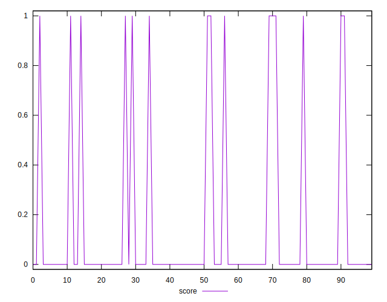
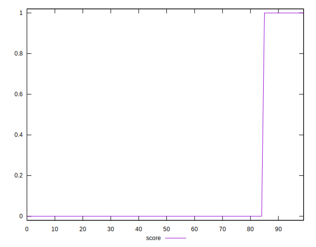

# //third-party-summary/samples/pages

[→ Parent](../..)


## Raw


```yaml
p90range: 0
confidence: .nan
p90confidence: .nan

```


## Score


```yaml
p90min: 0
p90max: 1
p90range: 1
p90mean: 0.06593406593406594
p90median: 0
p90stdev: 0.24816680858541149
p90skewness: 3.4981787978833734
p90eccentricity: 0.9999999999999992
p90discretization: 45.5
outlandishness: 5.175624999999999
confidence: 0.1399694251811448
p90confidence: 0.10197673106696417

```

