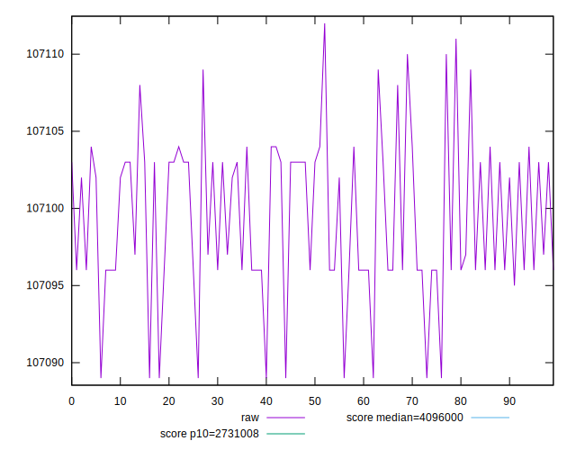
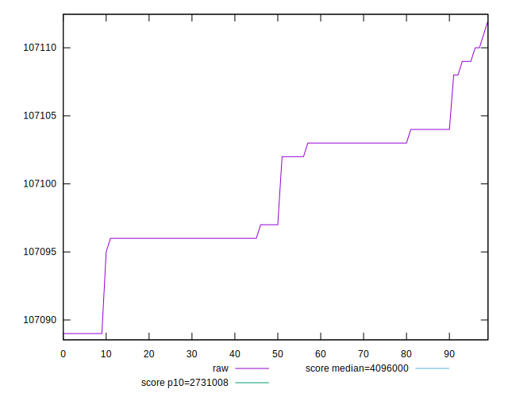
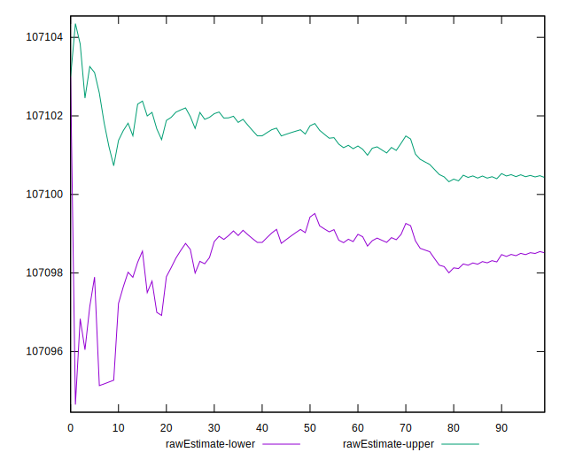
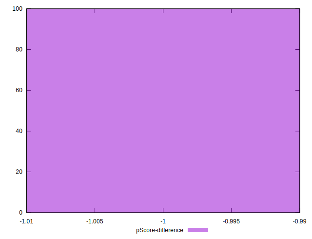

# //total-byte-weight/samples/pages+cached+noexternal+nofonts+nosvg+noimg

[→ Parent](../..)


## Raw


```yaml
p90min: 107089
p90max: 107109
p90range: 20
p90mean: 107099.47252747252
p90median: 107097
p90stdev: 4.66537552365485
p90skewness: -0.15803915845422173
p90eccentricity: 1.0000000000000004
p90discretization: 10.11111111111111
outlandishness: 0.9999986456058793
confidence: 2.161299129220424
p90confidence: 1.917096600518562

```


## Score


```yaml
p90min: 1
p90max: 1
p90range: 0
p90mean: 1
p90median: 1
p90stdev: 0
p90skewness: .nan
p90eccentricity: .nan
p90discretization: 91
outlandishness: 1
confidence: 0
p90confidence: 0

```


## Raw Estimate


## Score Estimate


## P Score


```yaml
p90min: 0
p90max: 0
p90range: 0
p90mean: 0
p90median: 0
p90stdev: 0
p90skewness: .nan
p90eccentricity: .nan
p90discretization: 91
outlandishness: .nan
confidence: 0
p90confidence: 0

```


## Score Difference


```yaml
p90min: -1
p90max: -1
p90range: 0
p90mean: -1
p90median: -1
p90stdev: 0
p90skewness: .nan
p90eccentricity: .nan
p90discretization: 91
outlandishness: 1
confidence: 0
p90confidence: 0

```


## P Score Difference


```yaml
p90min: -1
p90max: -1
p90range: 0
p90mean: -1
p90median: -1
p90stdev: 0
p90skewness: .nan
p90eccentricity: .nan
p90discretization: 91
outlandishness: 1
confidence: 0
p90confidence: 0

```

