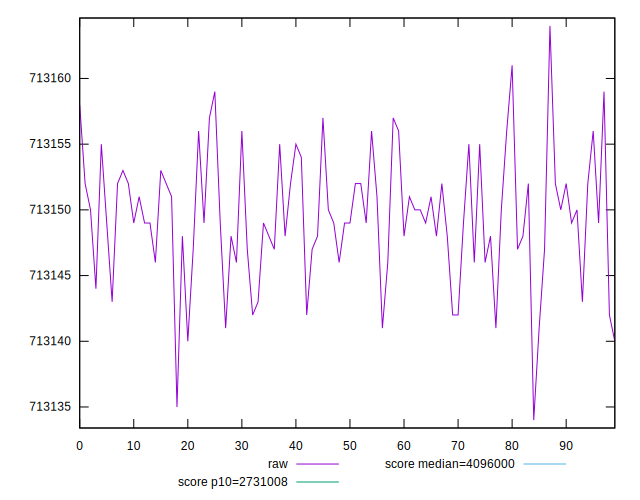
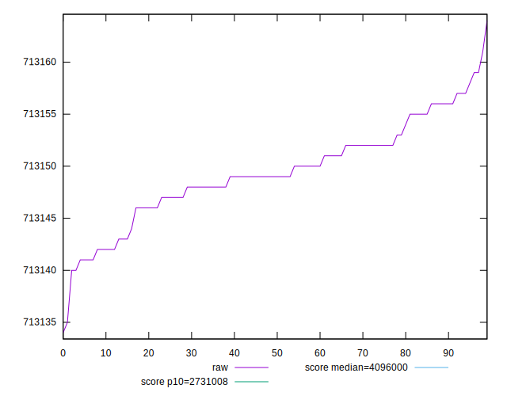
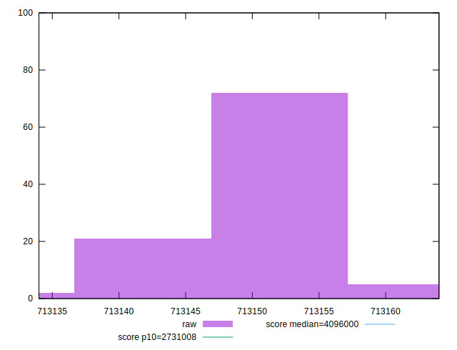
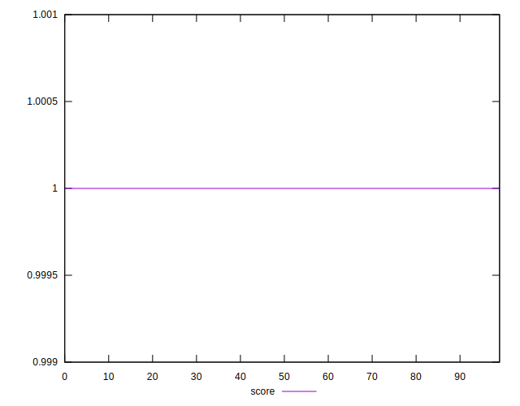
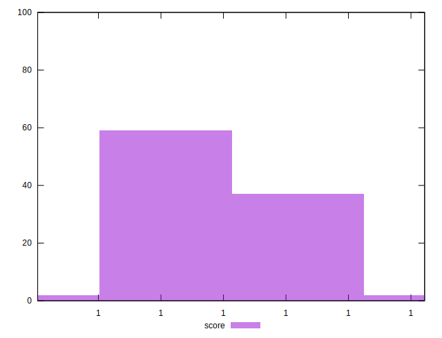
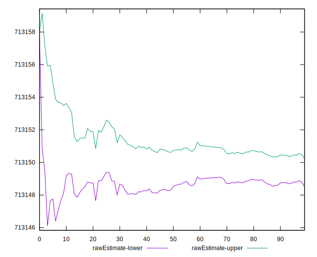
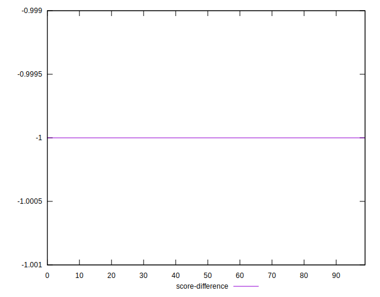
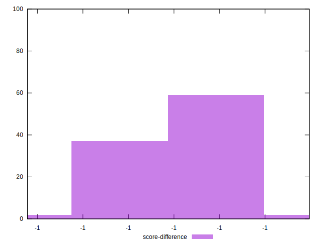
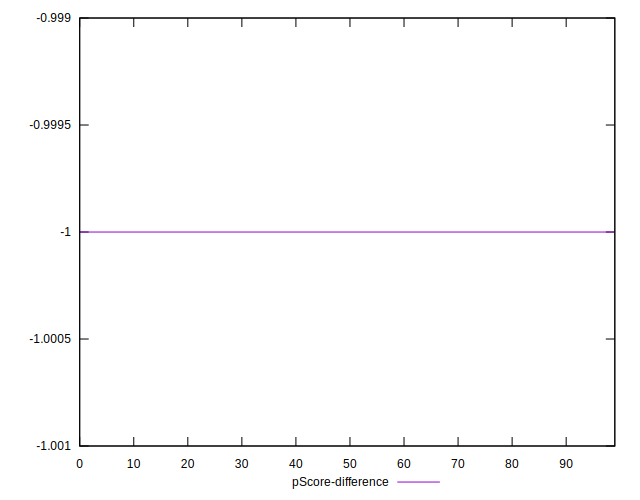

# //total-byte-weight/samples/pages+cached+noexternal+noimg

[→ Parent](../..)


## Raw


```yaml
p90min: 713141
p90max: 713157
p90range: 16
p90mean: 713149.3516483516
p90median: 713149
p90stdev: 4.1519851636801866
p90skewness: -0.17147673103082972
p90eccentricity: 0.9999999999999981
p90discretization: 5.6875
outlandishness: 1.000000163644966
confidence: 2.072819214547053
p90confidence: 1.7061341798398644

```


## Score


```yaml
p90min: 0.999999983652945
p90max: 0.9999999836595479
p90range: 6.602940416655656e-12
p90mean: 0.9999999836561018
p90median: 0.9999999836562466
p90stdev: 1.7134606770243196e-12
p90skewness: 0.17093245972902954
p90eccentricity: 1.0000000190537668
p90discretization: 5.6875
outlandishness: 0.9999999999999518
confidence: 8.553158181712206e-13
p90confidence: 7.041034422172743e-13

```


## Raw Estimate


## Score Estimate


## P Score


```yaml
p90min: 0
p90max: 0
p90range: 0
p90mean: 0
p90median: 0
p90stdev: 0
p90skewness: .nan
p90eccentricity: .nan
p90discretization: 91
outlandishness: .nan
confidence: 0
p90confidence: 0

```


## Score Difference


```yaml
p90min: -0.9999999836595479
p90max: -0.999999983652945
p90range: 6.602940416655656e-12
p90mean: -0.9999999836561018
p90median: -0.9999999836562466
p90stdev: 1.7134606770243196e-12
p90skewness: -0.17093245972902954
p90eccentricity: 1.0000000190537668
p90discretization: 5.6875
outlandishness: 0.9999999999999518
confidence: 8.553158181712206e-13
p90confidence: 7.041034422172743e-13

```


## P Score Difference


```yaml
p90min: -0.9999999836595479
p90max: -0.999999983652945
p90range: 6.602940416655656e-12
p90mean: -0.9999999836561018
p90median: -0.9999999836562466
p90stdev: 1.7134606770243196e-12
p90skewness: -0.17093245972902954
p90eccentricity: 1.0000000190537668
p90discretization: 5.6875
outlandishness: 0.9999999999999518
confidence: 8.553158181712206e-13
p90confidence: 7.041034422172743e-13

```

