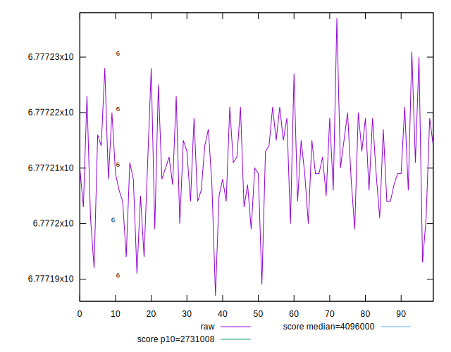
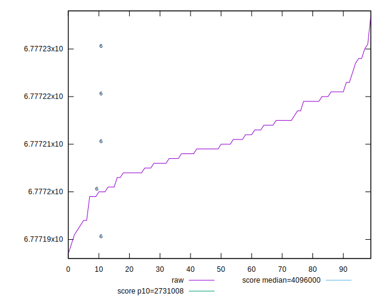
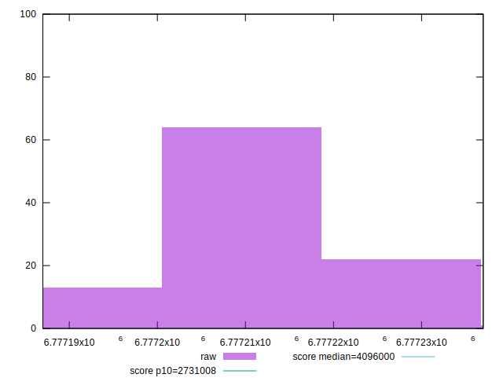
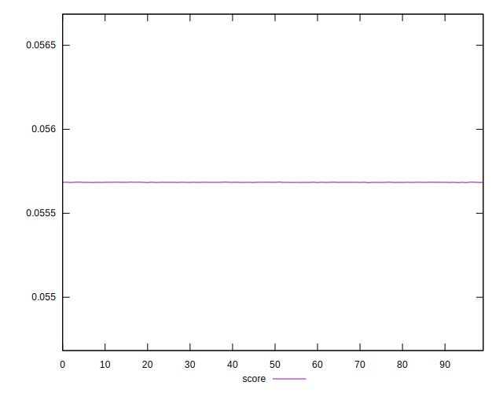
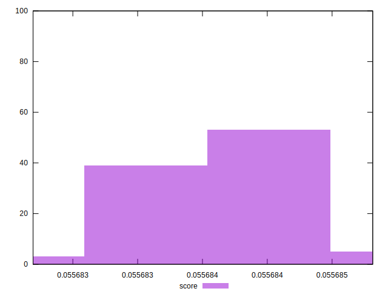
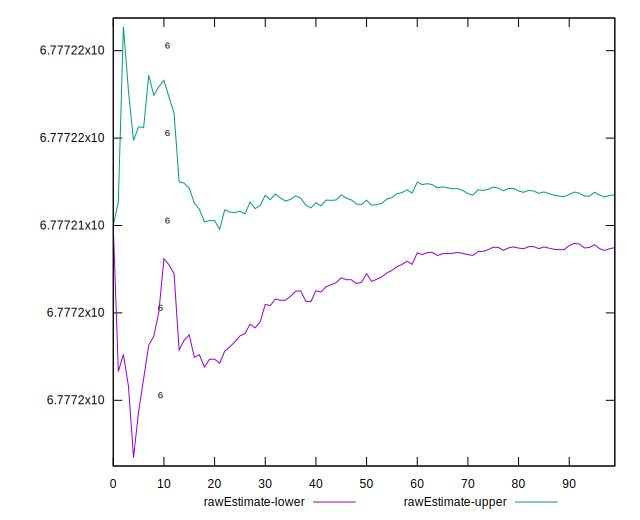
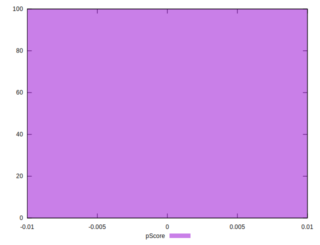
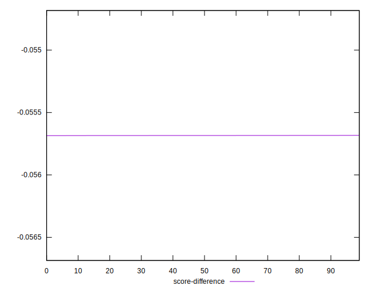
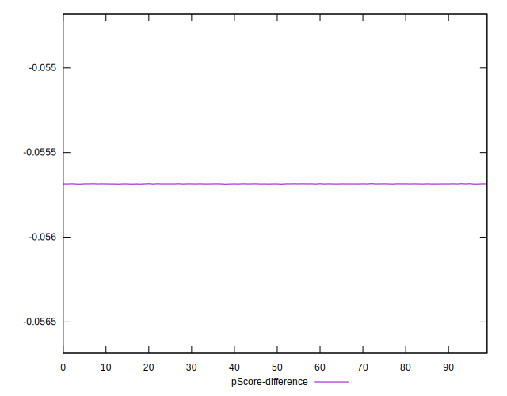
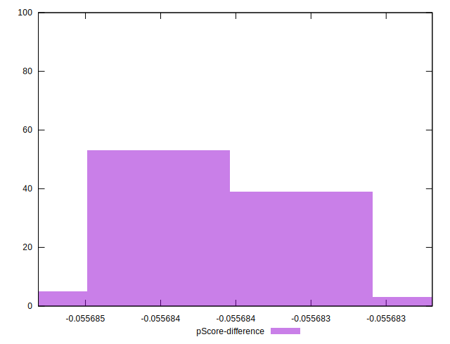

# //total-byte-weight/samples/pages+cached+noexternal

[→ Parent](../..)


## Raw


```yaml
p90min: 6777193
p90max: 6777227
p90range: 34
p90mean: 6777210.241758241
p90median: 6777209
p90stdev: 7.341498274098137
p90skewness: -0.0045692221780292515
p90eccentricity: 0.9999999999999996
p90discretization: 3.5
outlandishness: 1.0000000614535347
confidence: 3.6694273818284273
p90confidence: 3.016769241541624

```


## Score


```yaml
p90min: 0.05568321724855607
p90max: 0.05568499902455498
p90range: 0.0000017817759989102733
p90mean: 0.0556840954616892
p90median: 0.05568416053501363
p90stdev: 3.8473243531213325e-7
p90skewness: 0.004584232524423718
p90eccentricity: 0.9999999999999999
p90discretization: 3.5
outlandishness: 0.9999996080692439
confidence: 1.9229685330190982e-7
p90confidence: 1.580942927542628e-7

```


## Raw Estimate


## Score Estimate


## P Score


```yaml
p90min: 0
p90max: 0
p90range: 0
p90mean: 0
p90median: 0
p90stdev: 0
p90skewness: .nan
p90eccentricity: .nan
p90discretization: 91
outlandishness: .nan
confidence: 0
p90confidence: 0

```


## Score Difference


```yaml
p90min: -0.05568499902455498
p90max: -0.05568321724855607
p90range: 0.0000017817759989102733
p90mean: -0.0556840954616892
p90median: -0.05568416053501363
p90stdev: 3.8473243531213325e-7
p90skewness: -0.004584232524423718
p90eccentricity: 0.9999999999999999
p90discretization: 3.5
outlandishness: 0.9999996080692439
confidence: 1.9229685330190982e-7
p90confidence: 1.580942927542628e-7

```


## P Score Difference


```yaml
p90min: -0.05568499902455498
p90max: -0.05568321724855607
p90range: 0.0000017817759989102733
p90mean: -0.0556840954616892
p90median: -0.05568416053501363
p90stdev: 3.8473243531213325e-7
p90skewness: -0.004584232524423718
p90eccentricity: 0.9999999999999999
p90discretization: 3.5
outlandishness: 0.9999996080692439
confidence: 1.9229685330190982e-7
p90confidence: 1.580942927542628e-7

```

