# //total-byte-weight/samples/pages

[→ Parent](../..)


## Raw


```yaml
p90min: 7947933
p90max: 7948029
p90range: 96
p90mean: 7947988.659340659
p90median: 7947988
p90stdev: 27.884069176699892
p90skewness: -0.14252462329136922
p90eccentricity: 0.9999999999999993
p90discretization: 3.033333333333333
outlandishness: 0.9688769636094733
confidence: 342137.60496156104
p90confidence: 11.45812463760376

```

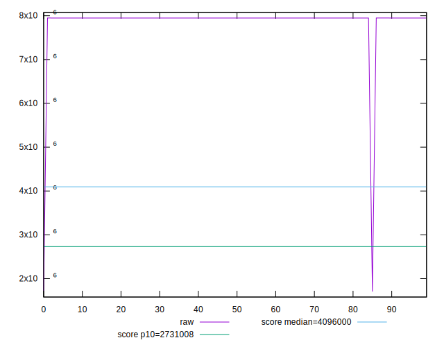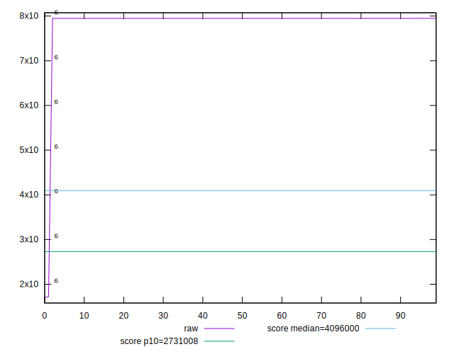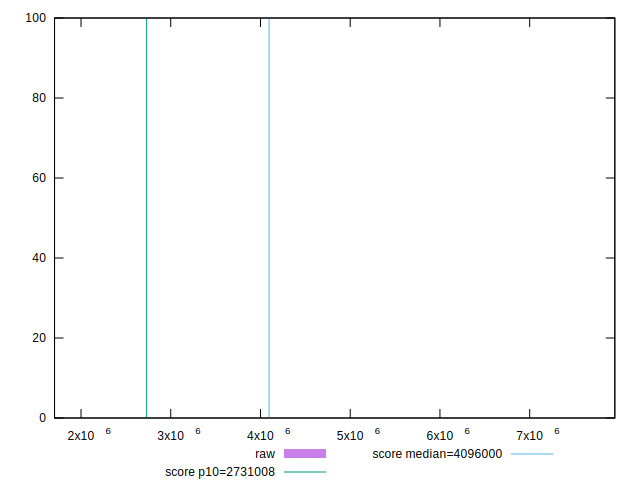
## Score


```yaml
p90min: 0.0180449262864667
p90max: 0.01804662047793304
p90range: 0.000001694191466339312
p90mean: 0.018045638199046945
p90median: 0.018045649828312194
p90stdev: 4.92090572021414e-7
p90skewness: 0.14254976022447216
p90eccentricity: 1.0000000000000002
p90discretization: 3.033333333333333
outlandishness: 4.347308270823146
confidence: 0.0537275290180511
p90confidence: 2.0220990957359186e-7

```

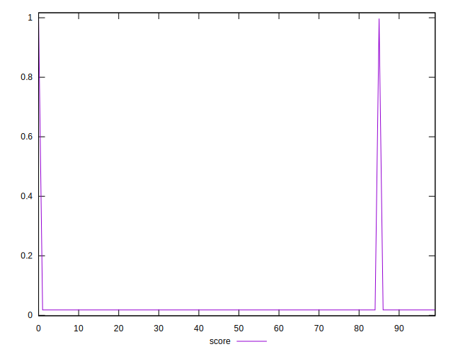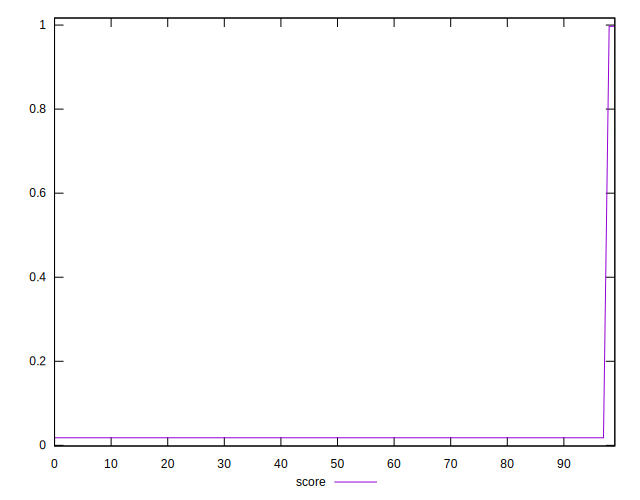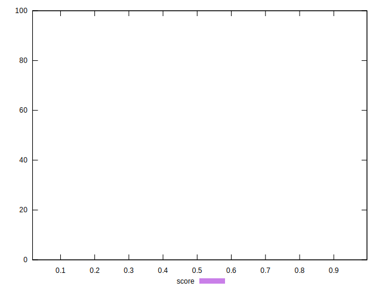
## Raw Estimate

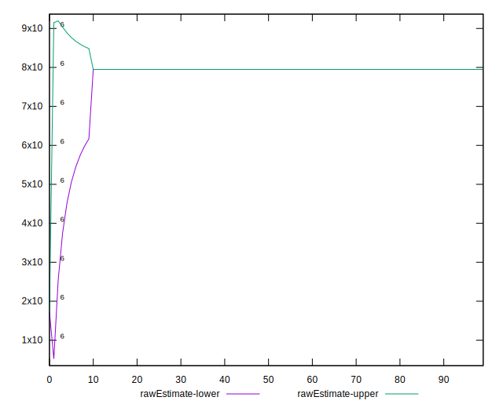
## Score Estimate


## P Score


```yaml
p90min: 0
p90max: 0
p90range: 0
p90mean: 0
p90median: 0
p90stdev: 0
p90skewness: .nan
p90eccentricity: .nan
p90discretization: 91
outlandishness: .nan
confidence: 0
p90confidence: 0

```


## Score Difference


```yaml
p90min: -0.01804662047793304
p90max: -0.0180449262864667
p90range: 0.000001694191466339312
p90mean: -0.018045638199046945
p90median: -0.018045649828312194
p90stdev: 4.92090572021414e-7
p90skewness: -0.14254976022447216
p90eccentricity: 1.0000000000000002
p90discretization: 3.033333333333333
outlandishness: 4.347308270823146
confidence: 0.05372752901805111
p90confidence: 2.0220990957359186e-7

```

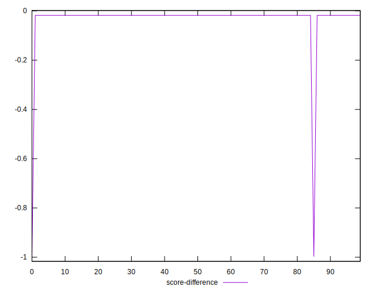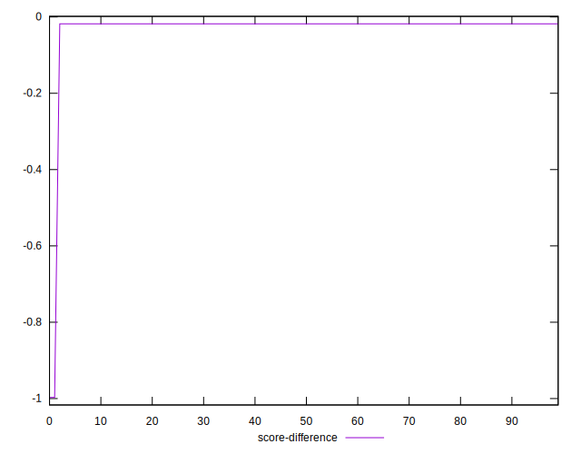
## P Score Difference


```yaml
p90min: -0.01804662047793304
p90max: -0.0180449262864667
p90range: 0.000001694191466339312
p90mean: -0.018045638199046945
p90median: -0.018045649828312194
p90stdev: 4.92090572021414e-7
p90skewness: -0.14254976022447216
p90eccentricity: 1.0000000000000002
p90discretization: 3.033333333333333
outlandishness: 4.347308270823146
confidence: 0.05372752901805111
p90confidence: 2.0220990957359186e-7

```

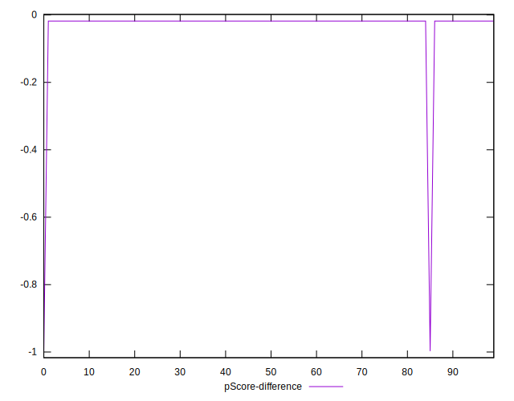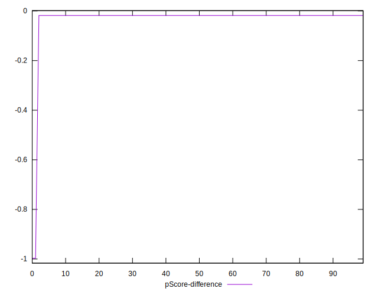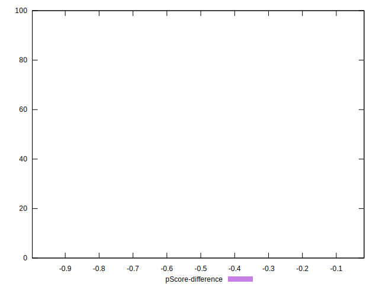