# //unused-javascript/samples/pages+cached

[→ Parent](../..)


## Raw


```yaml
p90min: 4550
p90max: 4560
p90range: 10
p90mean: 4558.021978021978
p90median: 4560
p90stdev: 3.9834217495366766
p90skewness: -1.5172774624374274
p90eccentricity: 0.9999999999999967
p90discretization: 45.5
outlandishness: 0.9993322875905435
confidence: 8.040631315530845
p90confidence: 1.6368680839896115

```

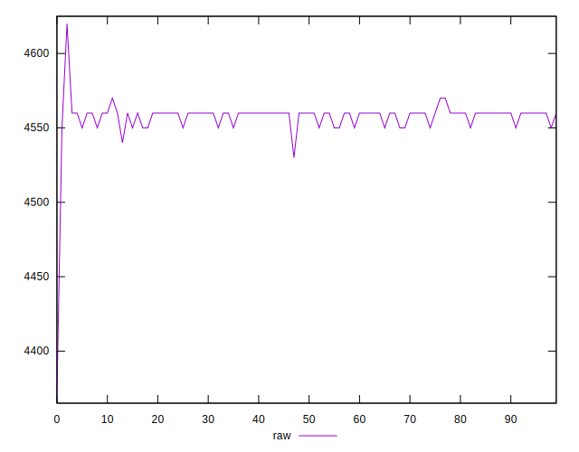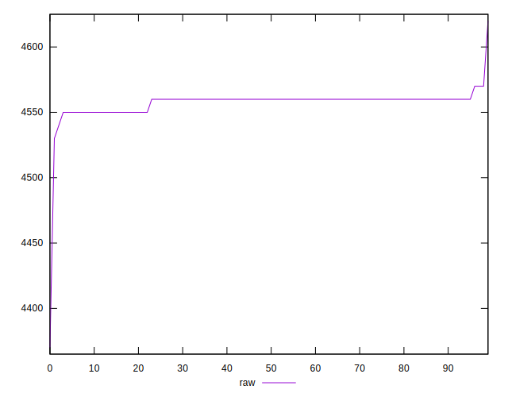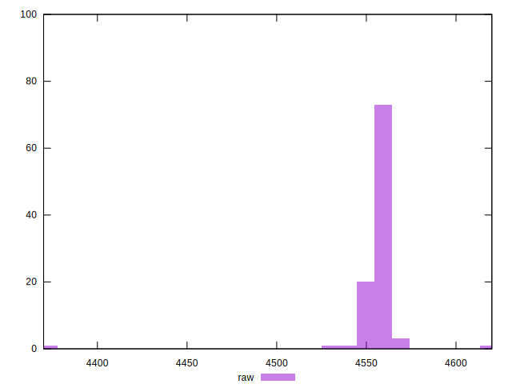
## Score


```yaml
p90min: 0.051764705882352935
p90max: 0.052941176470588214
p90range: 0.0011764705882352788
p90mean: 0.05199741435035549
p90median: 0.051764705882352935
p90stdev: 0.00046863785288666135
p90skewness: 1.517277462437827
p90eccentricity: 1.0000000000000004
p90discretization: 45.5
outlandishness: 1.006898978943756
confidence: 0.0009459566253564727
p90confidence: 0.00019257271576338109

```

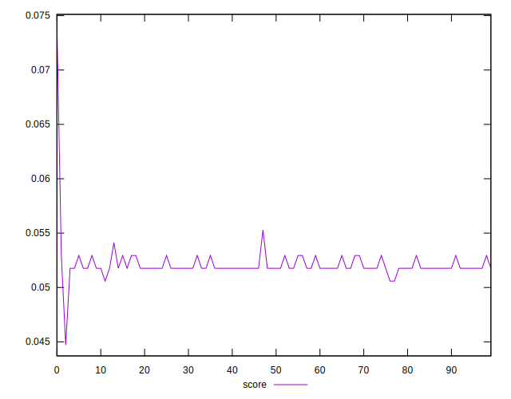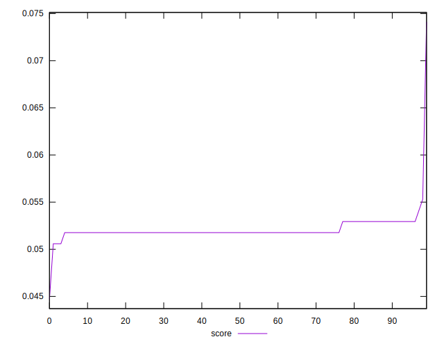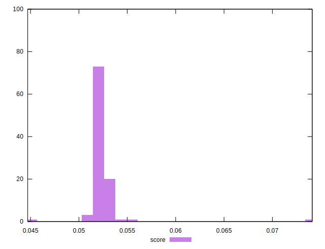
## Raw Estimate

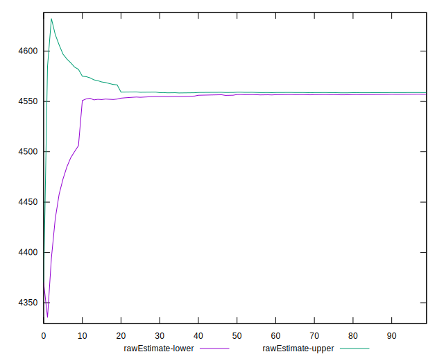
## Score Estimate

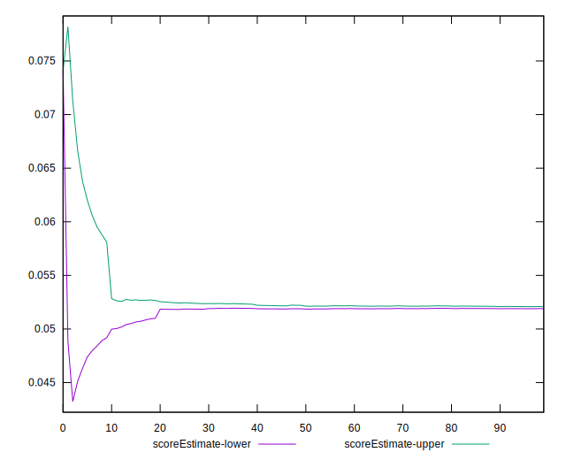
## P Score


```yaml
p90min: 0.051764705882352935
p90max: 0.052941176470588214
p90range: 0.0011764705882352788
p90mean: 0.05199741435035549
p90median: 0.051764705882352935
p90stdev: 0.00046863785288666135
p90skewness: 1.517277462437827
p90eccentricity: 1.0000000000000004
p90discretization: 45.5
outlandishness: 1.006898978943756
confidence: 0.0009459566253564727
p90confidence: 0.00019257271576338109

```

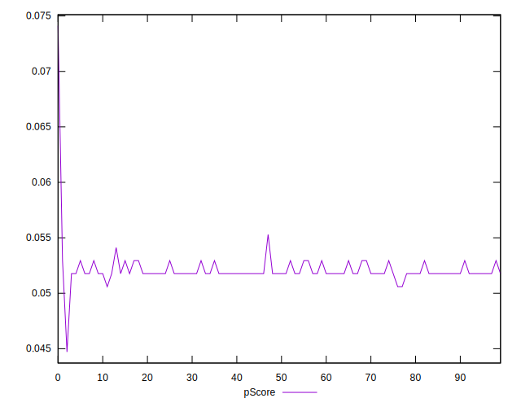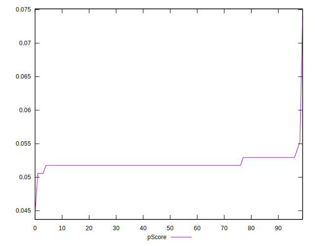
## Score Difference


```yaml
p90min: -0.002941176470588211
p90max: -0.0017647058823529321
p90range: 0.0011764705882352788
p90mean: -0.0019974143503555188
p90median: -0.0017647058823529321
p90stdev: 0.00046863785288666087
p90skewness: -1.5172774624376533
p90eccentricity: 1.0000000000000004
p90discretization: 45.5
outlandishness: 0.9791390706004339
confidence: 0.00036968303551872597
p90confidence: 0.00019257271576337588

```

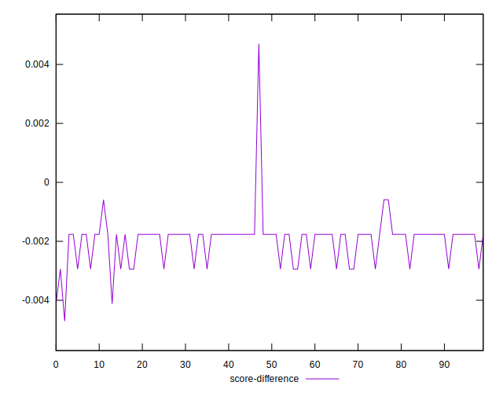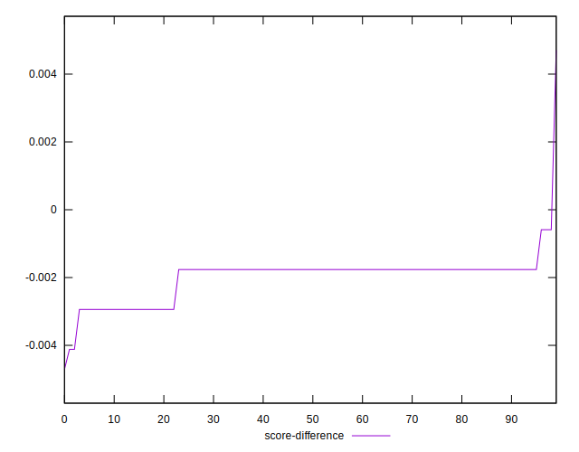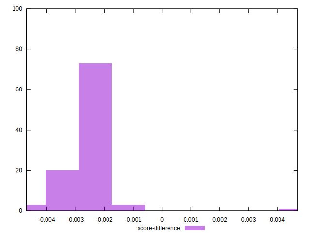
## P Score Difference


```yaml
p90min: 0
p90max: 0
p90range: 0
p90mean: 0
p90median: 0
p90stdev: 0
p90skewness: .nan
p90eccentricity: .nan
p90discretization: 91
outlandishness: .nan
confidence: 0
p90confidence: 0

```

