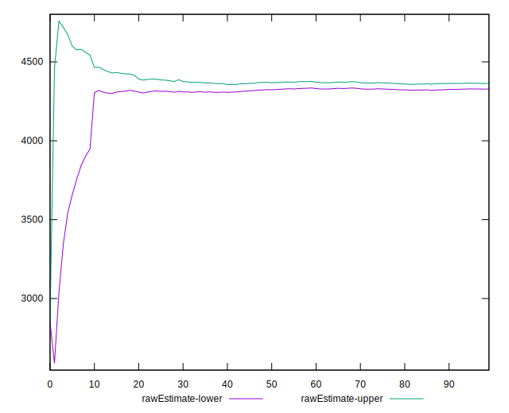

# //unused-javascript/samples/pages

[→ Parent](../..)


## Raw


```yaml
p90min: 4200
p90max: 4530
p90range: 330
p90mean: 4346.483516483517
p90median: 4360
p90stdev: 86.71506487079645
p90skewness: 0.12098165048826326
p90eccentricity: 1.0000000000000002
p90discretization: 3.64
outlandishness: 0.985748308594466
confidence: 132.19333911626018
p90confidence: 35.63296357071158

```


## Score


```yaml
p90min: 0.05529411764705883
p90max: 0.09411764705882353
p90range: 0.0388235294117647
p90mean: 0.07688429217840981
p90median: 0.07529411764705879
p90stdev: 0.010201772337740753
p90skewness: -0.12098165048826698
p90eccentricity: 1.0000000000000002
p90discretization: 3.64
outlandishness: 1.0973892391479263
confidence: 0.015552157543089529
p90confidence: 0.0041921133612601025

```


## Raw Estimate


## Score Estimate


## P Score


```yaml
p90min: 0.05529411764705883
p90max: 0.09411764705882353
p90range: 0.0388235294117647
p90mean: 0.07688429217840981
p90median: 0.07529411764705879
p90stdev: 0.010201772337740753
p90skewness: -0.12098165048826698
p90eccentricity: 1.0000000000000002
p90discretization: 3.64
outlandishness: 1.0973892391479263
confidence: 0.015552157543089529
p90confidence: 0.0041921133612601025

```


## Score Difference


```yaml
p90min: -0.0041176470588235314
p90max: 0.0047058823529412125
p90range: 0.008823529411764744
p90mean: 0.0002197802197802373
p90median: 0.0005882352941176394
p90stdev: 0.002685950523595844
p90skewness: -0.0703413470311081
p90eccentricity: 0.9999999999999999
p90discretization: 3.1379310344827585
outlandishness: 0.07163494809691734
confidence: 0.001149456027170207
p90confidence: 0.0011037110714571462

```


## P Score Difference


```yaml
p90min: 0
p90max: 0
p90range: 0
p90mean: 0
p90median: 0
p90stdev: 0
p90skewness: .nan
p90eccentricity: .nan
p90discretization: 91
outlandishness: .nan
confidence: 0
p90confidence: 0

```

