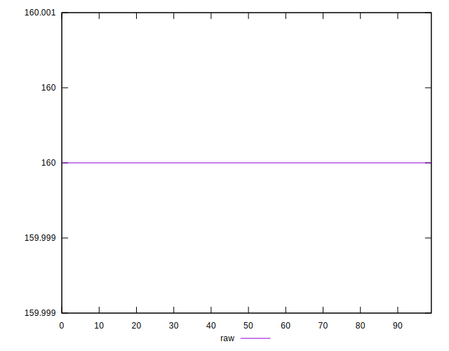
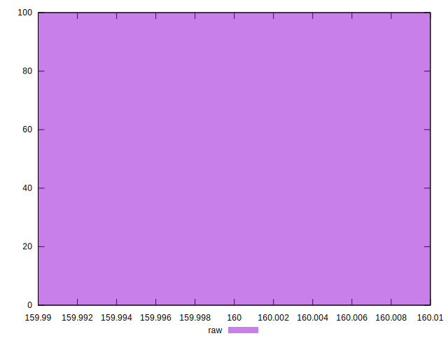
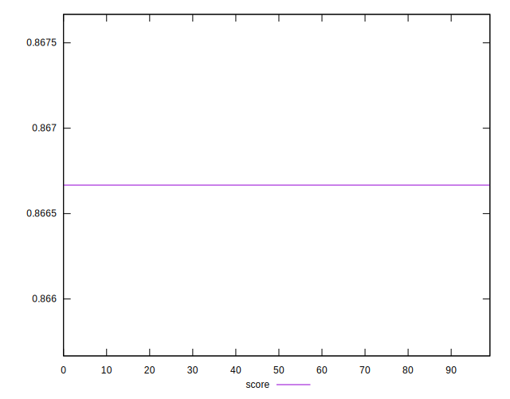
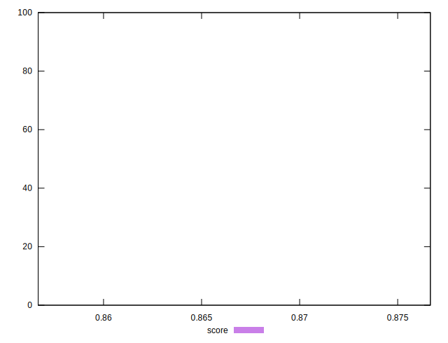
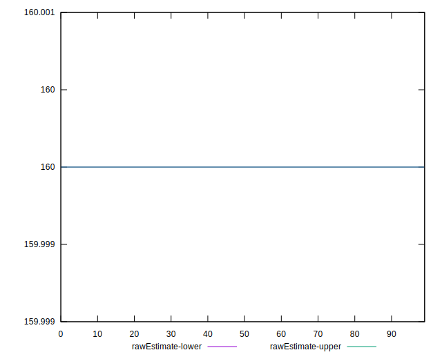
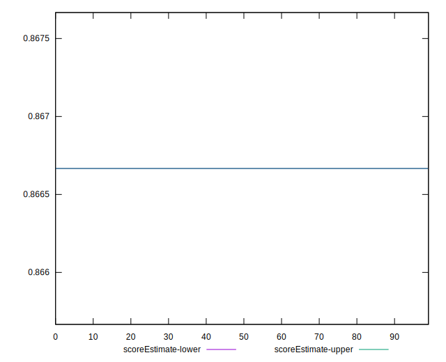
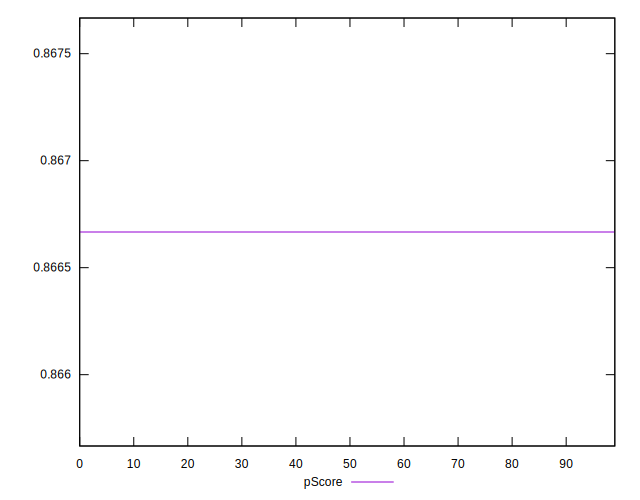
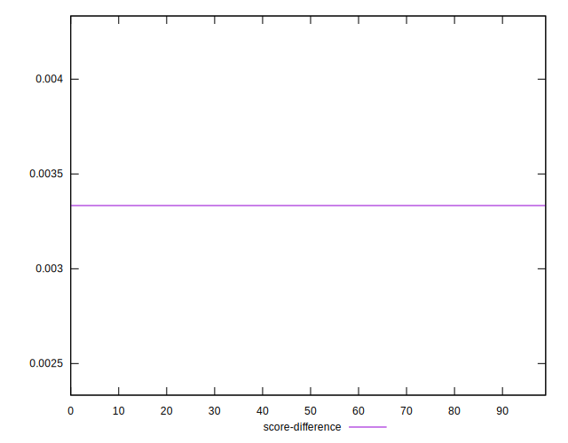
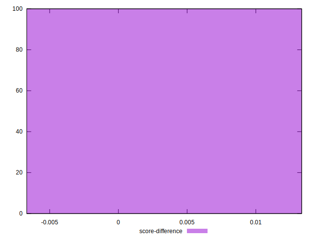

# //uses-http2/samples/pages+cached+noexternal+nofonts+nosvg+noimg+nocss

[→ Parent](../..)


## Raw


```yaml
p90min: 160
p90max: 160
p90range: 0
p90mean: 160
p90median: 160
p90stdev: 0
p90skewness: .nan
p90eccentricity: .nan
p90discretization: 91
outlandishness: 1
confidence: 0
p90confidence: 0

```


## Score


```yaml
p90min: 0.8666666666666667
p90max: 0.8666666666666667
p90range: 0
p90mean: 0.8666666666666657
p90median: 0.8666666666666667
p90stdev: 9.992007221626409e-16
p90skewness: 1
p90eccentricity: 1
p90discretization: 91
outlandishness: 0.9999999999999987
confidence: 6.661338147750939e-16
p90confidence: 4.440892098500626e-16

```


## Raw Estimate


## Score Estimate


## P Score


```yaml
p90min: 0.8666666666666667
p90max: 0.8666666666666667
p90range: 0
p90mean: 0.8666666666666657
p90median: 0.8666666666666667
p90stdev: 9.992007221626409e-16
p90skewness: 1
p90eccentricity: 1
p90discretization: 91
outlandishness: 0.9999999999999987
confidence: 6.661338147750939e-16
p90confidence: 4.440892098500626e-16

```


## Score Difference


```yaml
p90min: 0.0033333333333332993
p90max: 0.0033333333333332993
p90range: 0
p90mean: 0.0033333333333332993
p90median: 0.0033333333333332993
p90stdev: 0
p90skewness: .nan
p90eccentricity: .nan
p90discretization: 91
outlandishness: 1
confidence: 0
p90confidence: 0

```


## P Score Difference


```yaml
p90min: 0
p90max: 0
p90range: 0
p90mean: 0
p90median: 0
p90stdev: 0
p90skewness: .nan
p90eccentricity: .nan
p90discretization: 91
outlandishness: .nan
confidence: 0
p90confidence: 0

```

