# //uses-http2/samples/pages+cached+noexternal+noimg

[→ Parent](../..)


## Raw


```yaml
p90min: 160
p90max: 330
p90range: 170
p90mean: 281.97802197802196
p90median: 320
p90stdev: 68.15012162429434
p90skewness: -1.110107914450779
p90eccentricity: 0.9999999999999999
p90discretization: 15.166666666666666
outlandishness: 0.9236513350736201
confidence: 28.92524383902719
p90confidence: 28.004255140629198

```

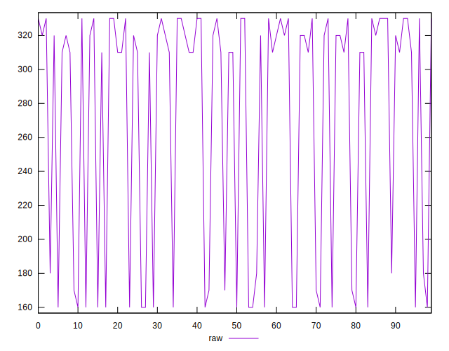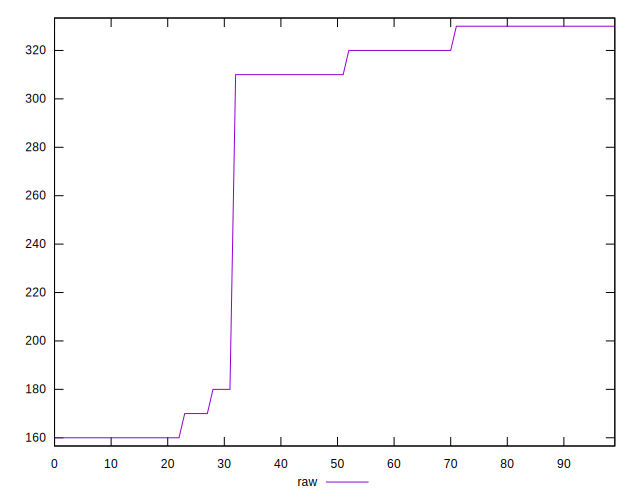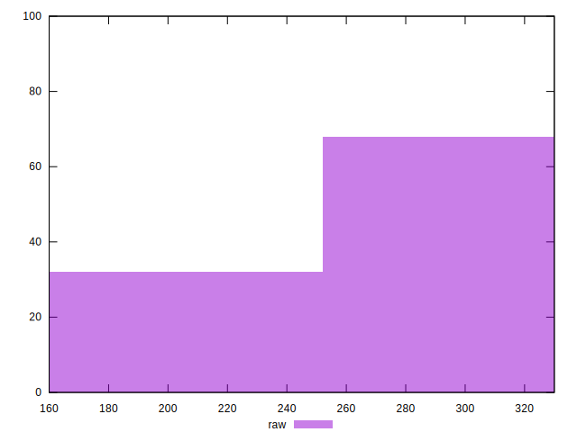
## Score


```yaml
p90min: 0.7333333333333333
p90max: 0.8666666666666667
p90range: 0.13333333333333341
p90mean: 0.7694444444444443
p90median: 0.7388888888888889
p90stdev: 0.0540501156774742
p90skewness: 1.1307512977071779
p90eccentricity: 0.9999999999999988
p90discretization: 15.166666666666666
outlandishness: 1.0228730010817295
confidence: 0.022966294290342137
p90confidence: 0.02221027921501073

```

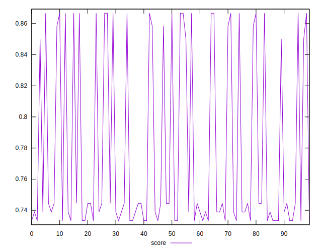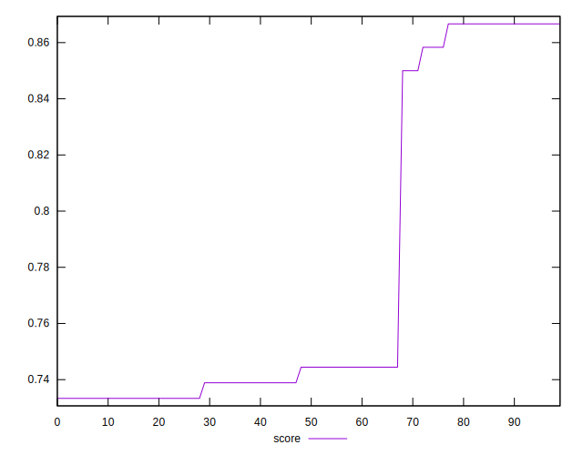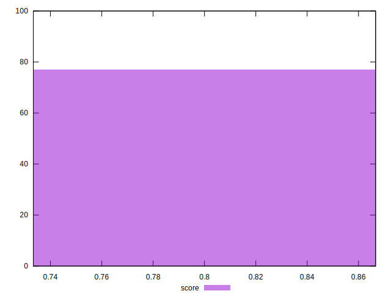
## Raw Estimate

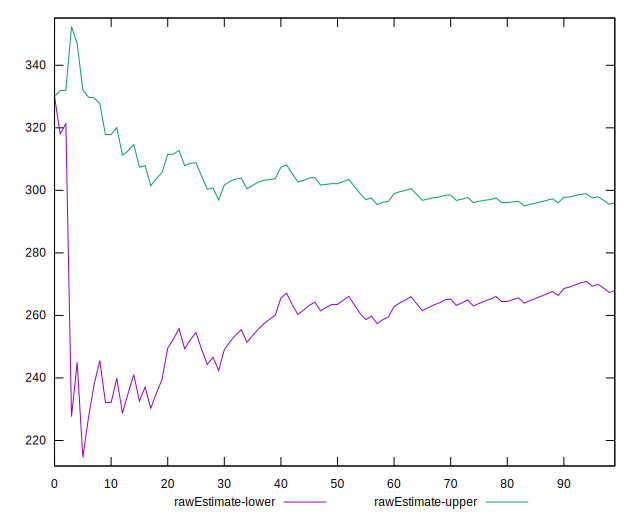
## Score Estimate

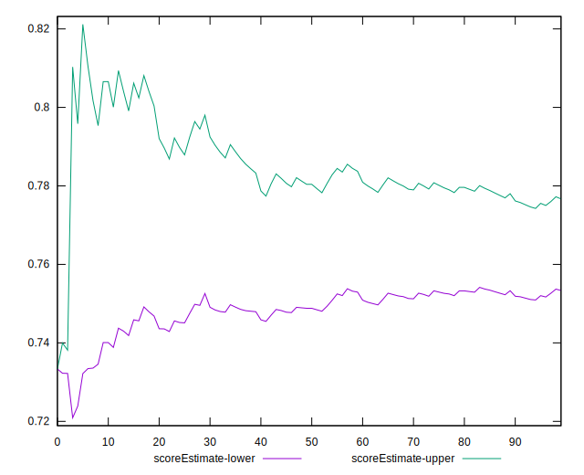
## P Score


```yaml
p90min: 0.7333333333333333
p90max: 0.8666666666666667
p90range: 0.13333333333333341
p90mean: 0.7694444444444443
p90median: 0.7388888888888889
p90stdev: 0.0540501156774742
p90skewness: 1.1307512977071779
p90eccentricity: 0.9999999999999988
p90discretization: 15.166666666666666
outlandishness: 1.0228730010817295
confidence: 0.022966294290342137
p90confidence: 0.02221027921501073

```

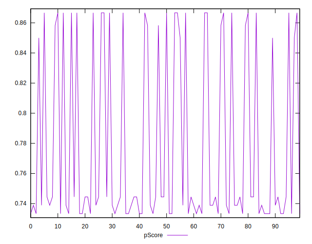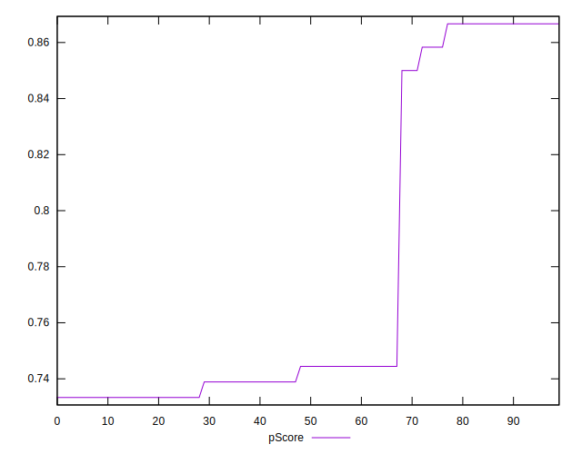
## Score Difference


```yaml
p90min: -0.004444444444444473
p90max: 0.0033333333333332993
p90range: 0.007777777777777772
p90mean: -0.0012026862026862175
p90median: -0.0033333333333332993
p90stdev: 0.002924992461512187
p90skewness: 0.30967462352758557
p90eccentricity: 0.9999999999999993
p90discretization: 15.166666666666666
outlandishness: 0.4363373676209199
confidence: 0.0012063389572335198
p90confidence: 0.0012019382097097262

```

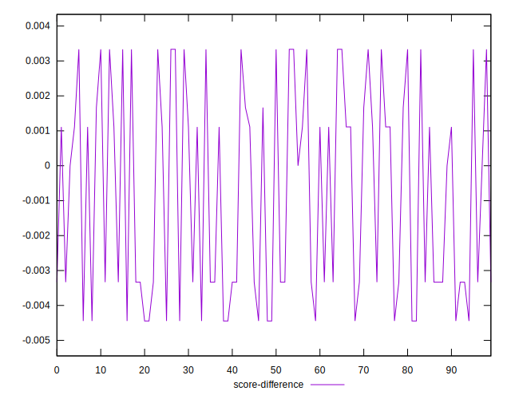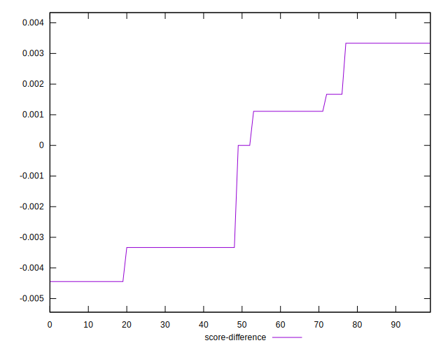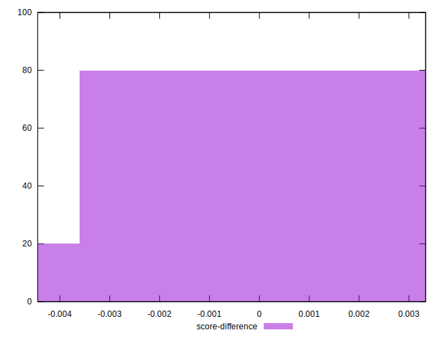
## P Score Difference


```yaml
p90min: 0
p90max: 0
p90range: 0
p90mean: 0
p90median: 0
p90stdev: 0
p90skewness: .nan
p90eccentricity: .nan
p90discretization: 91
outlandishness: .nan
confidence: 0
p90confidence: 0

```

