# //uses-http2/samples/pages+cached

[→ Parent](../..)


## Raw


```yaml
p90min: 170
p90max: 330
p90range: 160
p90mean: 181.75824175824175
p90median: 180
p90stdev: 30.583821284808618
p90skewness: 4.270242327105308
p90eccentricity: 1.0000000000000002
p90discretization: 22.75
outlandishness: 1.148655190231735
confidence: 25.40089126762433
p90confidence: 12.567507056801333

```

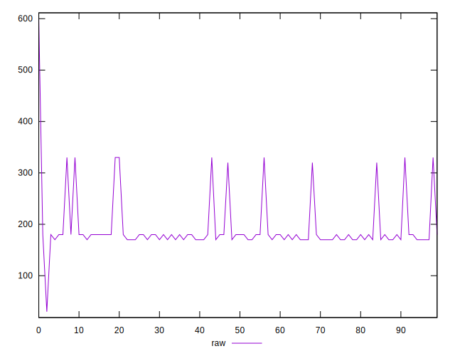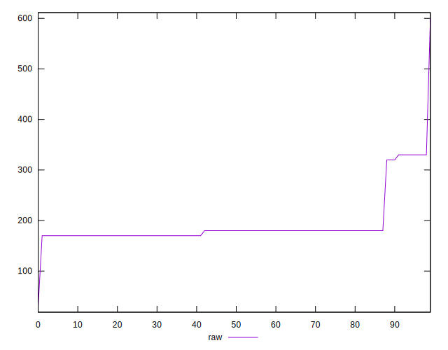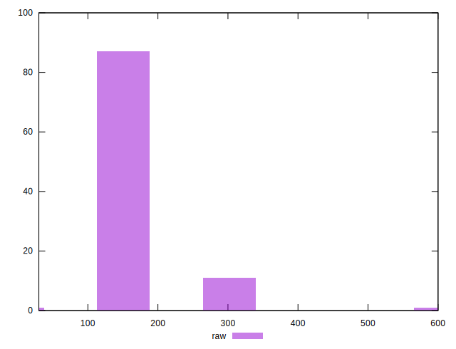
## Score


```yaml
p90min: 0.7333333333333333
p90max: 0.8583333333333334
p90range: 0.1250000000000001
p90mean: 0.8488095238095242
p90median: 0.85
p90stdev: 0.024216605445460834
p90skewness: -4.2470704053343
p90eccentricity: 0.9999999999999988
p90discretization: 22.75
outlandishness: 0.9777964462821296
confidence: 0.018557929372990722
p90confidence: 0.009951090054883815

```

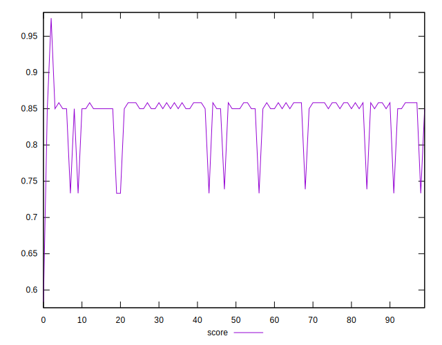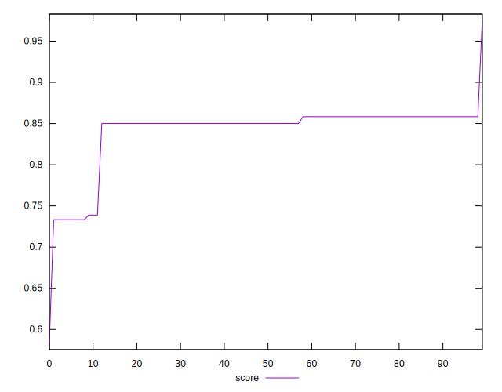
## Raw Estimate

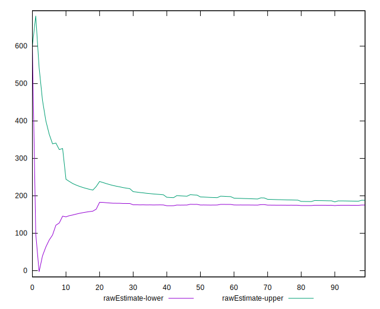
## Score Estimate

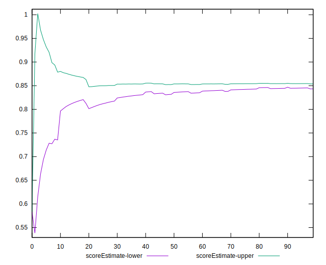
## P Score


```yaml
p90min: 0.7333333333333333
p90max: 0.8583333333333334
p90range: 0.1250000000000001
p90mean: 0.8488095238095242
p90median: 0.85
p90stdev: 0.024216605445460834
p90skewness: -4.2470704053343
p90eccentricity: 0.9999999999999988
p90discretization: 22.75
outlandishness: 0.9777964462821296
confidence: 0.018557929372990722
p90confidence: 0.009951090054883815

```

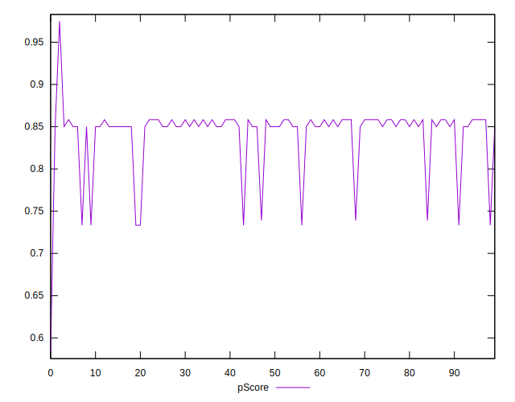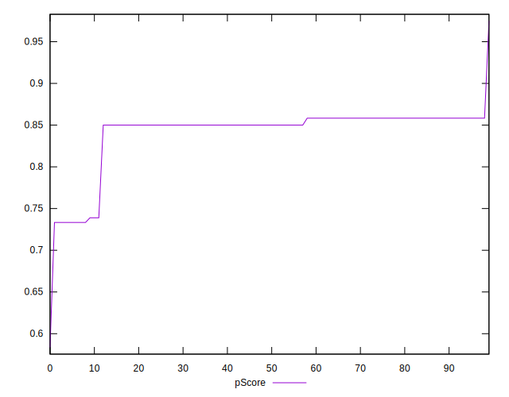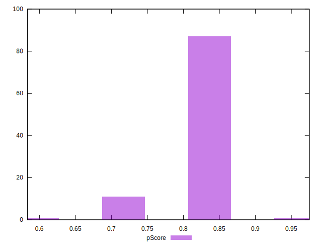
## Score Difference


```yaml
p90min: -0.0033333333333332993
p90max: 0.0016666666666665941
p90range: 0.004999999999999893
p90mean: 0.000750915750915717
p90median: 0
p90stdev: 0.0009221995171073263
p90skewness: -0.7843774691146208
p90eccentricity: 0.999999999999998
p90discretization: 22.75
outlandishness: 0.3862167757287195
confidence: 0.0005824949847373029
p90confidence: 0.0003789503224955698

```

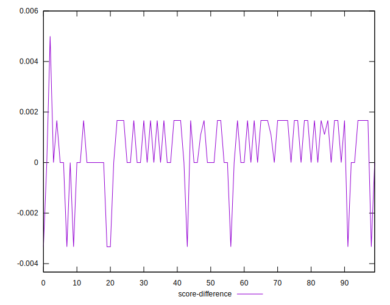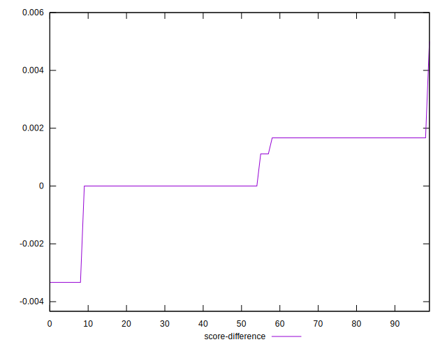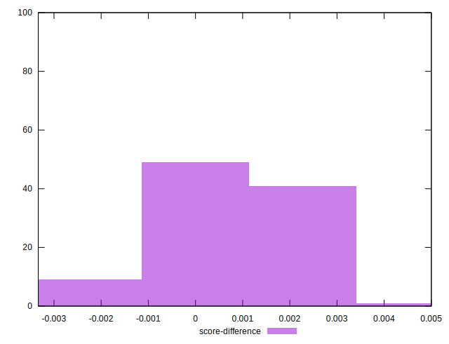
## P Score Difference


```yaml
p90min: 0
p90max: 0
p90range: 0
p90mean: 0
p90median: 0
p90stdev: 0
p90skewness: .nan
p90eccentricity: .nan
p90discretization: 91
outlandishness: .nan
confidence: 0
p90confidence: 0

```

