# //uses-long-cache-ttl/samples/pages+cached+noadtech

[→ Parent](../..)


## Raw


```yaml
p90min: 51073
p90max: 51089
p90range: 16
p90mean: 51081.604395604394
p90median: 51081
p90stdev: 4.927784248700313
p90skewness: -0.08318285002821112
p90eccentricity: 1.0000000000000013
p90discretization: 15.166666666666666
outlandishness: 1.0000060923940994
confidence: 2.297840243190876
p90confidence: 2.024925621401053

```

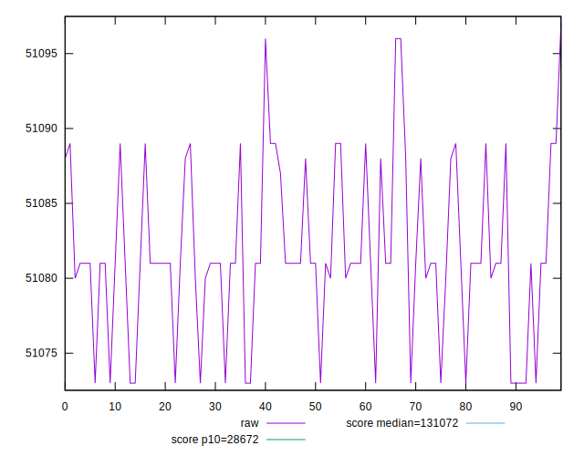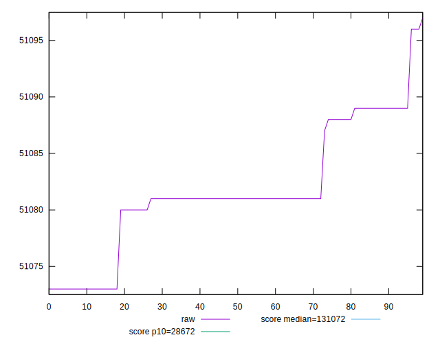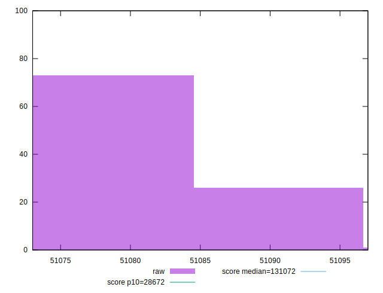
## Score


```yaml
p90min: 0.7865378232889095
p90max: 0.7866146671291339
p90range: 0.00007684384022432766
p90mean: 0.786573341843636
p90median: 0.7865762442162387
p90stdev: 0.00002366680552991839
p90skewness: 0.08325421385012757
p90eccentricity: 1.0000000000000002
p90discretization: 15.166666666666666
outlandishness: 0.9999981001963641
confidence: 0.000011035803486603157
p90confidence: 0.000009725166215890368

```

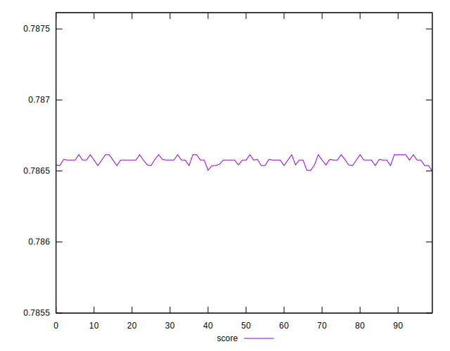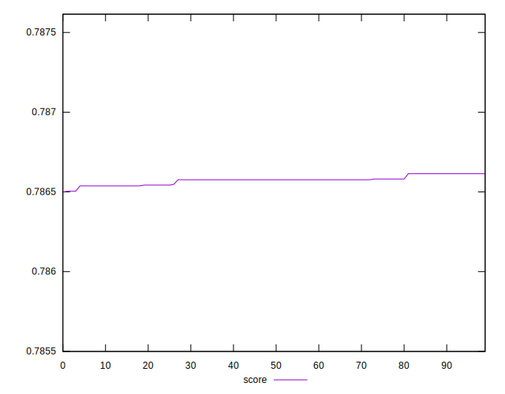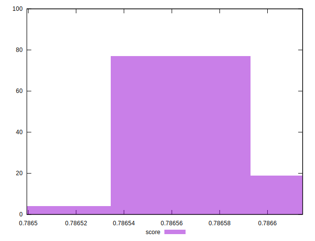
## Raw Estimate

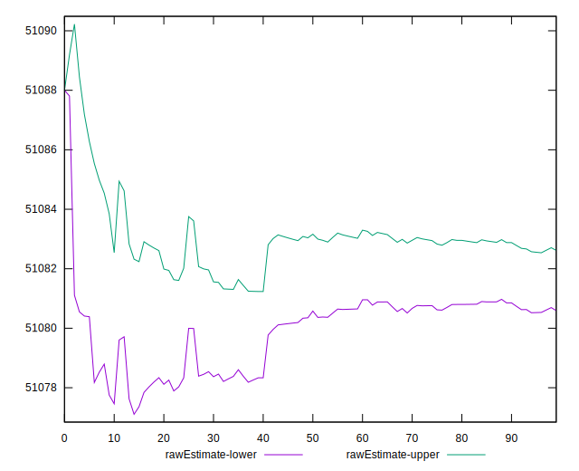
## Score Estimate

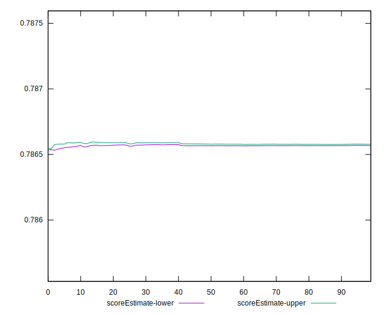
## P Score


```yaml
p90min: 0.7865378232889095
p90max: 0.7866146671291339
p90range: 0.00007684384022432766
p90mean: 0.786573341843636
p90median: 0.7865762442162387
p90stdev: 0.00002366680552991839
p90skewness: 0.08325421385012757
p90eccentricity: 1.0000000000000002
p90discretization: 15.166666666666666
outlandishness: 0.9999981001963641
confidence: 0.000011035803486603157
p90confidence: 0.000009725166215890368

```

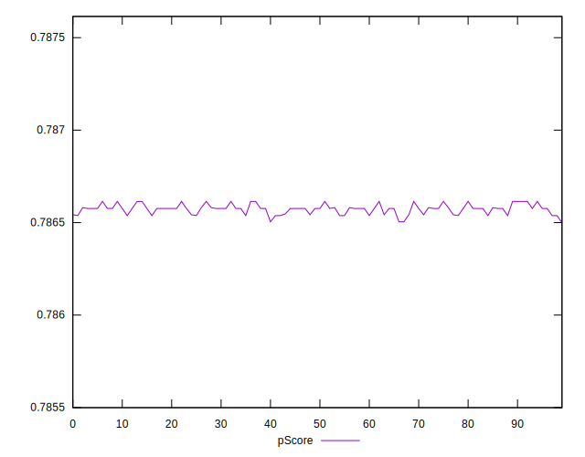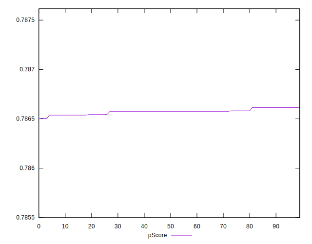
## Score Difference


```yaml
p90min: 0.0033853328708661756
p90max: 0.0034621767110905033
p90range: 0.00007684384022432766
p90mean: 0.0034266581563642093
p90median: 0.0034237557837613064
p90stdev: 0.000023666805529918383
p90skewness: -0.08325421391834899
p90eccentricity: 1.0000000000000018
p90discretization: 15.166666666666666
outlandishness: 1.000436138783765
confidence: 0.00001103580348663525
p90confidence: 0.000009725166215803632

```

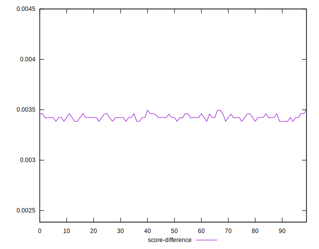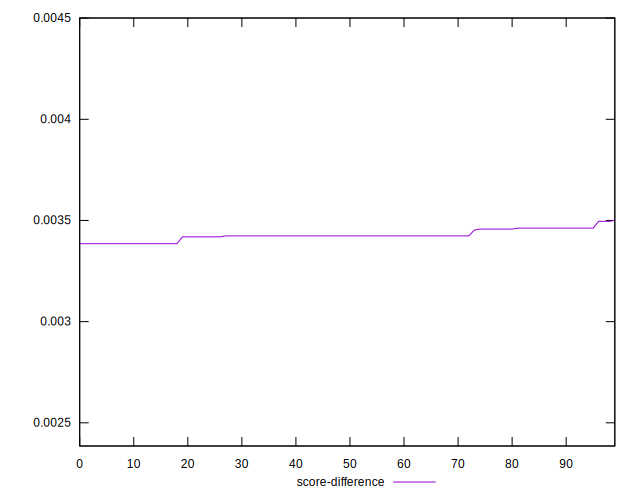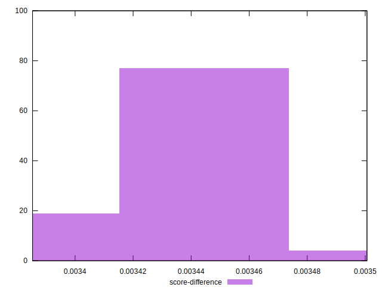
## P Score Difference


```yaml
p90min: 0
p90max: 0
p90range: 0
p90mean: 0
p90median: 0
p90stdev: 0
p90skewness: .nan
p90eccentricity: .nan
p90discretization: 91
outlandishness: .nan
confidence: 0
p90confidence: 0

```

