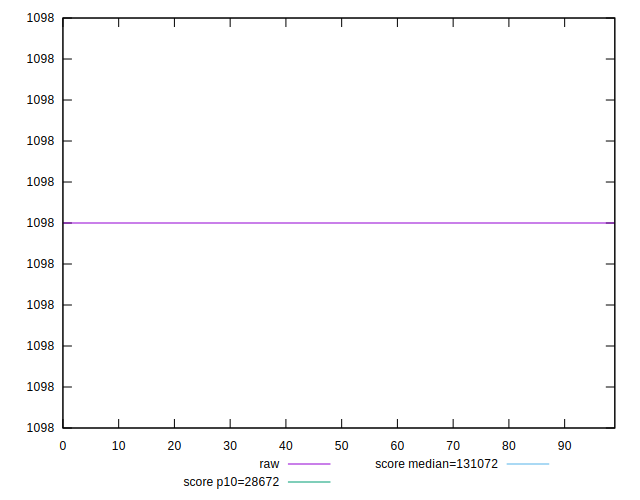
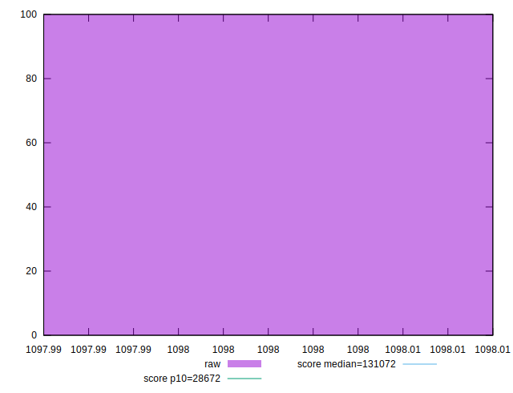
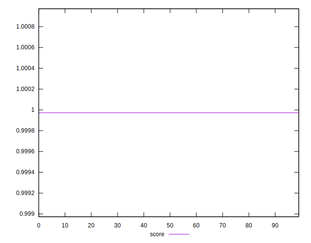
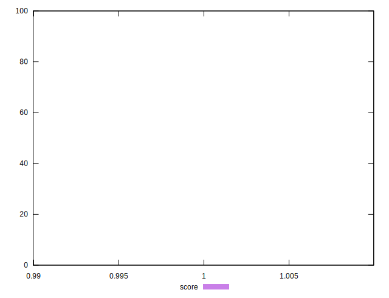
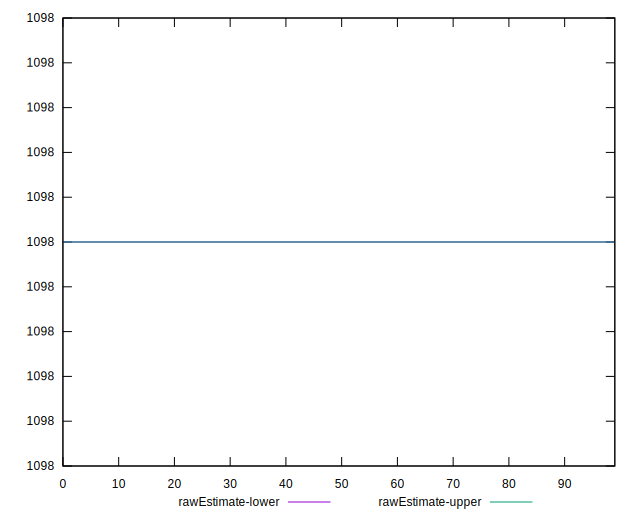
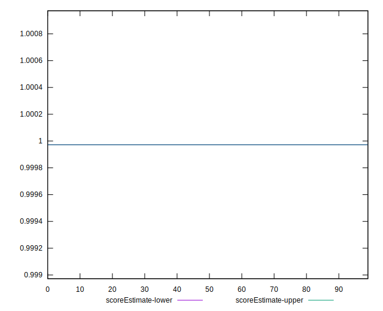
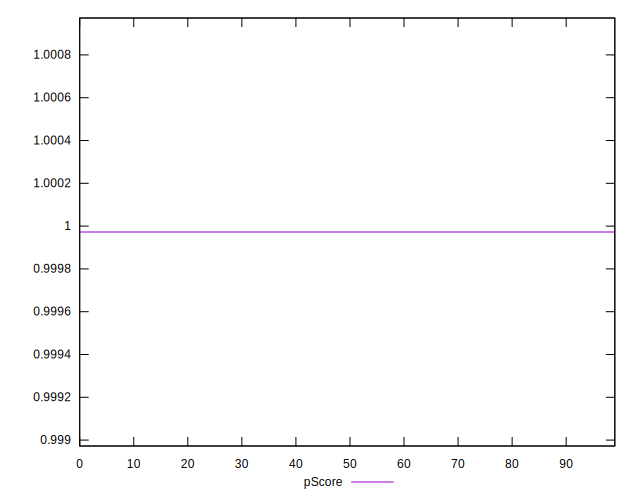
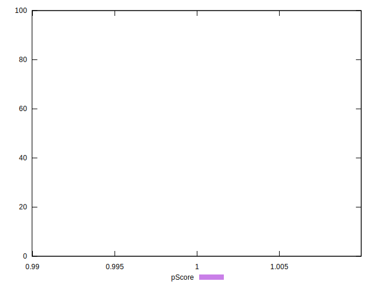
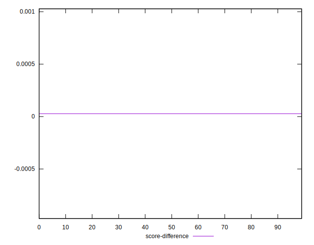
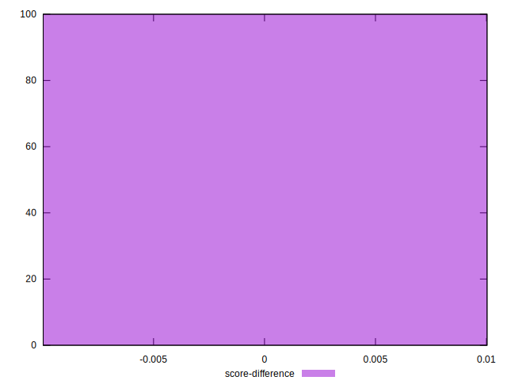

# //uses-long-cache-ttl/samples/pages+cached+noexternal

[→ Parent](../..)


## Raw


```yaml
p90min: 1098
p90max: 1098
p90range: 0
p90mean: 1098
p90median: 1098
p90stdev: 0
p90skewness: .nan
p90eccentricity: .nan
p90discretization: 91
outlandishness: 1
confidence: 0
p90confidence: 0

```


## Score


```yaml
p90min: 0.999972393989216
p90max: 0.999972393989216
p90range: 0
p90mean: 0.9999723939892153
p90median: 0.999972393989216
p90stdev: 6.661338147750939e-16
p90skewness: 1
p90eccentricity: 1
p90discretization: 91
outlandishness: 0.9999999999999991
confidence: 4.440892098500626e-16
p90confidence: 2.220446049250313e-16

```


## Raw Estimate


## Score Estimate


## P Score


```yaml
p90min: 0.999972393989216
p90max: 0.999972393989216
p90range: 0
p90mean: 0.9999723939892153
p90median: 0.999972393989216
p90stdev: 6.661338147750939e-16
p90skewness: 1
p90eccentricity: 1
p90discretization: 91
outlandishness: 0.9999999999999991
confidence: 4.440892098500626e-16
p90confidence: 2.220446049250313e-16

```


## Score Difference


```yaml
p90min: 0.00002760601078399816
p90max: 0.00002760601078399816
p90range: 0
p90mean: 0.00002760601078399816
p90median: 0.00002760601078399816
p90stdev: 0
p90skewness: .nan
p90eccentricity: .nan
p90discretization: 91
outlandishness: 1
confidence: 0
p90confidence: 0

```


## P Score Difference


```yaml
p90min: 0
p90max: 0
p90range: 0
p90mean: 0
p90median: 0
p90stdev: 0
p90skewness: .nan
p90eccentricity: .nan
p90discretization: 91
outlandishness: .nan
confidence: 0
p90confidence: 0

```

