# //uses-long-cache-ttl/samples/pages+cached+nointeractive

[→ Parent](../..)


## Raw


```yaml
p90min: 559302.7010273744
p90max: 559330.0246648666
p90range: 27.32363749225624
p90mean: 559315.7070796872
p90median: 559315.5049379889
p90stdev: 6.458426093169714
p90skewness: 0.06425693019538774
p90eccentricity: 0.9999999999999997
p90discretization: 1.0459770114942528
outlandishness: 0.9999998925404472
confidence: 3.270383384078741
p90confidence: 2.6538971289992332

```

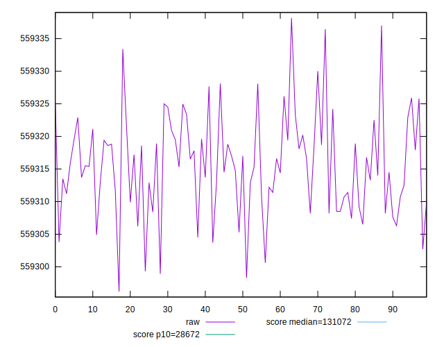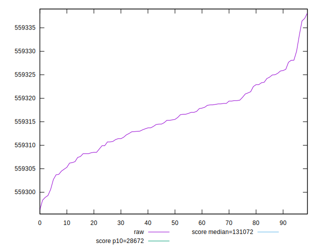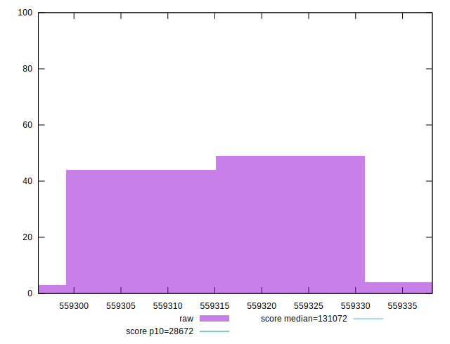
## Score


```yaml
p90min: 0.11056860643803901
p90max: 0.11057638106700829
p90range: 0.000007774628969281494
p90mean: 0.11057268026869545
p90median: 0.11057273776440929
p90stdev: 0.0000018376743713308507
p90skewness: -0.06421118911352658
p90eccentricity: 1
p90discretization: 1.0459770114942528
outlandishness: 1.0000001549273005
confidence: 9.305495500266936e-7
p90confidence: 7.551373458203336e-7

```

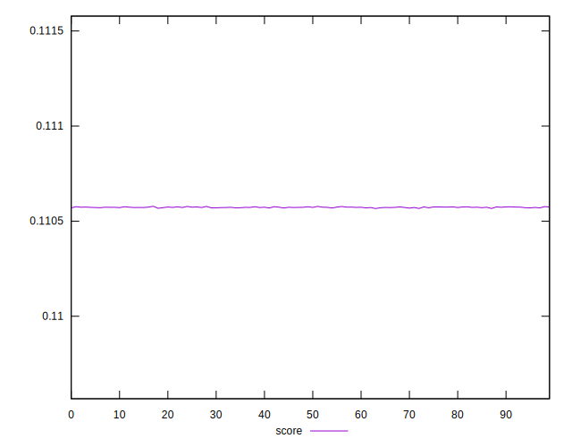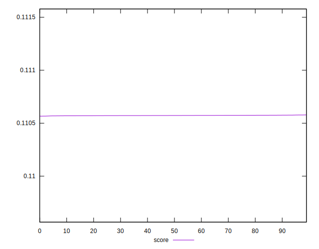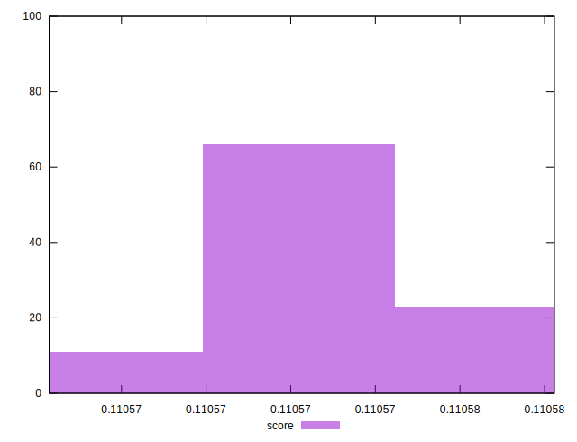
## Raw Estimate

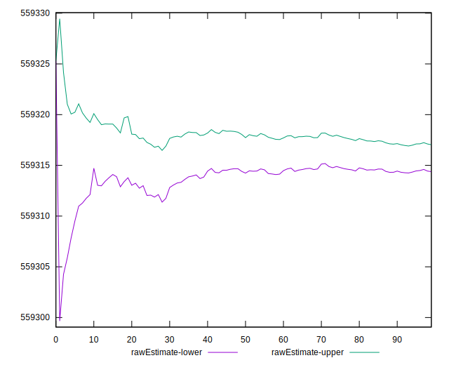
## Score Estimate

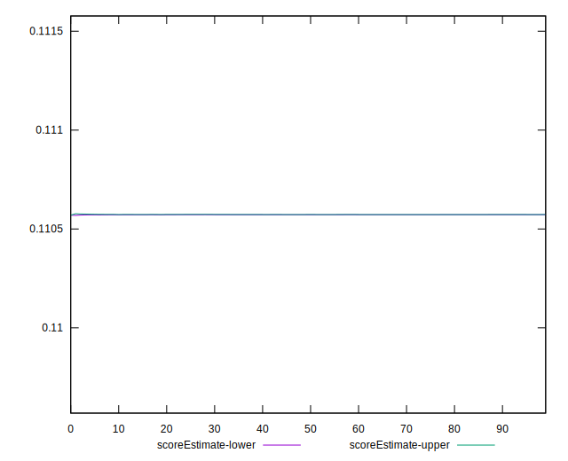
## P Score


```yaml
p90min: 0.11056860643803901
p90max: 0.11057638106700829
p90range: 0.000007774628969281494
p90mean: 0.11057268026869545
p90median: 0.11057273776440929
p90stdev: 0.0000018376743713308507
p90skewness: -0.06421118911352658
p90eccentricity: 1
p90discretization: 1.0459770114942528
outlandishness: 1.0000001549273005
confidence: 9.305495500266936e-7
p90confidence: 7.551373458203336e-7

```

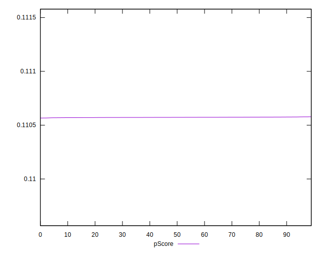
## Score Difference


```yaml
p90min: -0.0005763810670082886
p90max: -0.0005686064380390071
p90range: 0.000007774628969281494
p90mean: -0.0005726802686954318
p90median: -0.0005727377644092896
p90stdev: 0.0000018376743713308505
p90skewness: 0.06421118913423499
p90eccentricity: 1
p90discretization: 1.0459770114942528
outlandishness: 1.0000299134706605
confidence: 9.305495500264768e-7
p90confidence: 7.551373458120937e-7

```

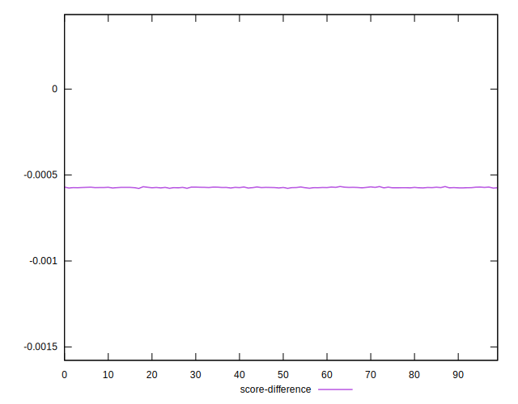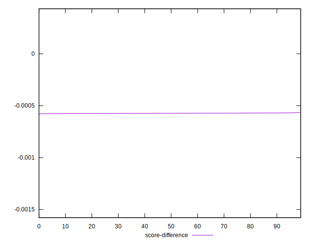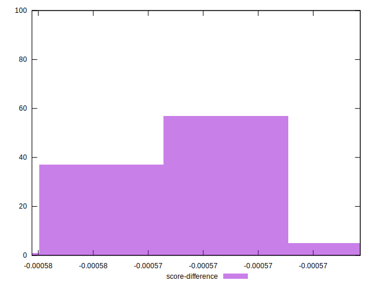
## P Score Difference


```yaml
p90min: 0
p90max: 0
p90range: 0
p90mean: 0
p90median: 0
p90stdev: 0
p90skewness: .nan
p90eccentricity: .nan
p90discretization: 91
outlandishness: .nan
confidence: 0
p90confidence: 0

```

