# //uses-rel-preload/samples/pages+cached+noexternal+noimg

[→ Parent](../..)


## Raw


```yaml
p90min: 454
p90max: 455
p90range: 1
p90mean: 454.31868131868134
p90median: 454
p90stdev: 0.4659651658706419
p90skewness: 0.7782499405501986
p90eccentricity: 0.9999999999999996
p90discretization: 45.5
outlandishness: 1.0263704680788315
confidence: 11.542421436880659
p90confidence: 0.19147445493388204

```

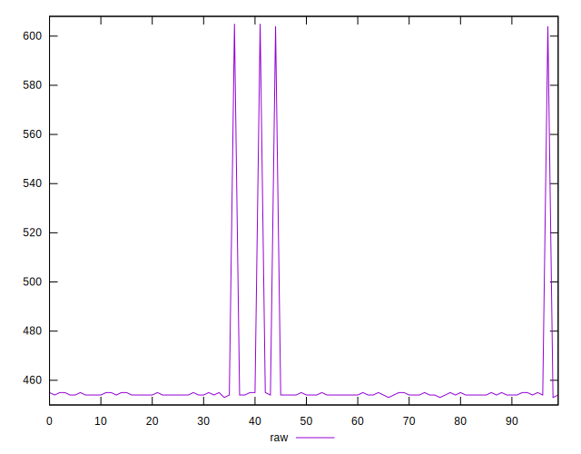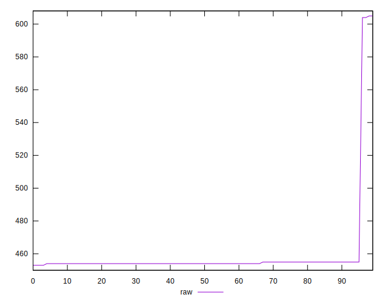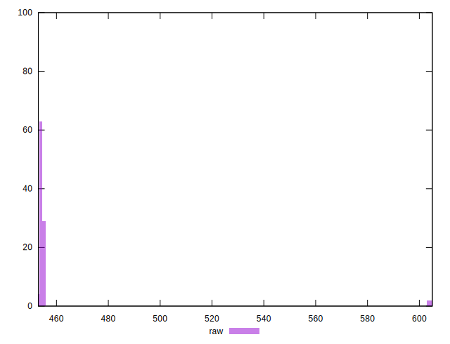
## Score


```yaml
p90min: 0.6638888888888889
p90max: 0.6644444444444444
p90range: 0.0005555555555555314
p90mean: 0.6642673992673989
p90median: 0.6644444444444444
p90stdev: 0.0002588695365947896
p90skewness: -0.7782499405474425
p90eccentricity: 1.0000000000000009
p90discretization: 45.5
outlandishness: 0.9900700835501764
confidence: 0.006412456353822593
p90confidence: 0.00010637469718544068

```

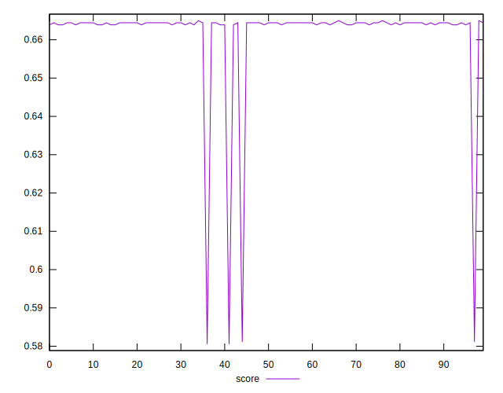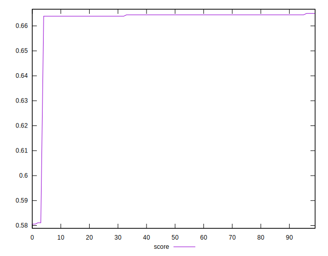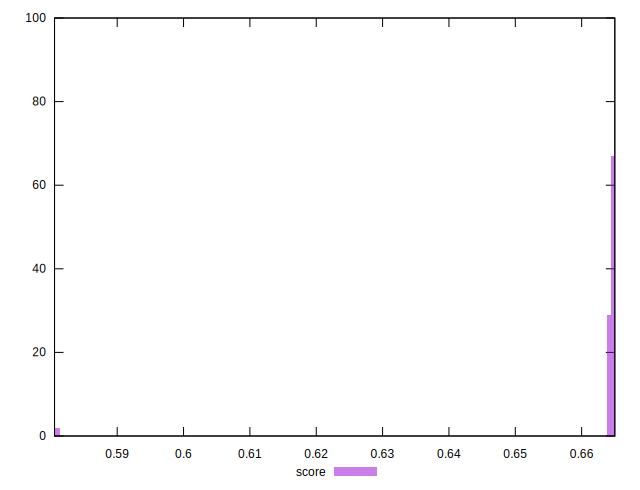
## Raw Estimate

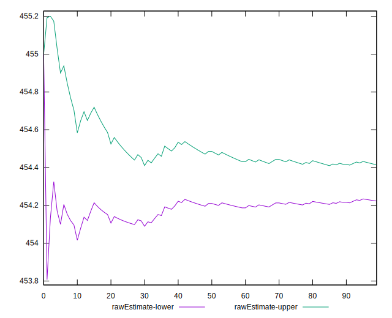
## Score Estimate

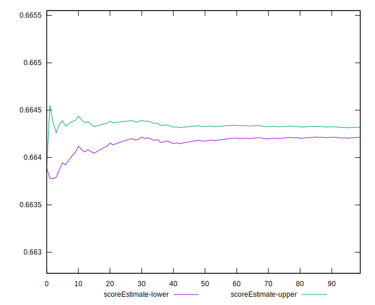
## P Score


```yaml
p90min: 0.6638888888888889
p90max: 0.6644444444444444
p90range: 0.0005555555555555314
p90mean: 0.6642673992673989
p90median: 0.6644444444444444
p90stdev: 0.0002588695365947896
p90skewness: -0.7782499405474425
p90eccentricity: 1.0000000000000009
p90discretization: 45.5
outlandishness: 0.9900700835501764
confidence: 0.006412456353822593
p90confidence: 0.00010637469718544068

```

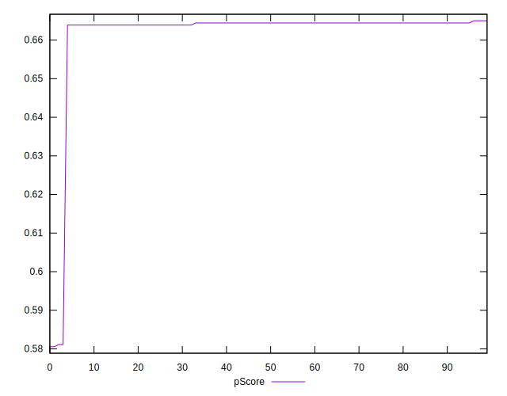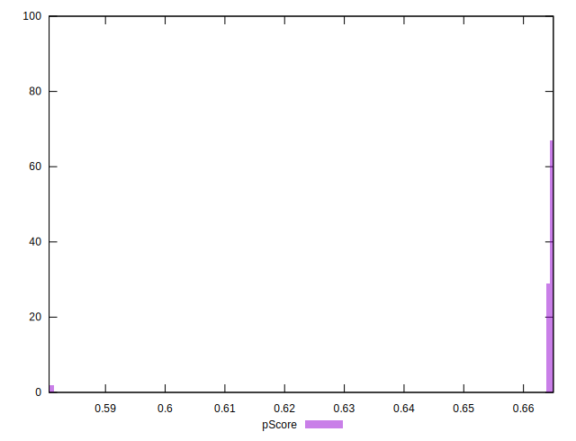
## Score Difference


```yaml
p90min: -0.004444444444444362
p90max: -0.0038888888888888307
p90range: 0.0005555555555555314
p90mean: -0.004267399267399193
p90median: -0.004444444444444362
p90stdev: 0.00025886953659478977
p90skewness: 0.7782499405503559
p90eccentricity: 1.0000000000000002
p90discretization: 45.5
outlandishness: 0.776793835665501
confidence: 0.000755555751393573
p90confidence: 0.00010637469718546497

```

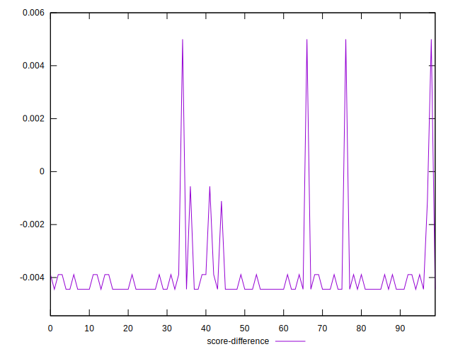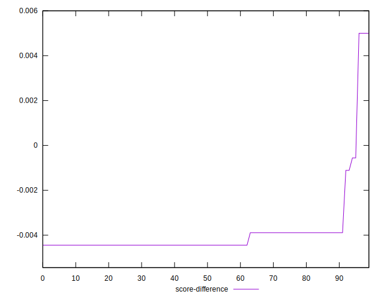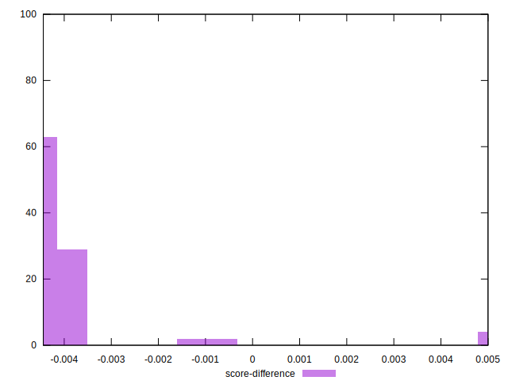
## P Score Difference


```yaml
p90min: 0
p90max: 0
p90range: 0
p90mean: 0
p90median: 0
p90stdev: 0
p90skewness: .nan
p90eccentricity: .nan
p90discretization: 91
outlandishness: .nan
confidence: 0
p90confidence: 0

```

