# //uses-rel-preload/samples/pages+cached+nointeractive

[→ Parent](../..)


## Raw


```yaml
p90min: 605
p90max: 606
p90range: 1
p90mean: 605.6483516483516
p90median: 606
p90stdev: 0.4774848567560532
p90skewness: -0.6213878670813774
p90eccentricity: 1.0000000000000018
p90discretization: 45.5
outlandishness: 0.9998073177703664
confidence: 0.21538211791767026
p90confidence: 0.19620812752327765

```

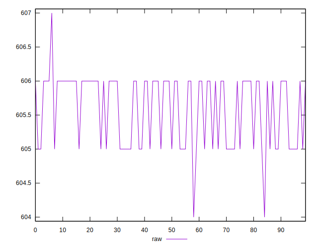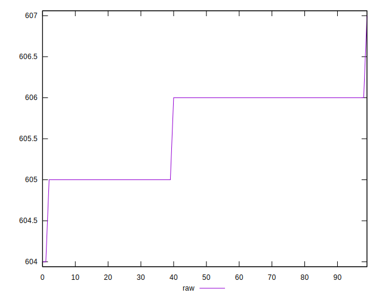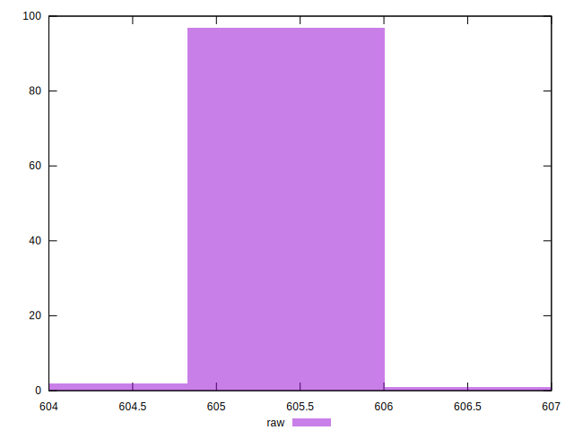
## Score


```yaml
p90min: 0.58
p90max: 0.5805555555555555
p90range: 0.0005555555555555314
p90mean: 0.5801953601953597
p90median: 0.58
p90stdev: 0.00026526936486446253
p90skewness: 0.6213878670905723
p90eccentricity: 0.9999999999999999
p90discretization: 45.5
outlandishness: 1.0001117502492596
confidence: 0.0001196567321763986
p90confidence: 0.00010900451529072264

```

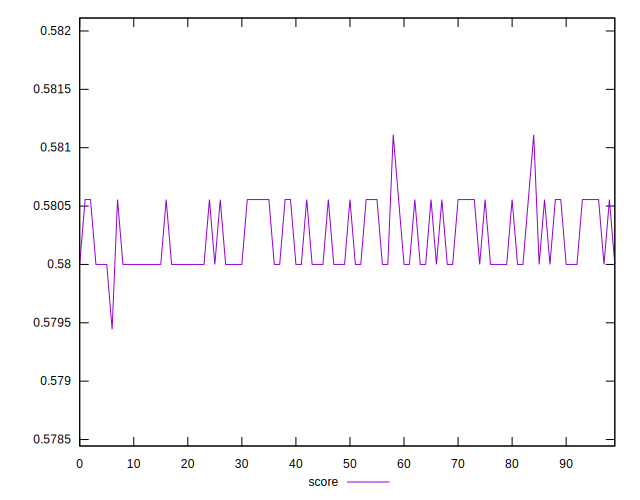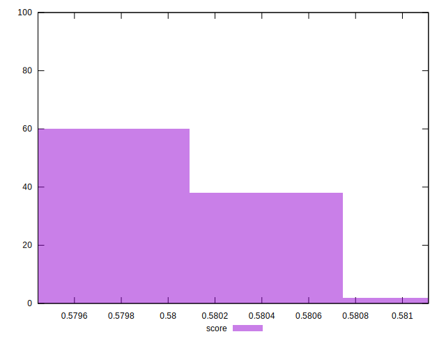
## Raw Estimate

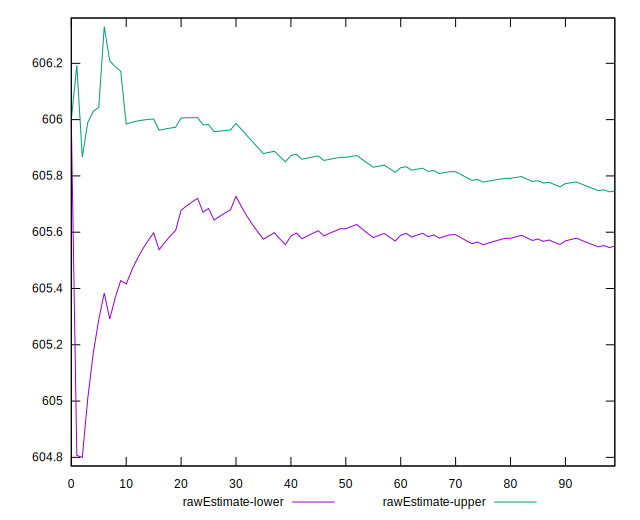
## Score Estimate

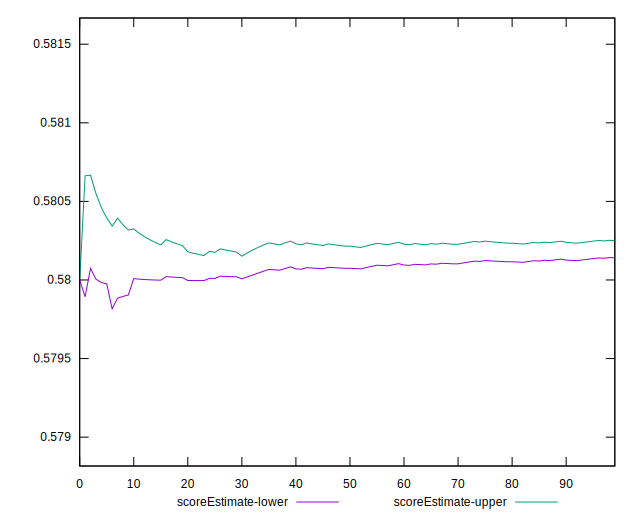
## P Score


```yaml
p90min: 0.58
p90max: 0.5805555555555555
p90range: 0.0005555555555555314
p90mean: 0.5801953601953597
p90median: 0.58
p90stdev: 0.00026526936486446253
p90skewness: 0.6213878670905723
p90eccentricity: 0.9999999999999999
p90discretization: 45.5
outlandishness: 1.0001117502492596
confidence: 0.0001196567321763986
p90confidence: 0.00010900451529072264

```

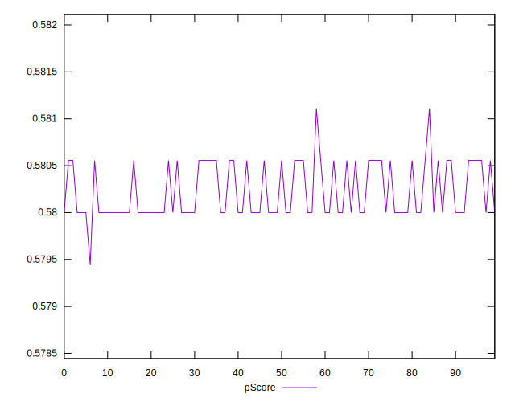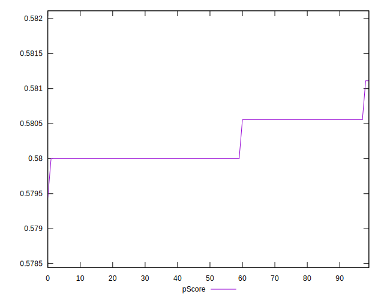
## Score Difference


```yaml
p90min: -0.0005555555555555314
p90max: 0
p90range: 0.0005555555555555314
p90mean: -0.00019536019536018685
p90median: 0
p90stdev: 0.00026526936486446237
p90skewness: -0.6213878670813693
p90eccentricity: 1.0000000000000002
p90discretization: 45.5
outlandishness: 1.3594102539062767
confidence: 0.0001196567321764822
p90confidence: 0.0001090045152906797

```

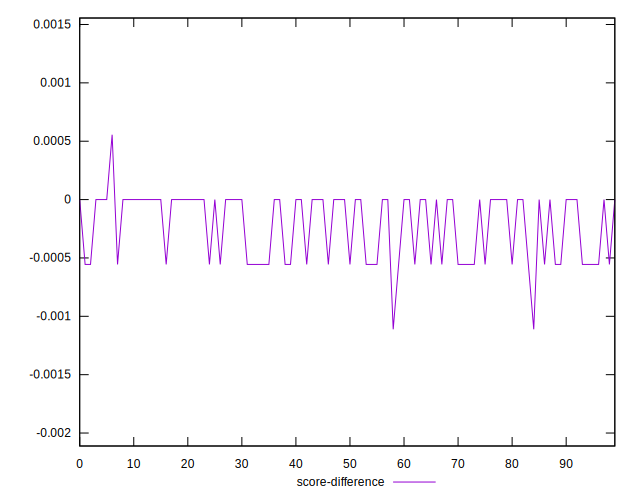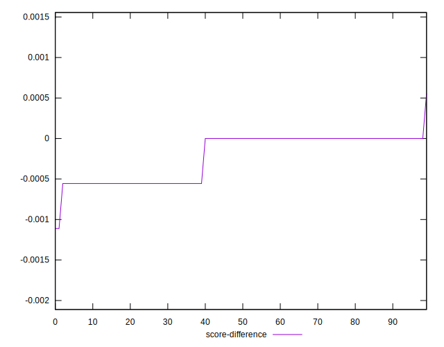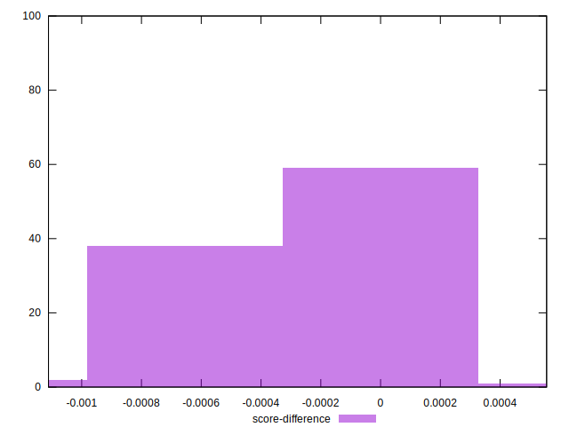
## P Score Difference


```yaml
p90min: 0
p90max: 0
p90range: 0
p90mean: 0
p90median: 0
p90stdev: 0
p90skewness: .nan
p90eccentricity: .nan
p90discretization: 91
outlandishness: .nan
confidence: 0
p90confidence: 0

```

