# //bootup-time/samples/pages+cached+noexternal+nomedia+nocss+nojs

[→ Parent](../..)


## Raw


```yaml
p90min: 1025.8440000000003
p90max: 1658.6399999999996
p90range: 632.7959999999994
p90mean: 1226.508923076924
p90median: 1175.0919999999996
p90stdev: 156.9619114714592
p90skewness: 1.1064354692234841
p90eccentricity: 0.9999999999999997
p90discretization: 1
outlandishness: 1.1407302882160706
confidence: 126.43367775200704
p90confidence: 64.49880515900122

```

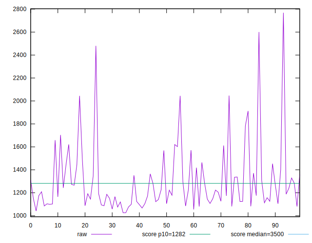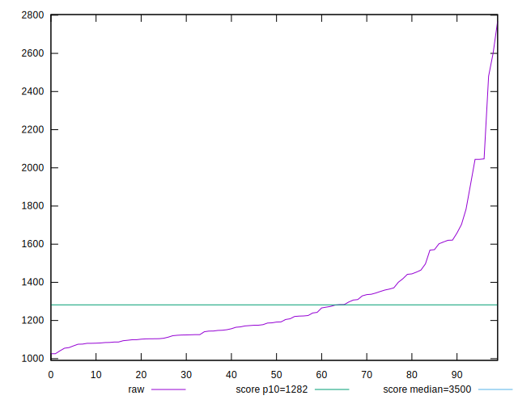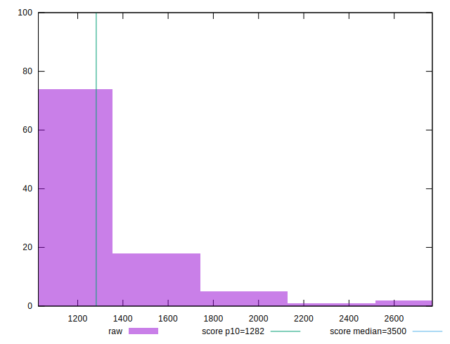
## Score


```yaml
p90min: 0.83
p90max: 0.94
p90range: 0.10999999999999999
p90mean: 0.9090109890109898
p90median: 0.92
p90stdev: 0.027095879620865813
p90skewness: -1.237738743054503
p90eccentricity: 1.0000000000000013
p90discretization: 7.583333333333333
outlandishness: 0.9655153038705301
confidence: 0.02351224947701991
p90confidence: 0.01113424170166133

```

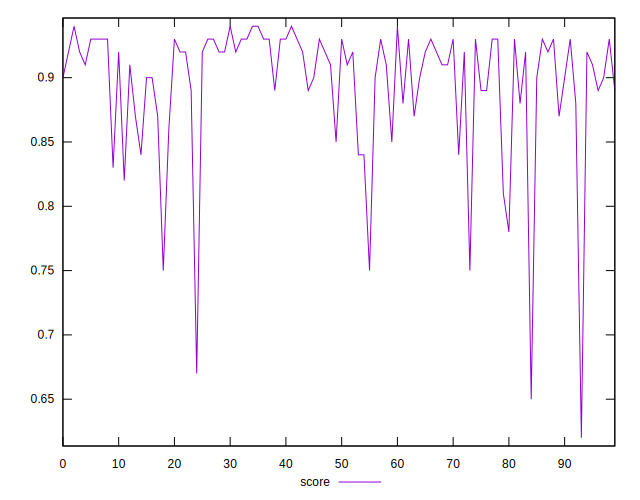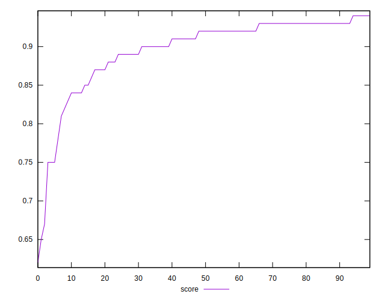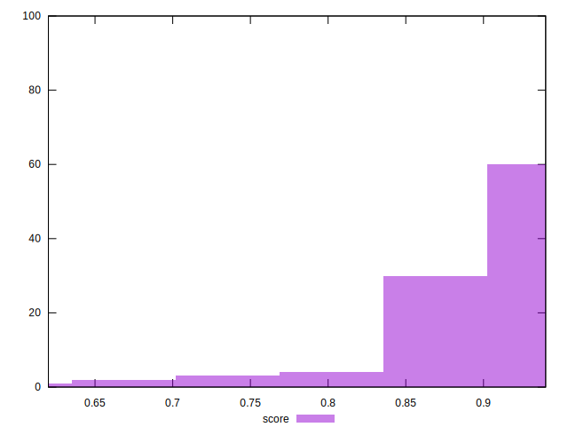
## Raw Estimate

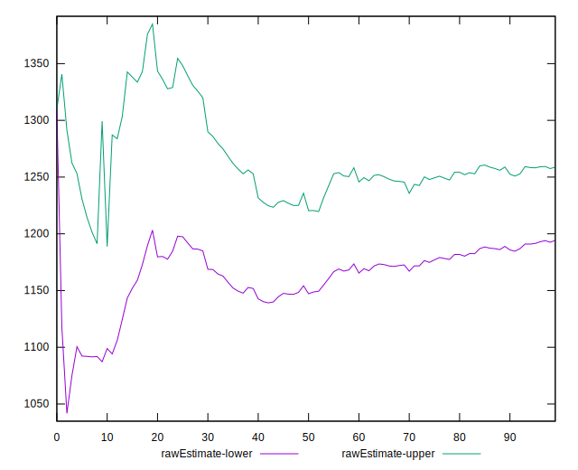
## Score Estimate

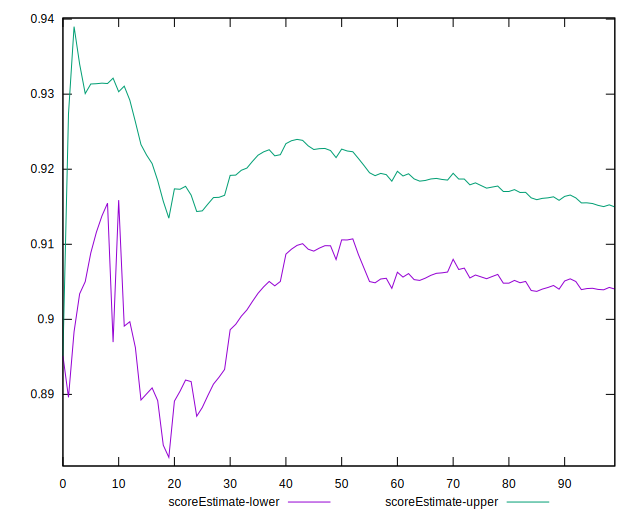
## P Score


```yaml
p90min: 0.8296747718603523
p90max: 0.9413235499128616
p90range: 0.11164877805250928
p90mean: 0.908482212615586
p90median: 0.9181386548263398
p90stdev: 0.02754730451720689
p90skewness: -1.2312064288278546
p90eccentricity: 0.9999999999999996
p90discretization: 1
outlandishness: 0.9656262367241821
confidence: 0.02354778401066815
p90confidence: 0.011319741267511674

```

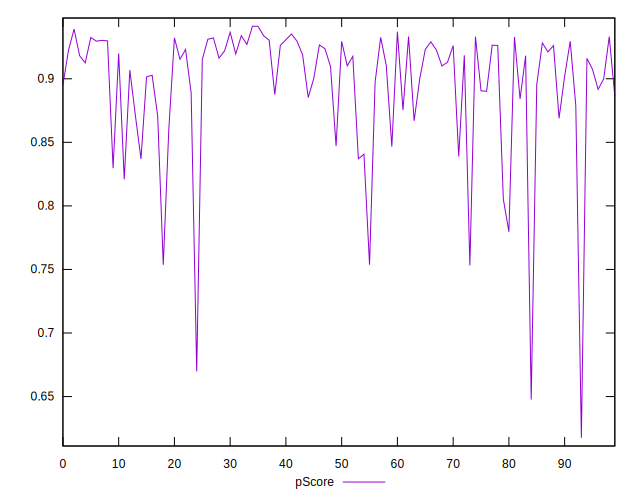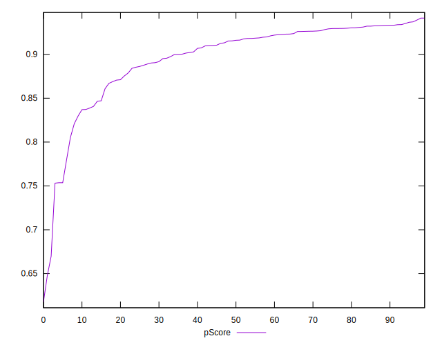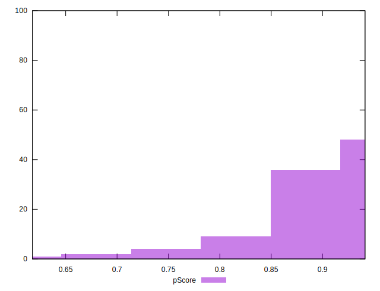
## Score Difference


```yaml
p90min: 0
p90max: 0
p90range: 0
p90mean: 0
p90median: 0
p90stdev: 0
p90skewness: .nan
p90eccentricity: .nan
p90discretization: 91
outlandishness: .inf
confidence: 1.1806664533324076e-17
p90confidence: 0

```

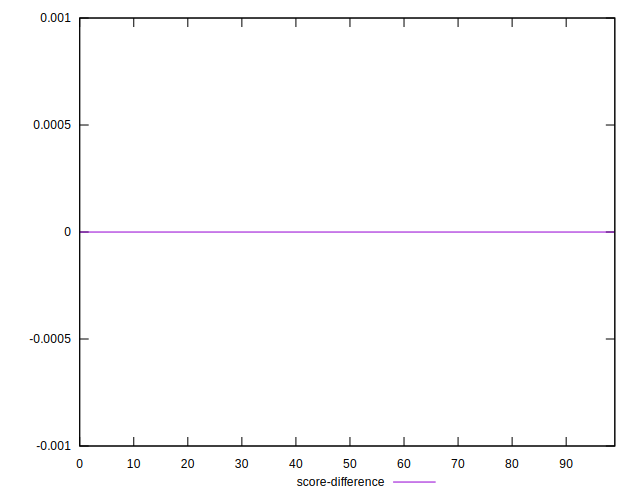
## P Score Difference


```yaml
p90min: -0.004631448306606112
p90max: 0.0036676960805680503
p90range: 0.008299144387174162
p90mean: -0.00033159854081558535
p90median: -0.00021184255438722044
p90stdev: 0.0023281929548385006
p90skewness: -0.017942195409101285
p90eccentricity: 0.9999999999999999
p90discretization: 1
outlandishness: 1.9944351481845686
confidence: 0.0010096833523369026
p90confidence: 0.0009567012937020268

```

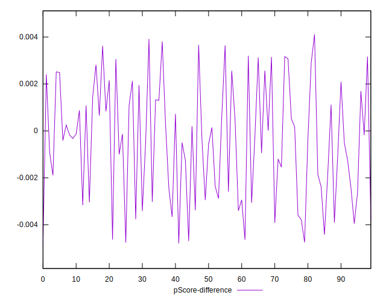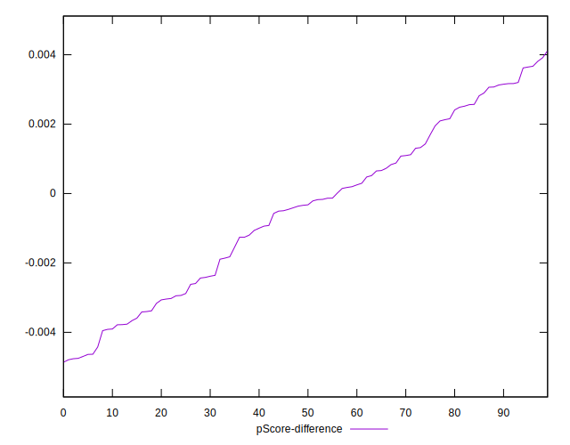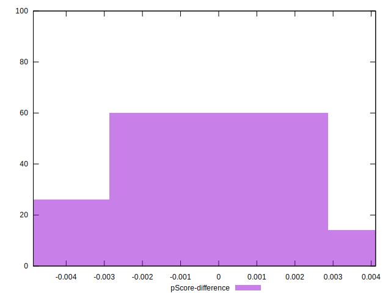