# //bootup-time/samples/pages+cached+noexternal+nomedia+nocss

[→ Parent](../..)


## Raw


```yaml
p90min: 996.3920000000005
p90max: 1499.352
p90range: 502.9599999999996
p90mean: 1200.0860219780218
p90median: 1172.7640000000006
p90stdev: 113.89969130677939
p90skewness: 0.6002458572516111
p90eccentricity: 1
p90discretization: 1
outlandishness: 1.0939227582156044
confidence: 83.37025467375906
p90confidence: 46.803673122967666

```

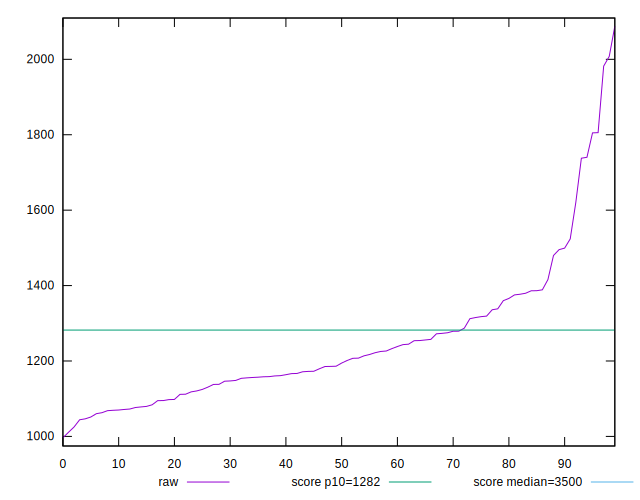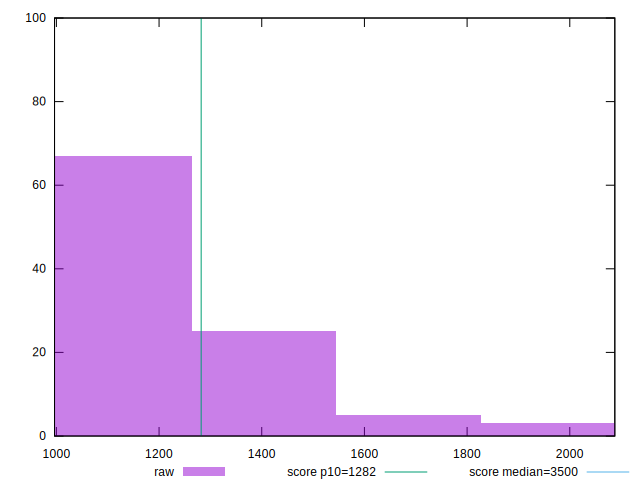
## Score


```yaml
p90min: 0.86
p90max: 0.94
p90range: 0.07999999999999996
p90mean: 0.911758241758242
p90median: 0.92
p90stdev: 0.020141990832854232
p90skewness: -0.7735588372383714
p90eccentricity: 0.9999999999999997
p90discretization: 11.375
outlandishness: 0.9800117050138532
confidence: 0.015188089596758214
p90confidence: 0.008276748990017735

```

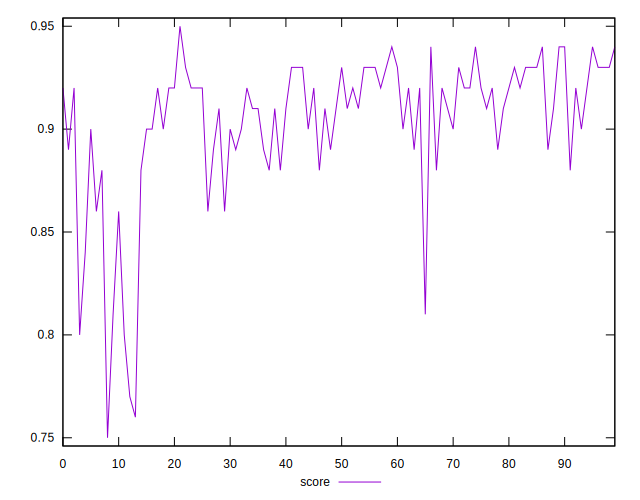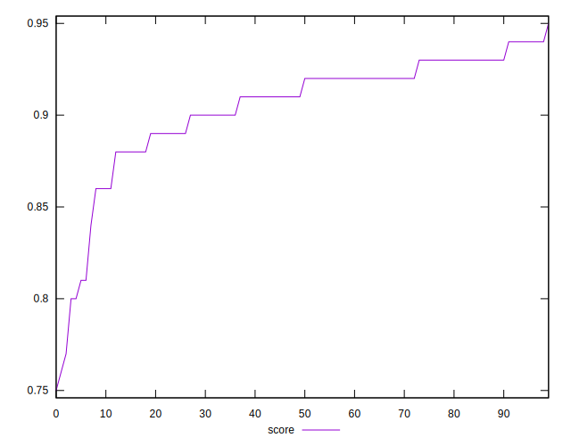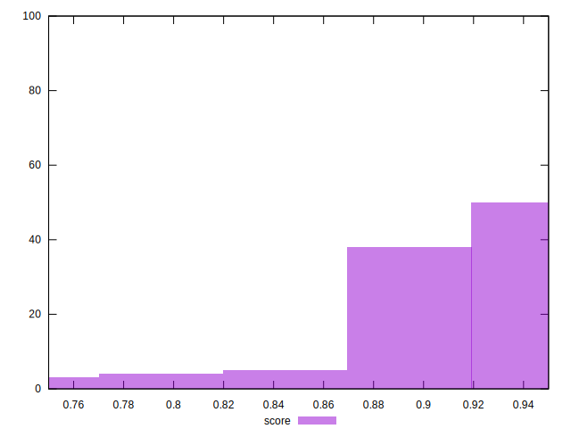
## Raw Estimate

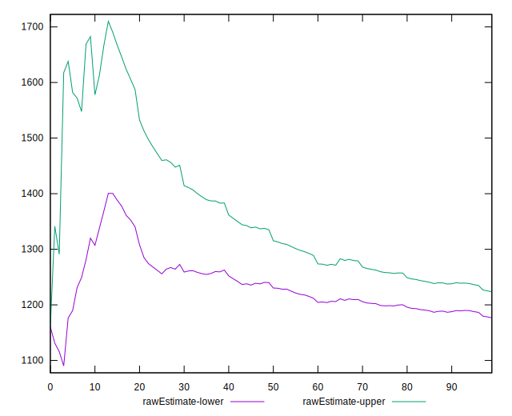
## Score Estimate

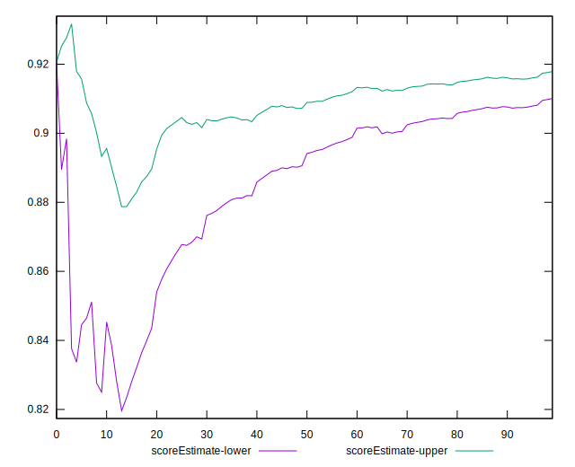
## P Score


```yaml
p90min: 0.8603099842551213
p90max: 0.9455494824503972
p90range: 0.08523949819527588
p90mean: 0.913357748910194
p90median: 0.9185207608190323
p90stdev: 0.019286392687507283
p90skewness: -0.7388038302811046
p90eccentricity: 0.9999999999999996
p90discretization: 1
outlandishness: 0.9776645824738756
confidence: 0.015222446989387795
p90confidence: 0.007925166510206028

```

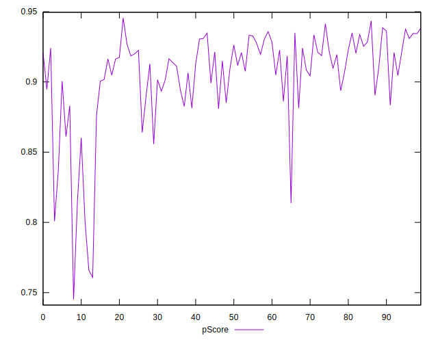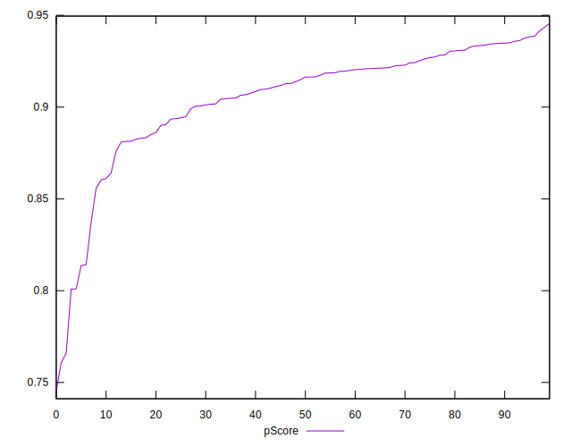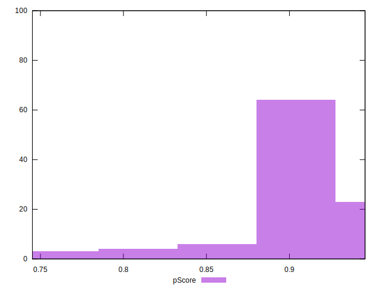
## Score Difference


```yaml
p90min: 0
p90max: 0
p90range: 0
p90mean: 0
p90median: 0
p90stdev: 0
p90skewness: .nan
p90eccentricity: .nan
p90discretization: 91
outlandishness: .inf
confidence: 1.2454613861688433e-17
p90confidence: 0

```

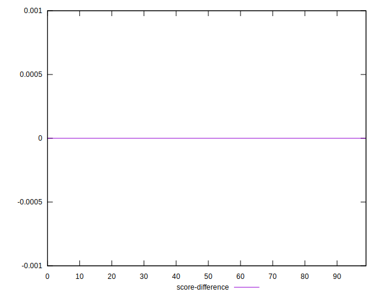
## P Score Difference


```yaml
p90min: -0.0038765620388453437
p90max: 0.004929140448127423
p90range: 0.008805702486972766
p90mean: 0.0009946853242291734
p90median: 0.0009463295873280986
p90stdev: 0.0025475223375924705
p90skewness: -0.2603846239881511
p90eccentricity: 1.0000000000000002
p90discretization: 1
outlandishness: 0.252713583051061
confidence: 0.0011354882752185162
p90confidence: 0.0010468281467154385

```

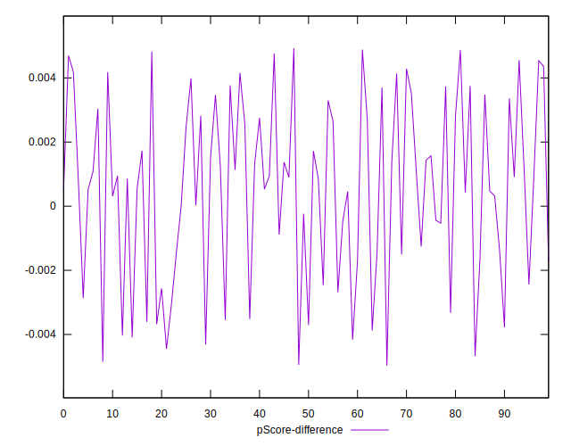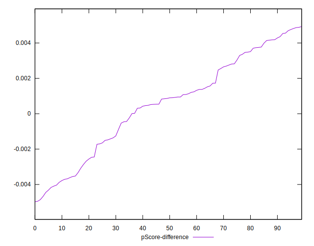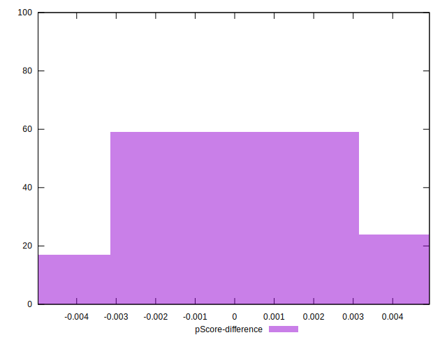