# //bootup-time/samples/pages+cached+noexternal+nomedia

[→ Parent](../..)


## Raw


```yaml
p90min: 1015.4560000000005
p90max: 1239.8759999999993
p90range: 224.41999999999882
p90mean: 1100.4395164835166
p90median: 1089.6880000000008
p90stdev: 58.198790851334635
p90skewness: 0.47767546075307205
p90eccentricity: 1.0000000000000007
p90discretization: 1
outlandishness: 1.0446387938970247
confidence: 47.572704176668594
p90confidence: 23.915053253490896

```

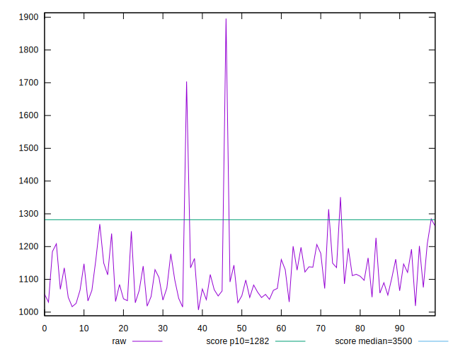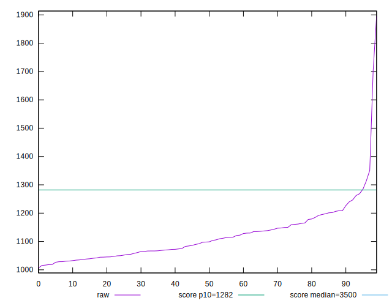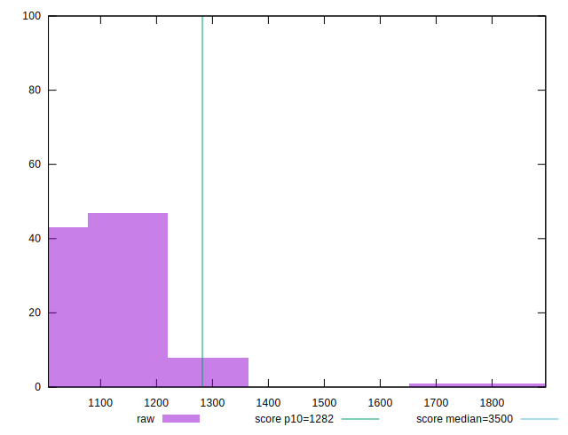
## Score


```yaml
p90min: 0.91
p90max: 0.94
p90range: 0.029999999999999916
p90mean: 0.9300000000000003
p90median: 0.93
p90stdev: 0.009833783437888799
p90skewness: -0.5546741484593171
p90eccentricity: 0.9999999999999999
p90discretization: 22.75
outlandishness: 0.9899180136431961
confidence: 0.008578375239679525
p90confidence: 0.004040899323856317

```

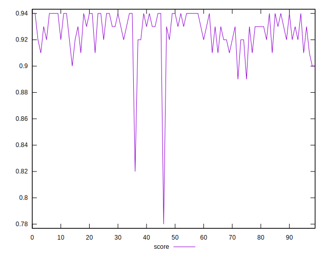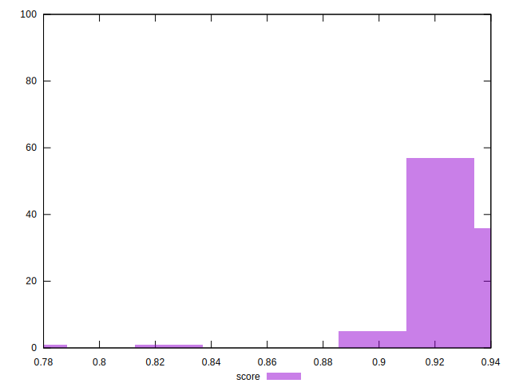
## Raw Estimate


## Score Estimate

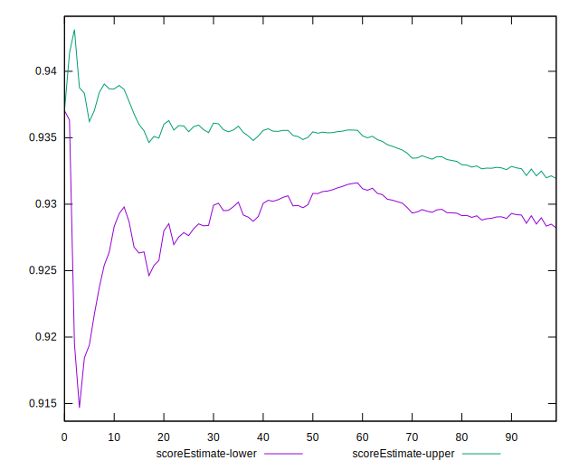
## P Score


```yaml
p90min: 0.9072788118132817
p90max: 0.9428284020116938
p90range: 0.035549590198412084
p90mean: 0.9298753018657228
p90median: 0.9317486011566803
p90stdev: 0.009140188138355768
p90skewness: -0.5408583089957668
p90eccentricity: 0.9999999999999996
p90discretization: 1
outlandishness: 0.9908289587980296
confidence: 0.008353995347017973
p90confidence: 0.0037558870704732517

```

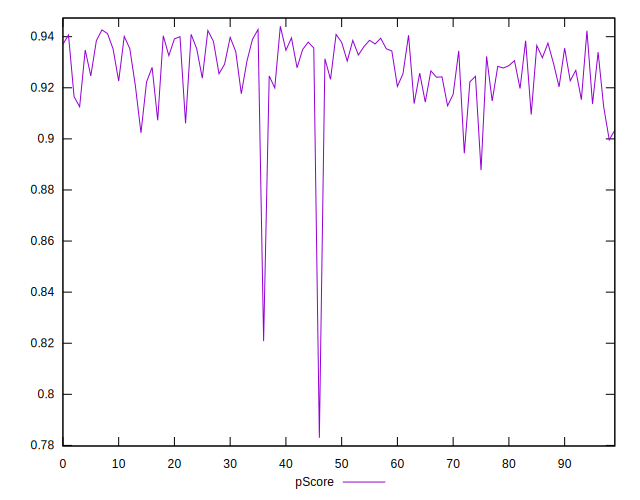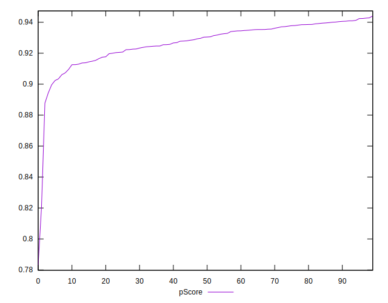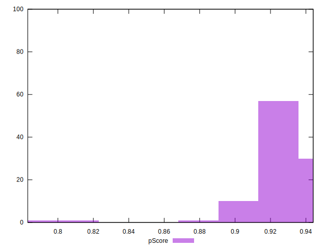
## Score Difference


```yaml
p90min: 0
p90max: 1.1102230246251565e-16
p90range: 1.1102230246251565e-16
p90mean: 3.416070845000482e-17
p90median: 0
p90stdev: 5.124106267500721e-17
p90skewness: 0.8333333333333353
p90eccentricity: 0.9999999999999996
p90discretization: 45.5
outlandishness: 1.4460062499999997
confidence: 2.1011615905382478e-17
p90confidence: 2.105598285999734e-17

```

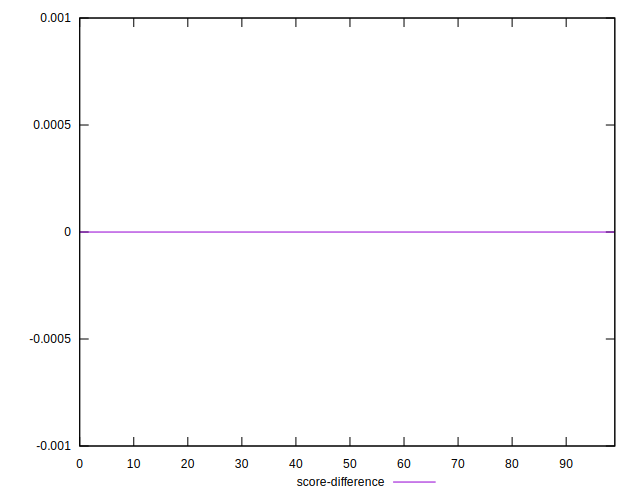
## P Score Difference


```yaml
p90min: -0.004262851204987372
p90max: 0.004981820363072487
p90range: 0.009244671568059859
p90mean: 0.0007876825494033673
p90median: 0.0006084587213975867
p90stdev: 0.0026352540283437267
p90skewness: -0.0743067907629637
p90eccentricity: 0.9999999999999996
p90discretization: 1
outlandishness: 0.14652932923611314
confidence: 0.0011569318780070338
p90confidence: 0.0010828788622997982

```

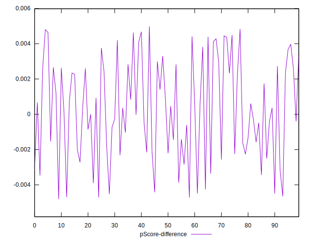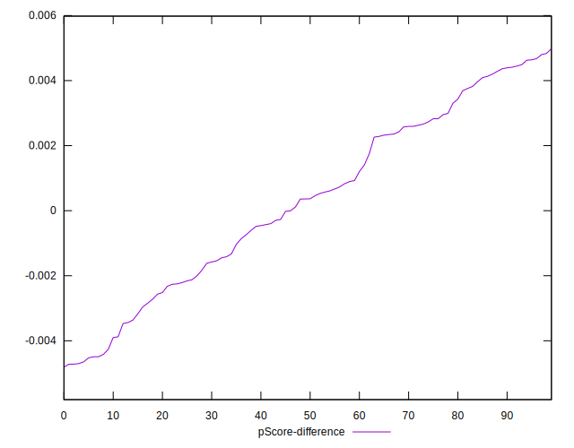