# //bootup-time/samples/pages+cached+noexternal

[→ Parent](../..)


## Raw


```yaml
p90min: 1000.4880000000006
p90max: 1175.8680000000006
p90range: 175.38
p90mean: 1070.428351648352
p90median: 1066.3760000000009
p90stdev: 41.575475808600245
p90skewness: 0.4338823375333595
p90eccentricity: 1
p90discretization: 1
outlandishness: 1.0322663927271187
confidence: 31.803959083969403
p90confidence: 17.084198888972423

```

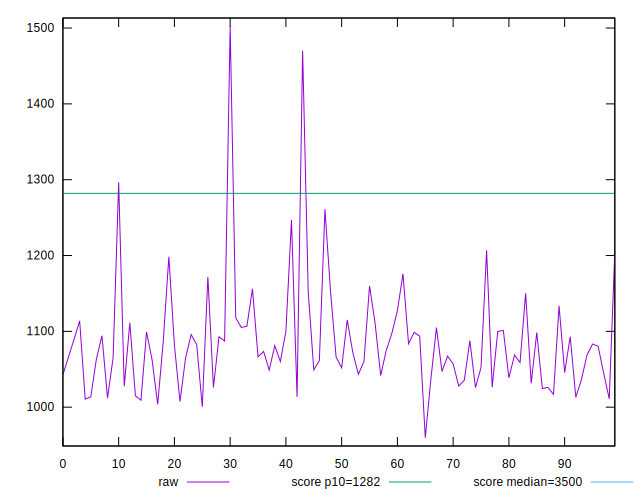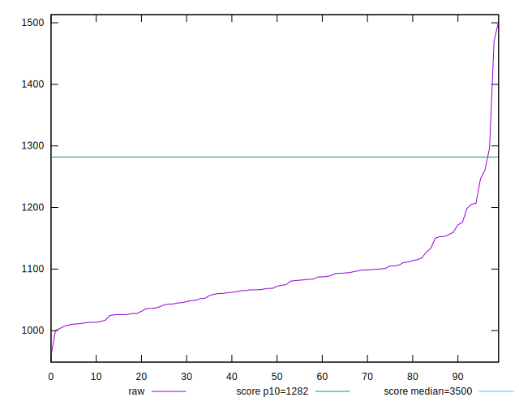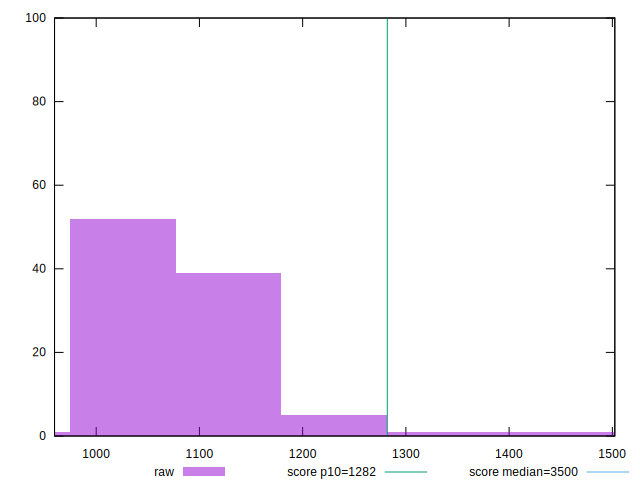
## Score


```yaml
p90min: 0.92
p90max: 0.94
p90range: 0.019999999999999907
p90mean: 0.9342857142857143
p90median: 0.94
p90stdev: 0.006486309698186195
p90skewness: -0.7001789979948482
p90eccentricity: 1.0000000000000013
p90discretization: 30.333333333333332
outlandishness: 0.9938321699445425
confidence: 0.00520096302926687
p90confidence: 0.0026653550629085476

```

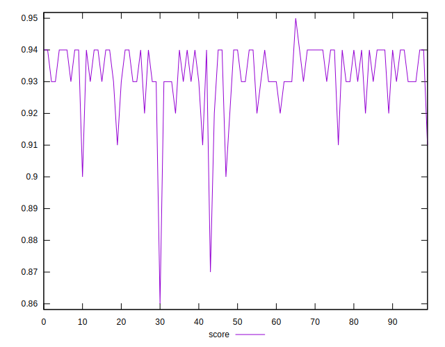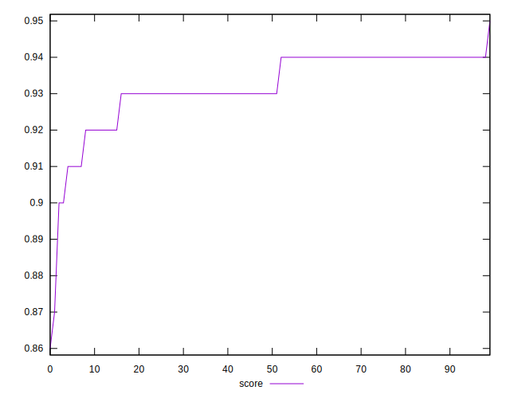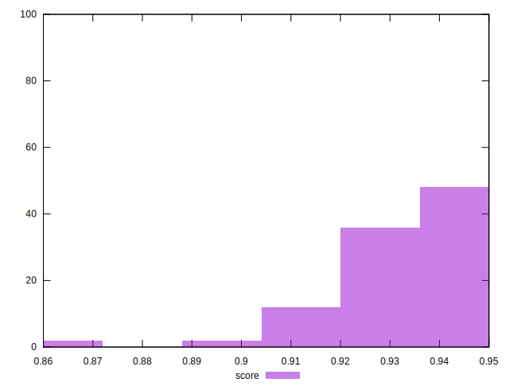
## Raw Estimate

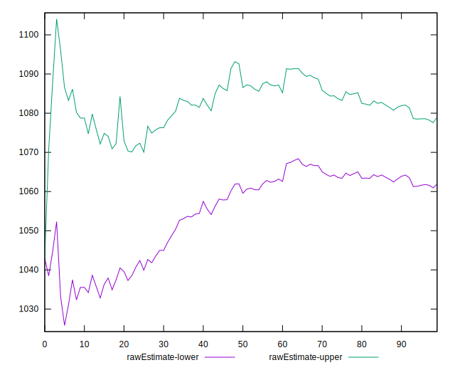
## Score Estimate

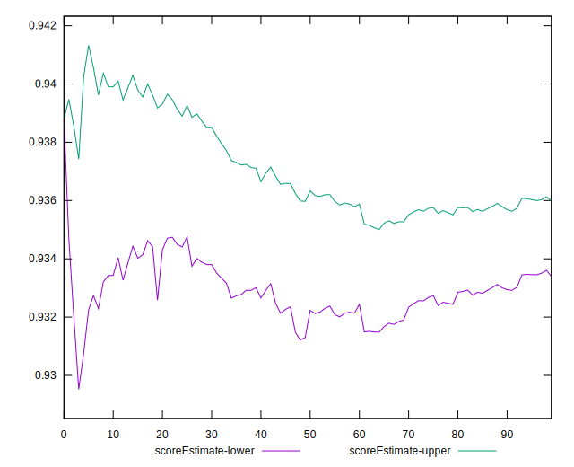
## P Score


```yaml
p90min: 0.9180111552129004
p90max: 0.9449693374542603
p90range: 0.026958182241359818
p90mean: 0.9345817558010088
p90median: 0.9353080332099302
p90stdev: 0.0063504997471202146
p90skewness: -0.5134361071562916
p90eccentricity: 0.9999999999999997
p90discretization: 1
outlandishness: 0.9938553297197489
confidence: 0.00524766475141325
p90confidence: 0.0026095480235424073

```

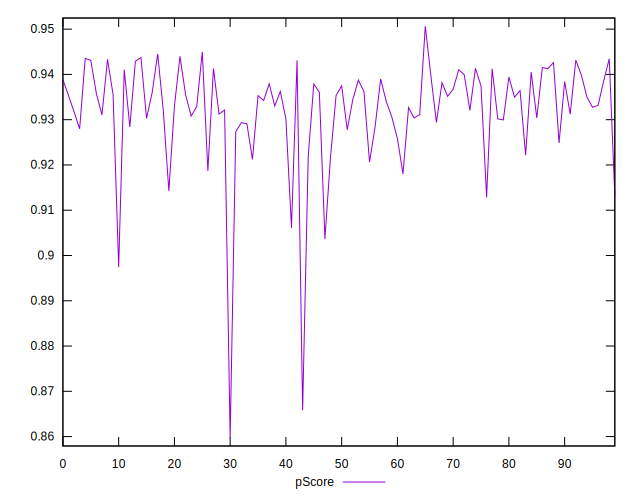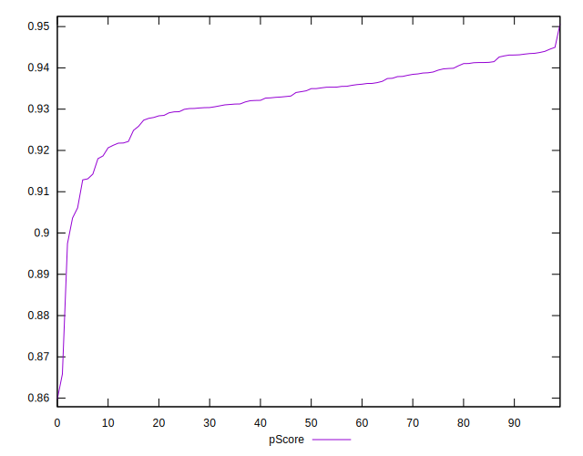
## Score Difference


```yaml
p90min: 0
p90max: 1.1102230246251565e-16
p90range: 1.1102230246251565e-16
p90mean: 4.7580986769649563e-17
p90median: 0
p90stdev: 5.494179103953045e-17
p90skewness: 0.28867513459481214
p90eccentricity: 0.9999999999999981
p90discretization: 45.5
outlandishness: 1.2544000000000002
confidence: 2.174255648481275e-17
p90confidence: 2.2576686548504455e-17

```

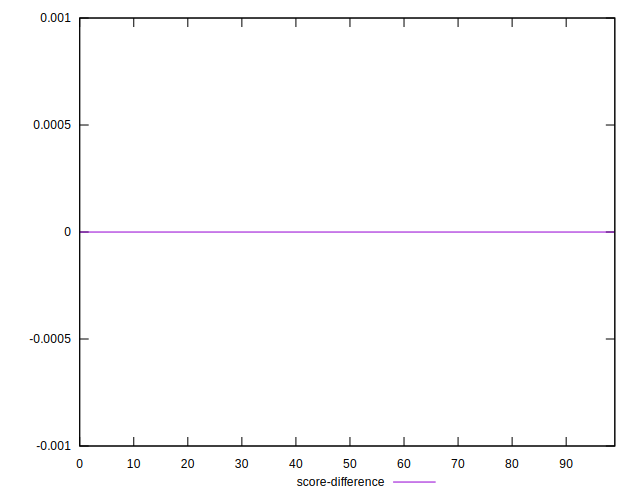
## P Score Difference


```yaml
p90min: -0.004231841991616303
p90max: 0.004858127555968261
p90range: 0.009089969547584564
p90mean: 0.00047798938559956124
p90median: 0.0006412147781509336
p90stdev: 0.002471884441439664
p90skewness: -0.23977688916139847
p90eccentricity: 1
p90discretization: 1
outlandishness: 0.40978679929928186
confidence: 0.0010882050330365618
p90confidence: 0.0010157470144785664

```

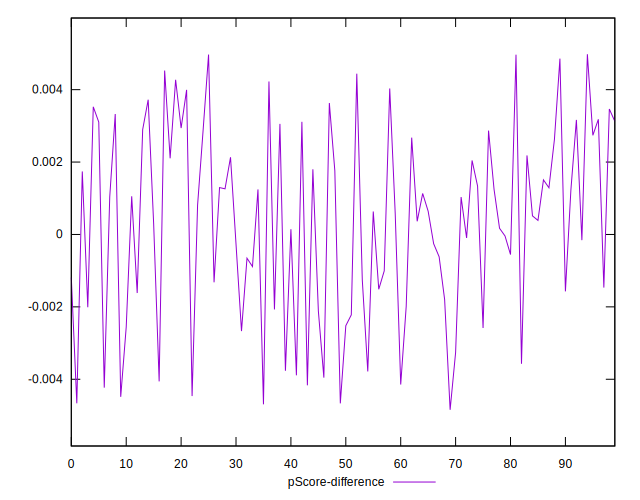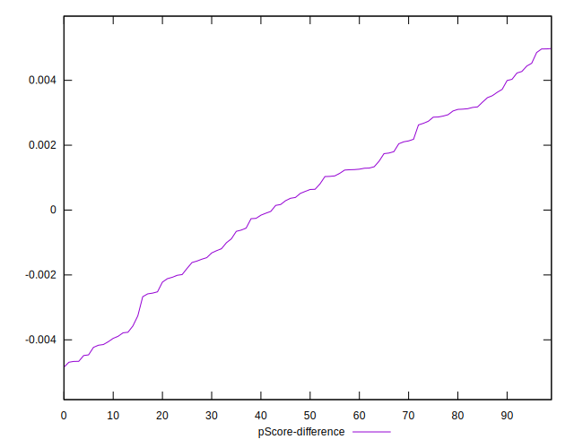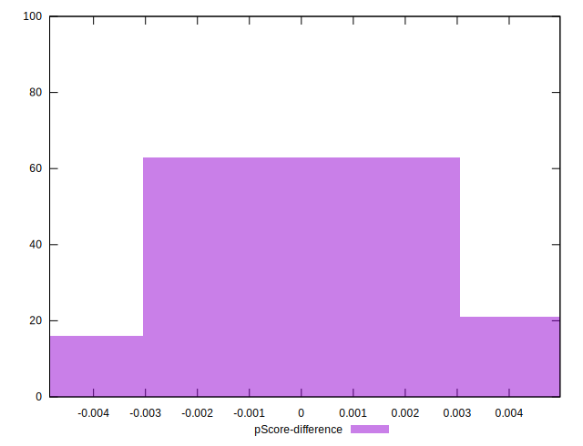