# //bootup-time/samples/pages+cached

[→ Parent](../..)


## Raw


```yaml
p90min: 999.8960000000005
p90max: 1365.6120000000008
p90range: 365.71600000000024
p90mean: 1111.3815384615389
p90median: 1090.1800000000003
p90stdev: 82.38452524011836
p90skewness: 0.8434903703228331
p90eccentricity: 1.0000000000000016
p90discretization: 1
outlandishness: 1.136415852781048
confidence: 125.96978314983335
p90confidence: 33.853457770520436

```

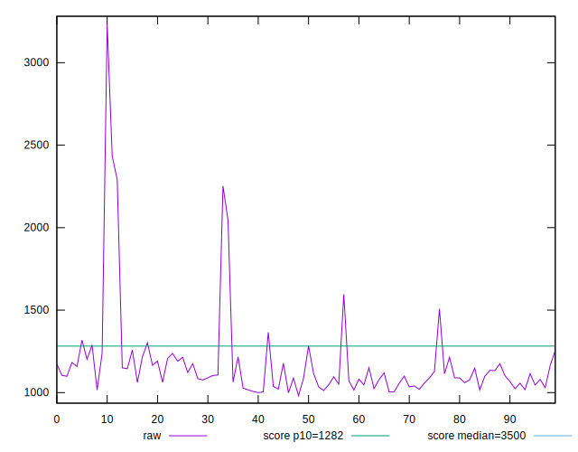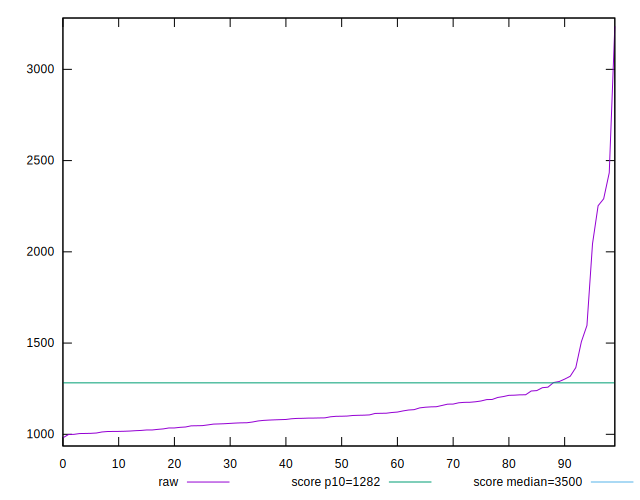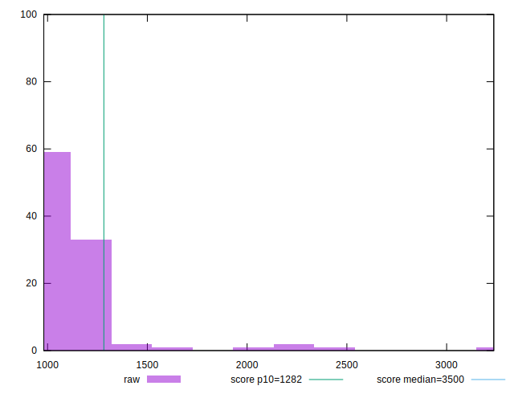
## Score


```yaml
p90min: 0.89
p90max: 0.95
p90range: 0.05999999999999994
p90mean: 0.9276923076923078
p90median: 0.93
p90stdev: 0.013099527973789507
p90skewness: -0.9473048152053055
p90eccentricity: 0.9999999999999989
p90discretization: 13
outlandishness: 0.9709111909358684
confidence: 0.02313816968428939
p90confidence: 0.005382859411787733

```

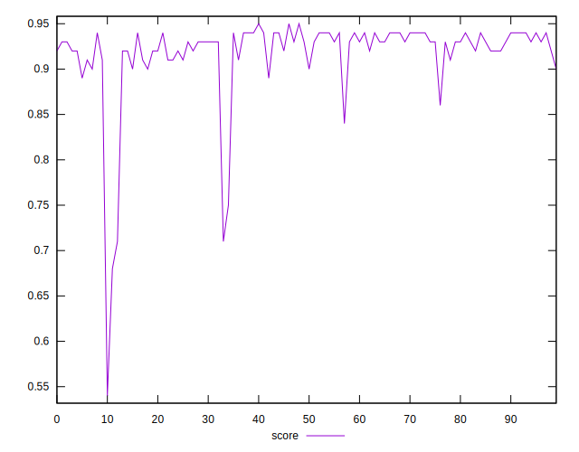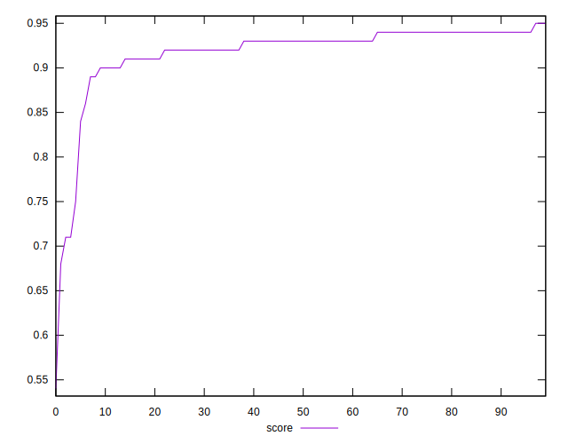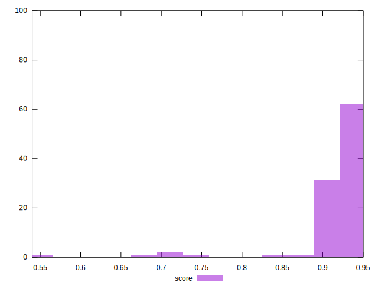
## Raw Estimate

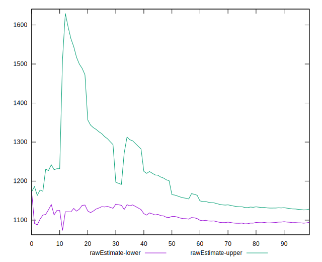
## Score Estimate

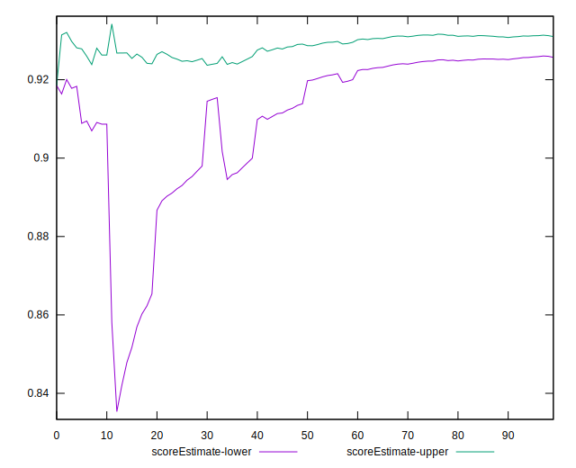
## P Score


```yaml
p90min: 0.8851110413586031
p90max: 0.9450533397784757
p90range: 0.05994229841987264
p90mean: 0.9279750452589312
p90median: 0.9316727237002037
p90stdev: 0.01322114993930062
p90skewness: -0.9689367442492033
p90eccentricity: 1
p90discretization: 1
outlandishness: 0.9707460022452647
confidence: 0.023155330091062742
p90confidence: 0.005432836322638357

```

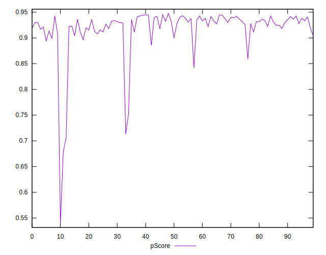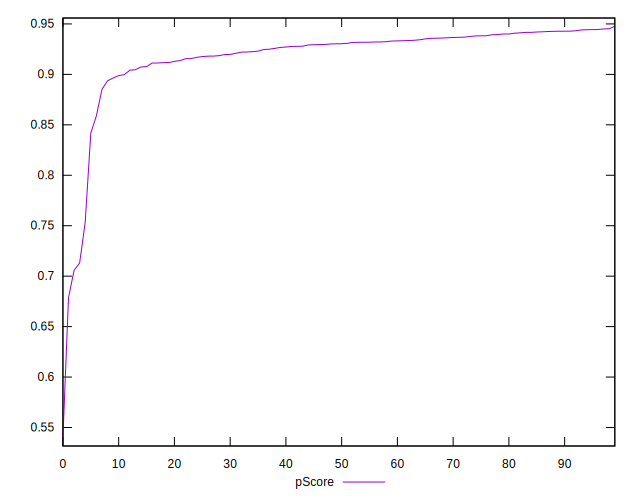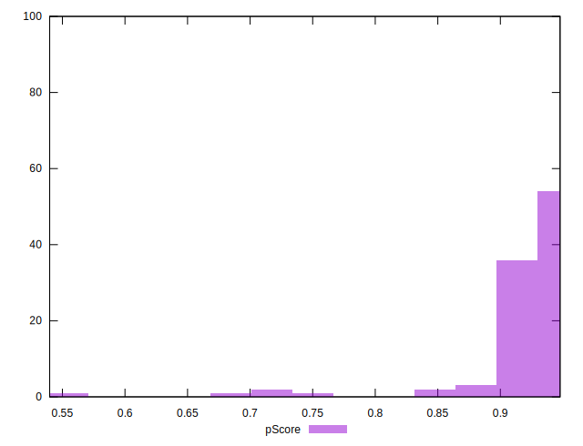
## Score Difference


```yaml
p90min: 0
p90max: 1.1102230246251565e-16
p90range: 1.1102230246251565e-16
p90mean: 3.172065784643304e-17
p90median: 0
p90stdev: 5.015476383680996e-17
p90skewness: 0.9486832980505171
p90eccentricity: 1.0000000000000024
p90discretization: 45.5
outlandishness: 1.5006250000000003
confidence: 2.0757689769480706e-17
p90confidence: 2.0609600827232192e-17

```

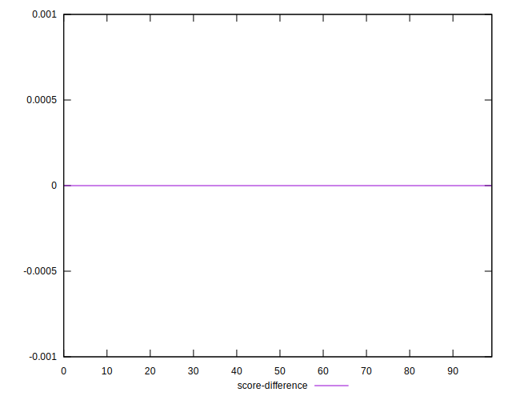
## P Score Difference


```yaml
p90min: -0.0042342541186094484
p90max: 0.004612891394389473
p90range: 0.008847145512998922
p90mean: 0.000571203678863474
p90median: 0.0009191261689336372
p90stdev: 0.0025138943939109343
p90skewness: -0.20257459663150315
p90eccentricity: 0.9999999999999999
p90discretization: 1
outlandishness: 0.12358718974908721
confidence: 0.0011055422028393622
p90confidence: 0.0010330097485634277

```

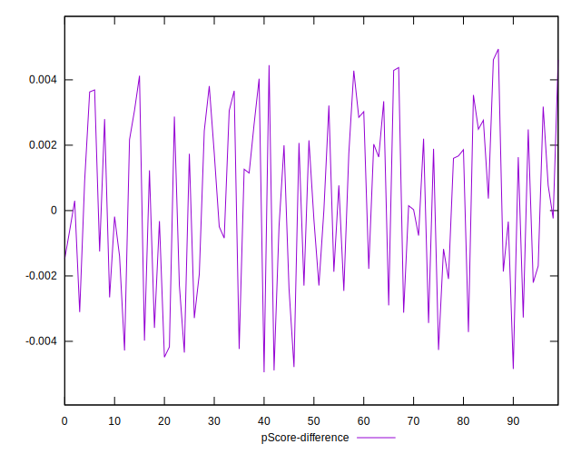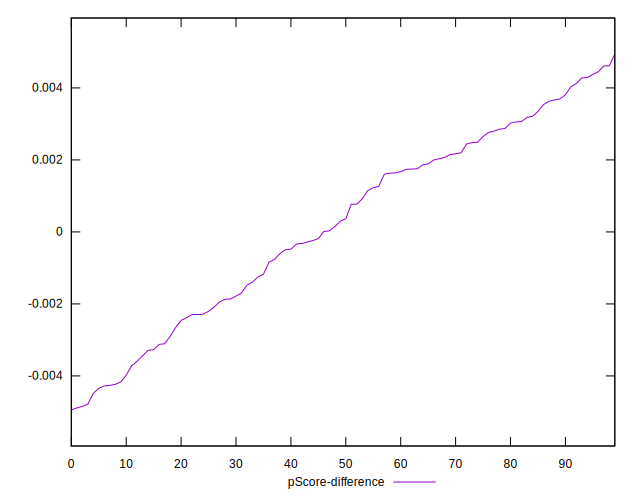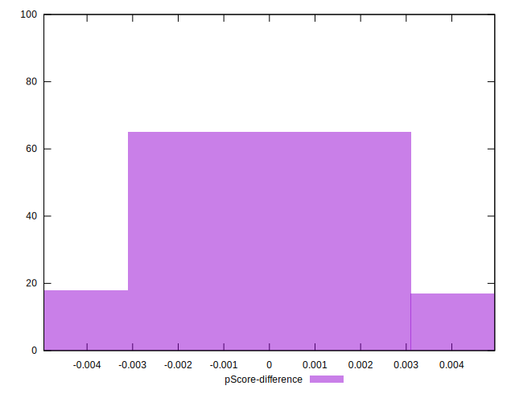