# //bootup-time/samples/pages

[→ Parent](../..)


## Raw


```yaml
p90min: 985.7040000000006
p90max: 1392.939999999999
p90range: 407.2359999999983
p90mean: 1126.5015384615378
p90median: 1102.8400000000006
p90stdev: 90.18097521696924
p90skewness: 1.0870240180590784
p90eccentricity: 1.0000000000000002
p90discretization: 1
outlandishness: 1.1012850854921152
confidence: 92.78378388198871
p90confidence: 37.057175814437414

```

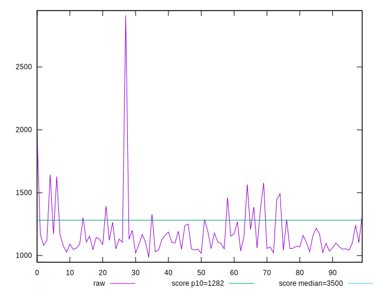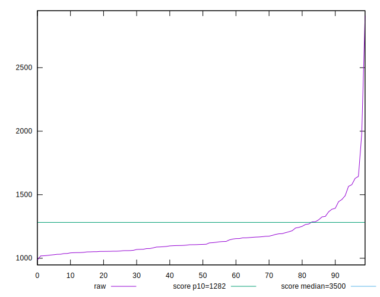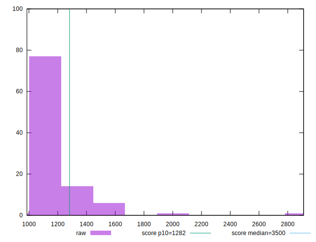
## Score


```yaml
p90min: 0.88
p90max: 0.95
p90range: 0.06999999999999995
p90mean: 0.9261538461538463
p90median: 0.93
p90stdev: 0.014955555457864275
p90skewness: -1.198970852313285
p90eccentricity: 0.9999999999999997
p90discretization: 11.375
outlandishness: 0.9784068780283883
confidence: 0.016932047074187828
p90confidence: 0.006145538420617491

```

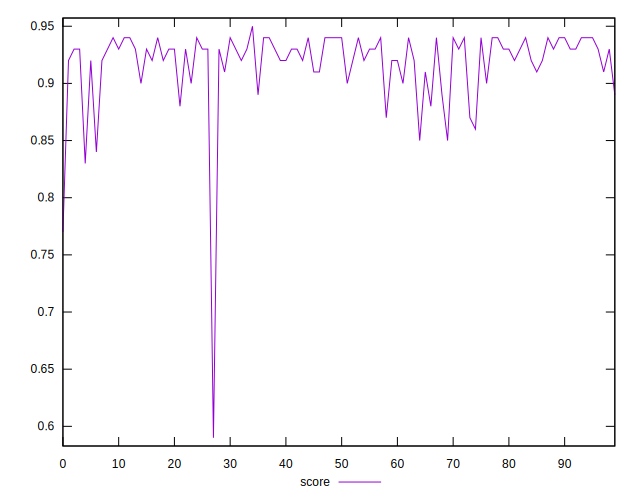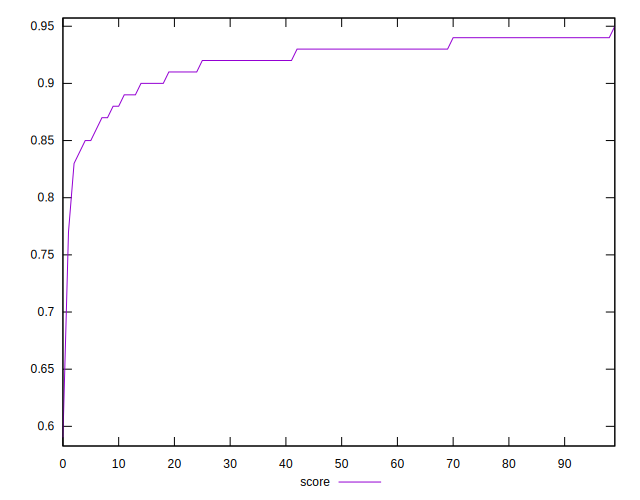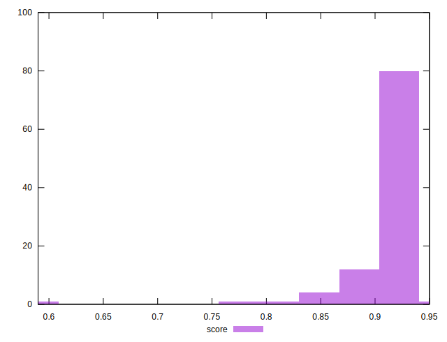
## Raw Estimate

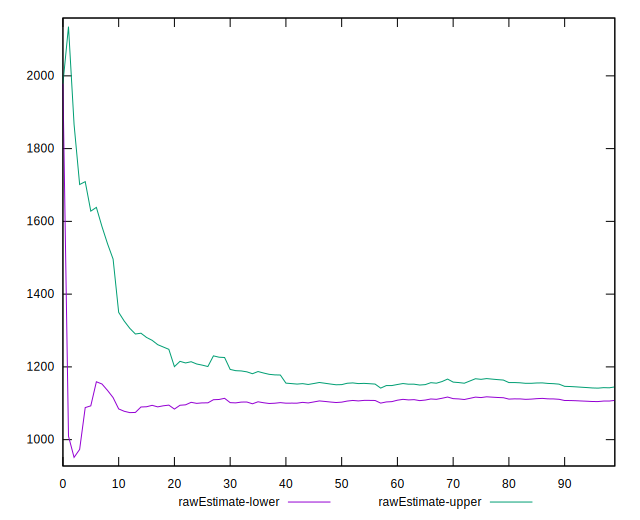
## Score Estimate

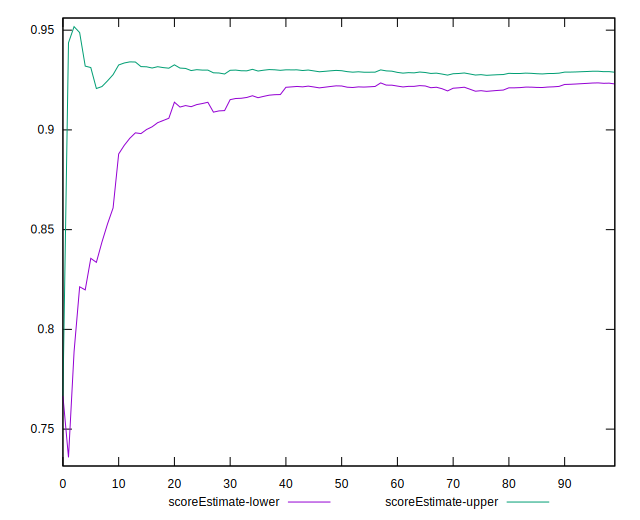
## P Score


```yaml
p90min: 0.8801322846638273
p90max: 0.947051541215577
p90range: 0.06691925655174968
p90mean: 0.9255312257276637
p90median: 0.9297097506222676
p90stdev: 0.014755299816640166
p90skewness: -1.2163858530326608
p90eccentricity: 0.9999999999999988
p90discretization: 1
outlandishness: 0.9782971093583206
confidence: 0.0168670130866444
p90confidence: 0.006063249351478284

```

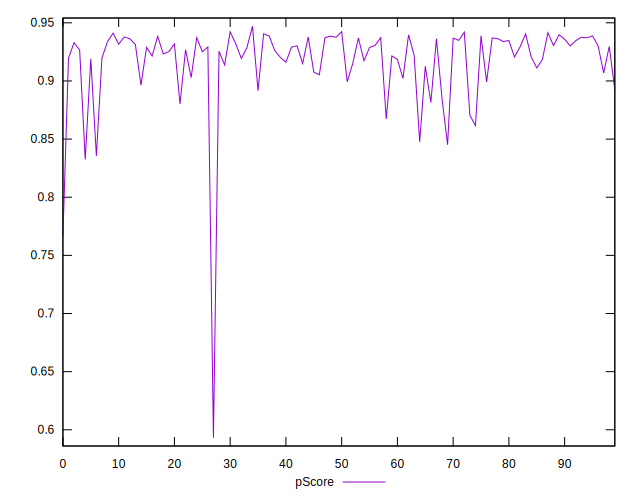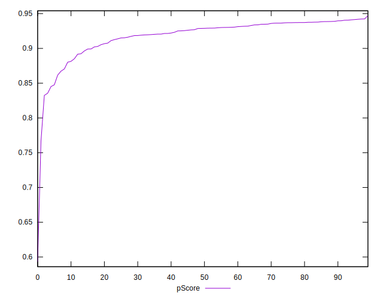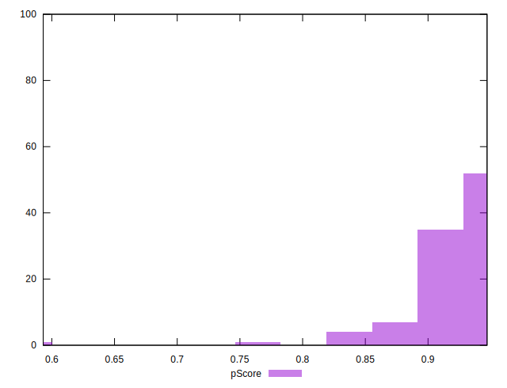
## Score Difference


```yaml
p90min: 0
p90max: 1.1102230246251565e-16
p90range: 1.1102230246251565e-16
p90mean: 2.68405566392895e-17
p90median: 0
p90stdev: 4.7534039558642325e-17
p90skewness: 1.2063184554974629
p90eccentricity: 1
p90discretization: 45.5
outlandishness: 1.644223347107438
confidence: 2.0127679517604042e-17
p90confidence: 1.9532692531401874e-17

```

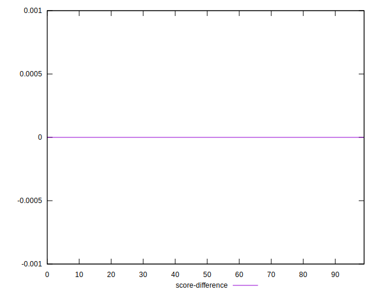
## P Score Difference


```yaml
p90min: -0.00485802666551971
p90max: 0.003174928306243552
p90range: 0.008032954971763262
p90mean: -0.000856454468776826
p90median: -0.0008796110784208278
p90stdev: 0.0022398198129450248
p90skewness: 0.009997204413825804
p90eccentricity: 1.0000000000000007
p90discretization: 1
outlandishness: 0.6069131052720156
confidence: 0.0010096880493674657
p90confidence: 0.0009203869929468879

```

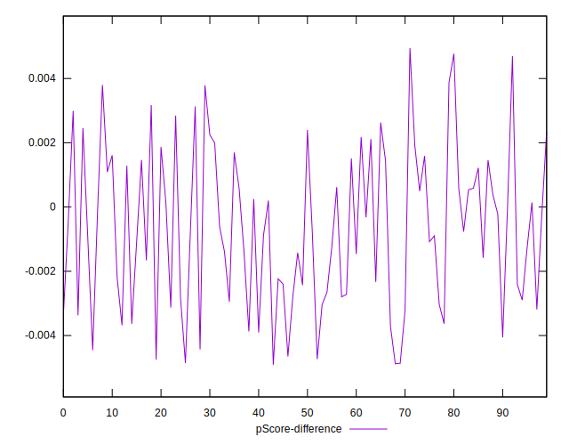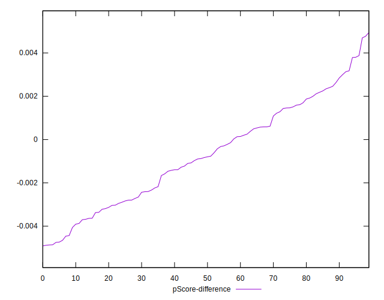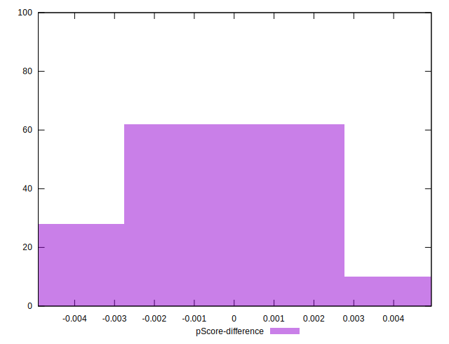