# //cumulative-layout-shift/samples/pages+cached+noexternal+nomedia+nocss+nojs

[→ Parent](../..)


## Raw


```yaml
p90min: 1.289334196302626
p90max: 1.3752179175482857
p90range: 0.0858837212456598
p90mean: 1.3171165713169348
p90median: 1.3085753529866537
p90stdev: 0.022513399418137812
p90skewness: 1.67116110234231
p90eccentricity: 1
p90discretization: 1.011111111111111
outlandishness: 1.0183726516846963
confidence: 0.03599817846983644
p90confidence: 0.009251208455124171

```

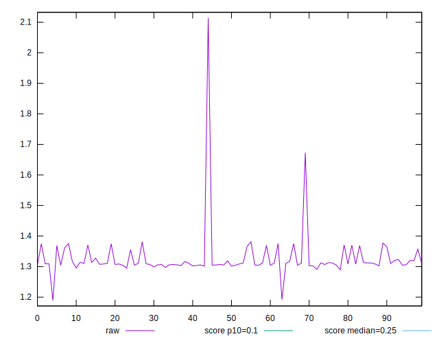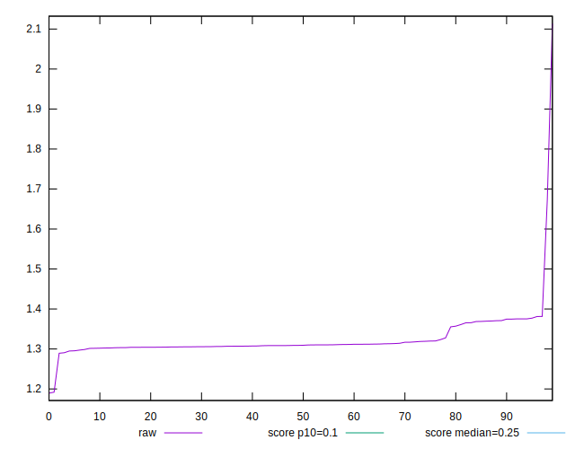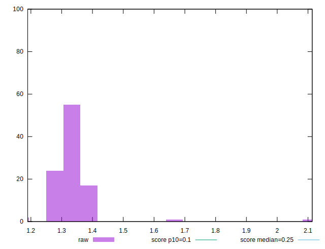
## Score


```yaml
p90min: 0.01
p90max: 0.01
p90range: 0
p90mean: 0.010000000000000007
p90median: 0.01
p90stdev: 6.938893903907228e-18
p90skewness: -1
p90eccentricity: 1
p90discretization: 91
outlandishness: 0.9603999999999999
confidence: 0.0005487899156712168
p90confidence: 3.469446951953614e-18

```

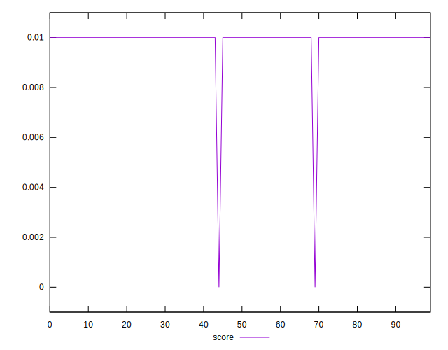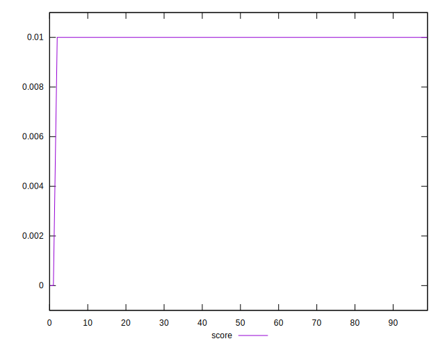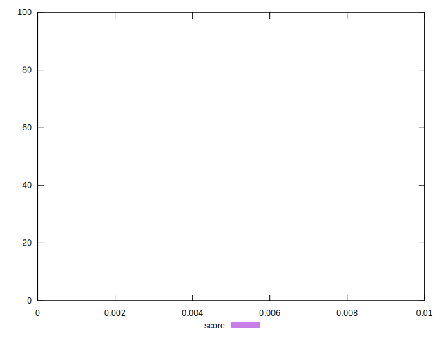
## Raw Estimate

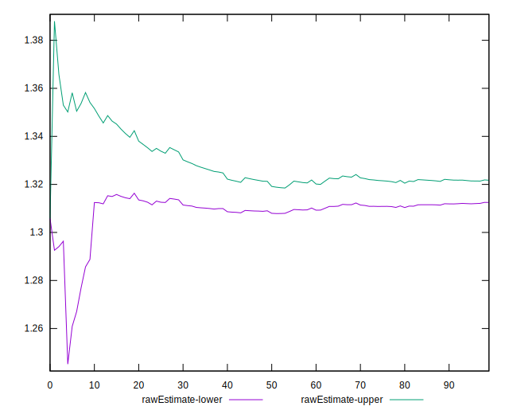
## Score Estimate

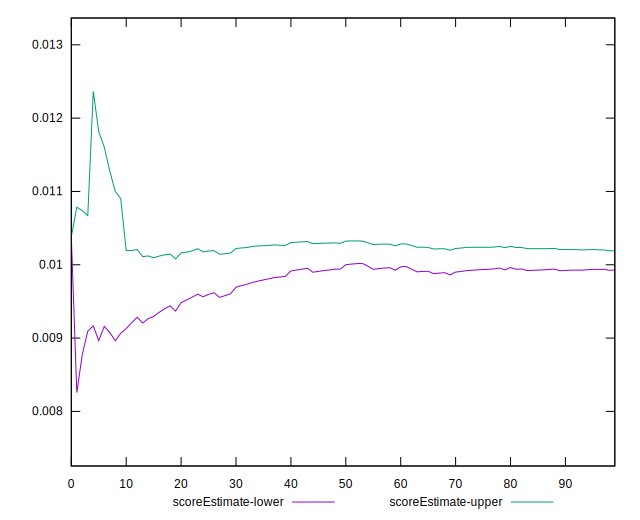
## P Score


```yaml
p90min: 0.008550392139790919
p90max: 0.010885435088264173
p90range: 0.0023350429484732538
p90mean: 0.010080749826400537
p90median: 0.01030483125695375
p90stdev: 0.0006043870729500329
p90skewness: -1.6075109666860528
p90eccentricity: 0.9999999999999999
p90discretization: 1.011111111111111
outlandishness: 0.9725312365743317
confidence: 0.0005493505655331417
p90confidence: 0.00024835479953945125

```

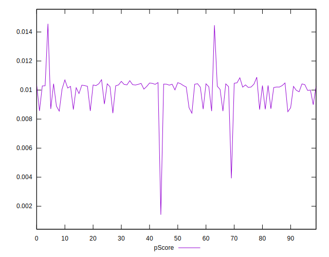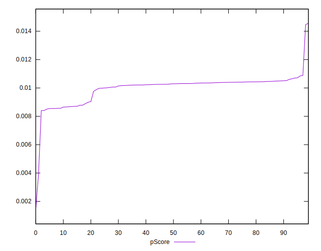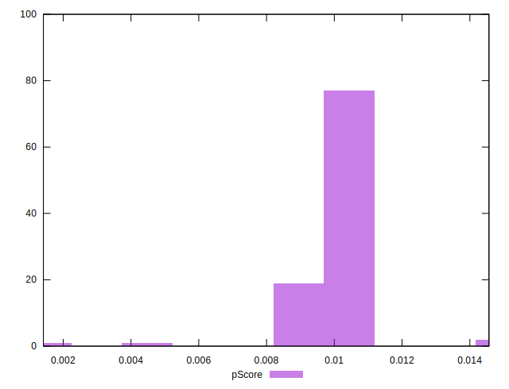
## Score Difference


```yaml
p90min: 0
p90max: 0
p90range: 0
p90mean: 0
p90median: 0
p90stdev: 0
p90skewness: .nan
p90eccentricity: .nan
p90discretization: 91
outlandishness: .nan
confidence: 0
p90confidence: 0

```


## P Score Difference


```yaml
p90min: -0.0014367559672946364
p90max: 0.0014147314694036295
p90range: 0.002851487436698266
p90mean: 0.00011222608276991038
p90median: 0.0003077207231686561
p90stdev: 0.0005984244284291177
p90skewness: -1.5084738707544638
p90eccentricity: 0.9999999999999993
p90discretization: 1.011111111111111
outlandishness: 1.5859842764588472
confidence: 0.0003949002580072596
p90confidence: 0.00024590462902622534

```

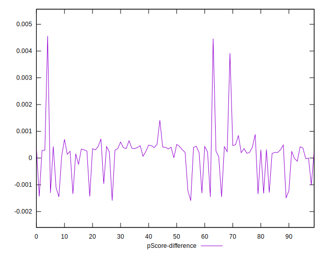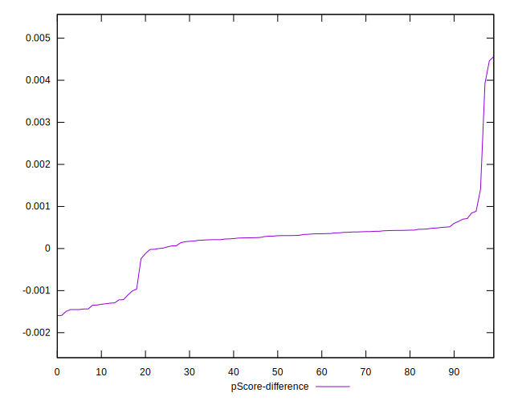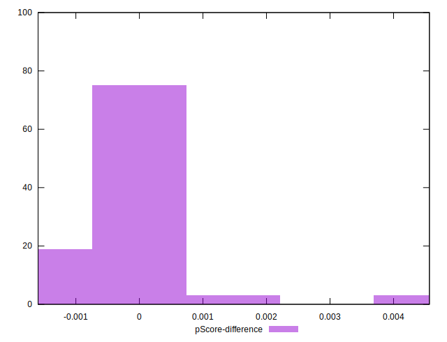