# //cumulative-layout-shift/samples/pages+cached+noexternal+nomedia+nocss

[→ Parent](../..)


## Raw


```yaml
p90min: 1.2892389814588758
p90max: 1.382502473619249
p90range: 0.09326349216037322
p90mean: 1.3166277046622816
p90median: 1.3079331003824868
p90stdev: 0.02590482842647547
p90skewness: 1.6325144601391768
p90eccentricity: 1.0000000000000002
p90discretization: 1.011111111111111
outlandishness: 1.0278490372667968
confidence: 0.034982055054987526
p90confidence: 0.010644814819679382

```

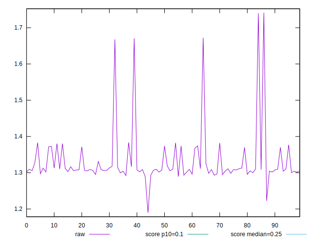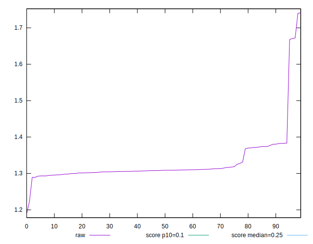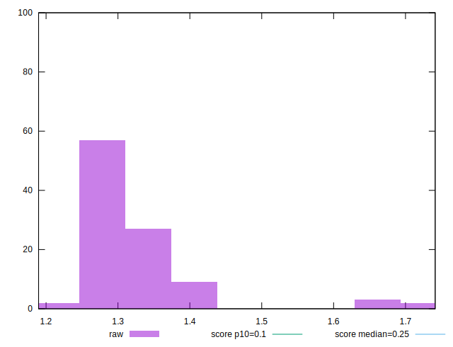
## Score


```yaml
p90min: 0.01
p90max: 0.01
p90range: 0
p90mean: 0.010000000000000007
p90median: 0.01
p90stdev: 6.938893903907228e-18
p90skewness: -1
p90eccentricity: 1
p90discretization: 91
outlandishness: 0.9025
confidence: 0.0008543284941589409
p90confidence: 3.469446951953614e-18

```

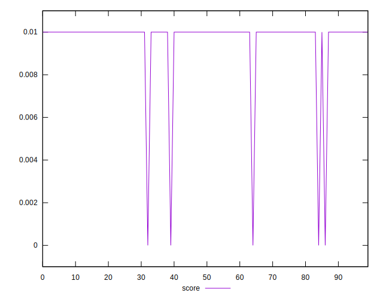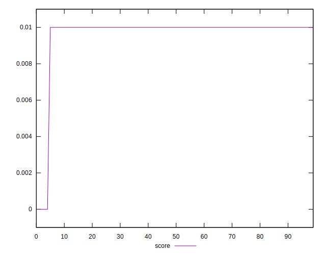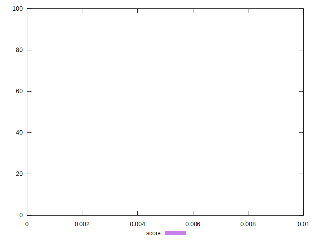
## Raw Estimate

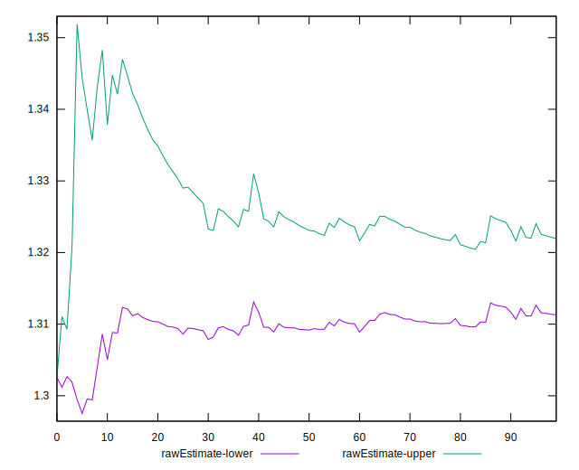
## Score Estimate

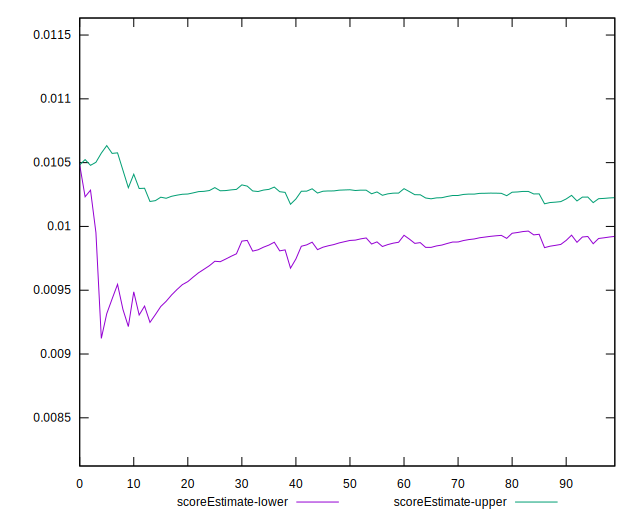
## P Score


```yaml
p90min: 0.008380188306198577
p90max: 0.010888399600877341
p90range: 0.002508211294678764
p90mean: 0.010101778906071985
p90median: 0.010323631709927339
p90stdev: 0.0006918297096227841
p90skewness: -1.5637573276581629
p90eccentricity: 0.9999999999999997
p90discretization: 1.011111111111111
outlandishness: 0.9454951011516458
confidence: 0.0006522238197149213
p90confidence: 0.0002842867369914903

```

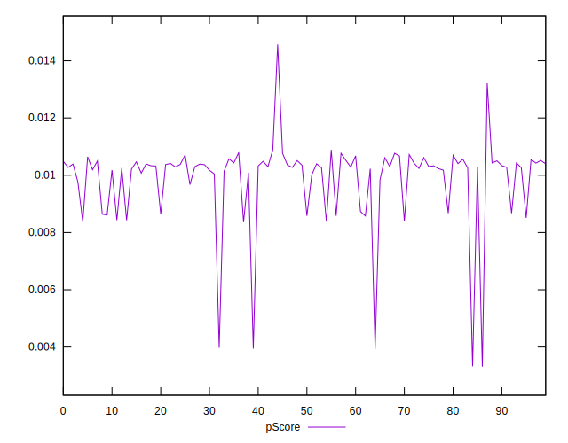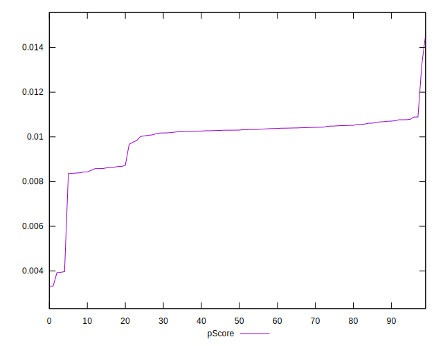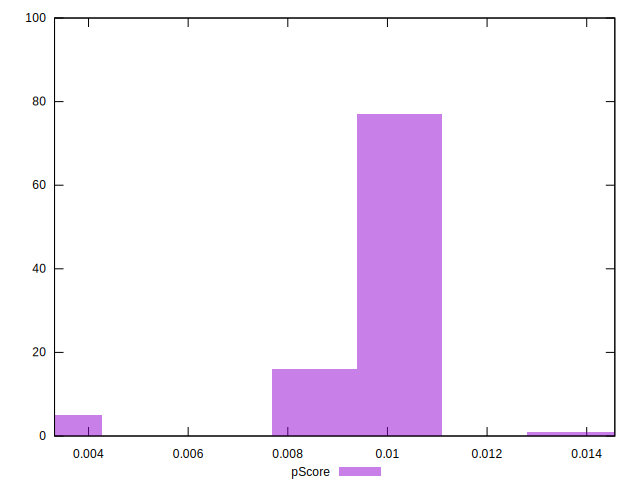
## Score Difference


```yaml
p90min: 0
p90max: 0
p90range: 0
p90mean: 0
p90median: 0
p90stdev: 0
p90skewness: .nan
p90eccentricity: .nan
p90discretization: 91
outlandishness: .nan
confidence: 0
p90confidence: 0

```


## P Score Difference


```yaml
p90min: -0.001619811693801423
p90max: 0.0008883996008773407
p90range: 0.002508211294678764
p90mean: 0.0001017789060719818
p90median: 0.0003236317099273387
p90stdev: 0.0006918297096227839
p90skewness: -1.5637573276581498
p90eccentricity: 1.0000000000000002
p90discretization: 1.011111111111111
outlandishness: 10.04792996053619
confidence: 0.0004629454531175197
p90confidence: 0.00028428673699149097

```

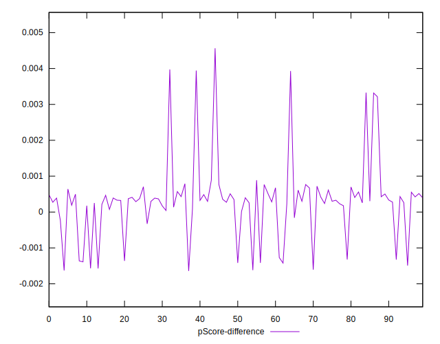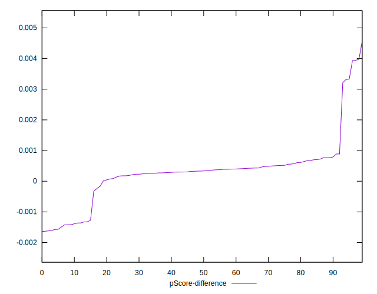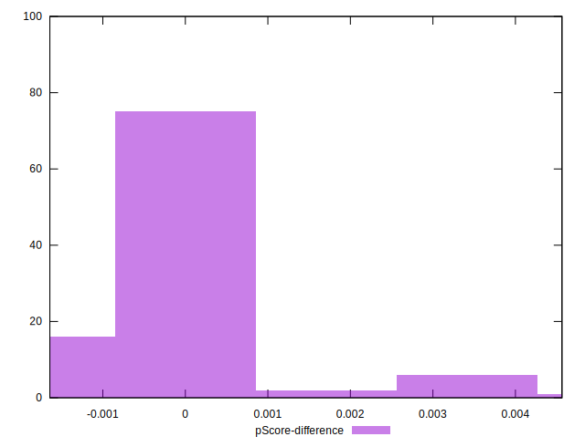