# //cumulative-layout-shift/samples/pages+cached+noexternal+nomedia

[→ Parent](../..)


## Raw


```yaml
p90min: 1.2892389814588758
p90max: 1.3739683515760635
p90range: 0.08472937011718762
p90mean: 1.3109218650137846
p90median: 1.3053593156602648
p90stdev: 0.020997933678046574
p90skewness: 2.2264060783041018
p90eccentricity: 1.0000000000000002
p90discretization: 1.0340909090909092
outlandishness: 1.013552894600804
confidence: 0.024654771998029457
p90confidence: 0.008628473113926116

```

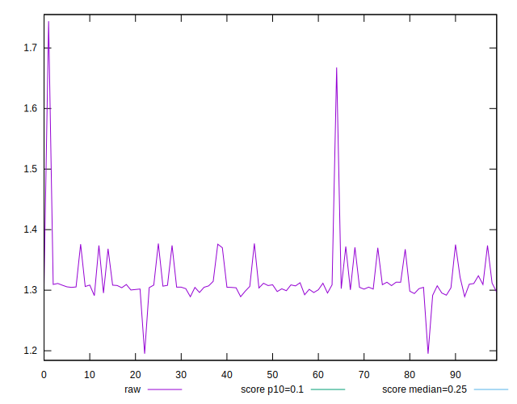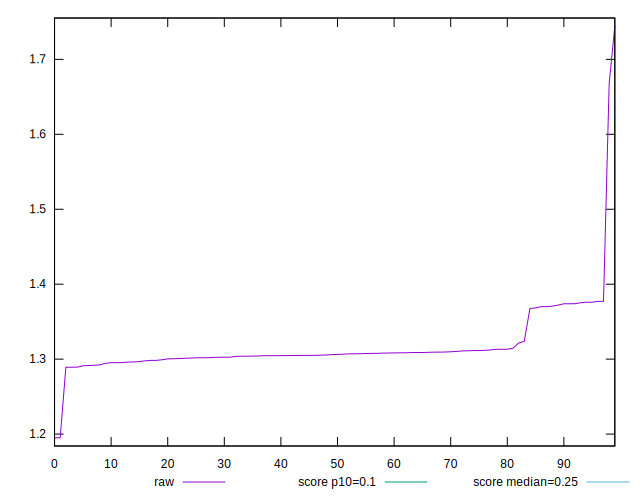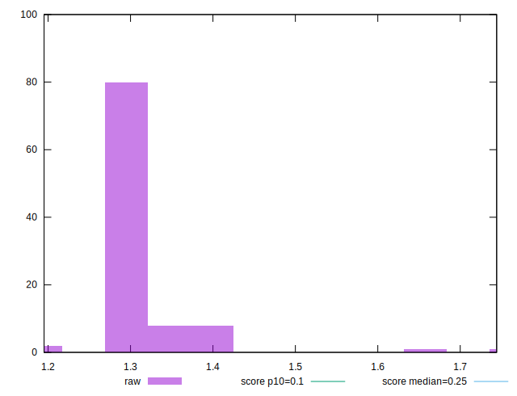
## Score


```yaml
p90min: 0.01
p90max: 0.01
p90range: 0
p90mean: 0.010000000000000007
p90median: 0.01
p90stdev: 6.938893903907228e-18
p90skewness: -1
p90eccentricity: 1
p90discretization: 91
outlandishness: 0.9603999999999999
confidence: 0.0005487899156712134
p90confidence: 3.469446951953614e-18

```

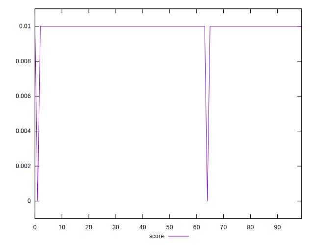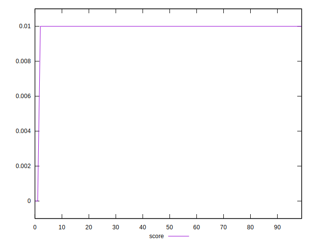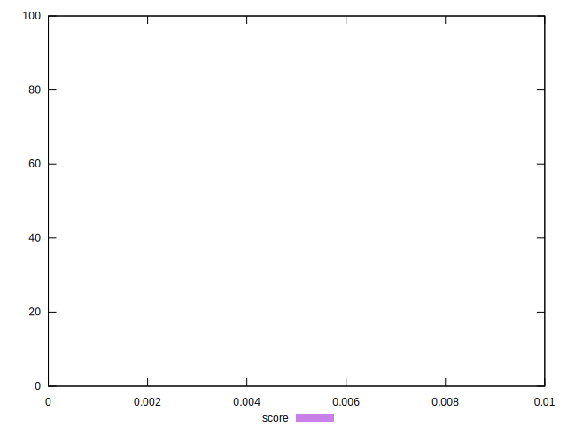
## Raw Estimate

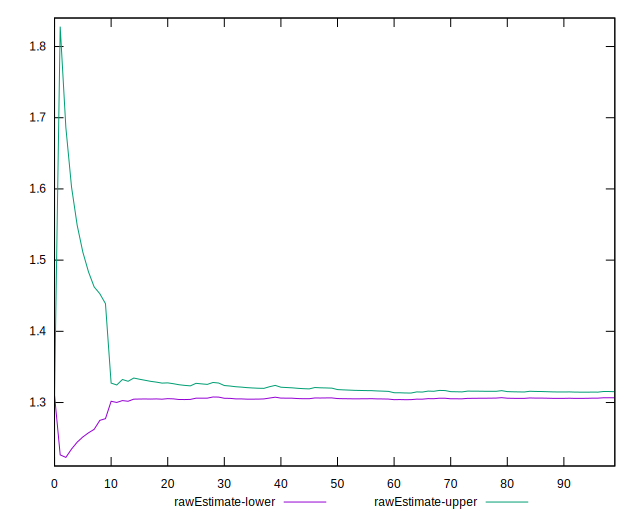
## Score Estimate

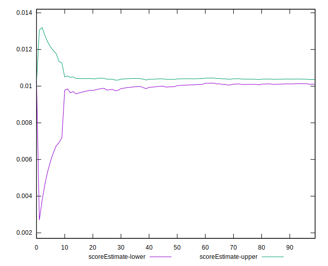
## P Score


```yaml
p90min: 0.008579982704777611
p90max: 0.010888399600877341
p90range: 0.0023084168960997298
p90mean: 0.010256071372136778
p90median: 0.010399367074598043
p90stdev: 0.0005670331712971564
p90skewness: -2.1265015840641825
p90eccentricity: 1.0000000000000002
p90discretization: 1.0340909090909092
outlandishness: 0.973356847560367
confidence: 0.0005011651679933601
p90confidence: 0.0002330053303462483

```

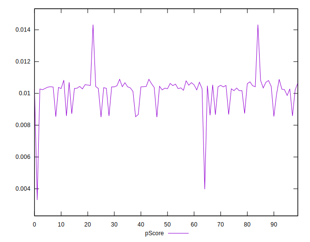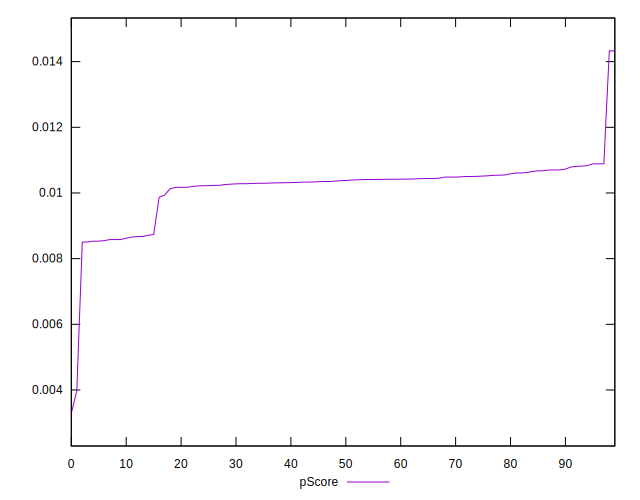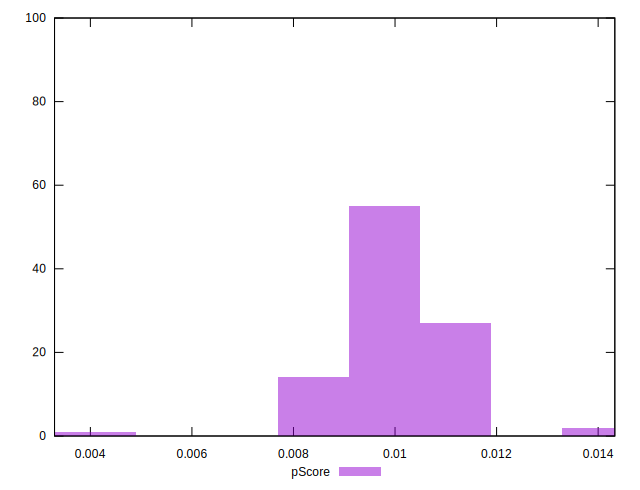
## Score Difference


```yaml
p90min: 0
p90max: 0
p90range: 0
p90mean: 0
p90median: 0
p90stdev: 0
p90skewness: .nan
p90eccentricity: .nan
p90discretization: 91
outlandishness: .nan
confidence: 0
p90confidence: 0

```


## P Score Difference


```yaml
p90min: -0.001420017295222389
p90max: 0.0008883996008773407
p90range: 0.0023084168960997298
p90mean: 0.0002560713721367786
p90median: 0.00039936707459804245
p90stdev: 0.0005670331712971564
p90skewness: -2.126501584064149
p90eccentricity: 1.0000000000000002
p90discretization: 1.0340909090909092
outlandishness: 1.5472365274715265
confidence: 0.0003921274839532799
p90confidence: 0.00023300533034624818

```

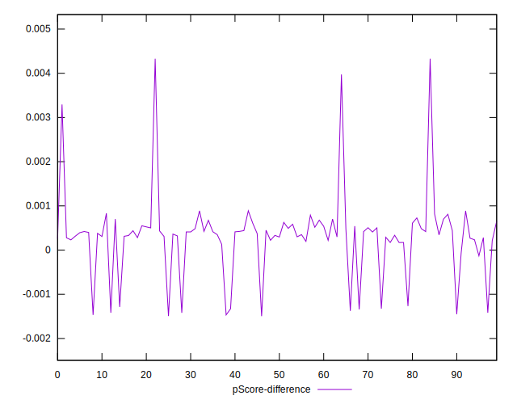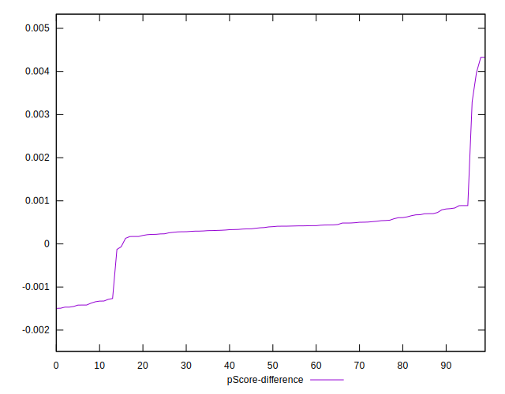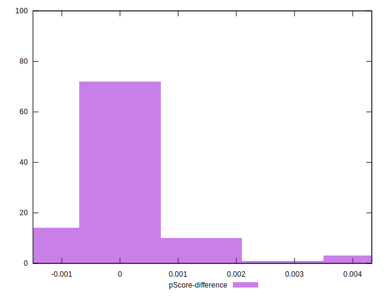