# //cumulative-layout-shift/samples/pages+cached+noexternal

[→ Parent](../..)


## Raw


```yaml
p90min: 1.2892389814588758
p90max: 1.3589486033121747
p90range: 0.06970962185329888
p90mean: 1.3038994093115954
p90median: 1.3043781416151259
p90stdev: 0.008068235089173526
p90skewness: 3.125320543837081
p90eccentricity: 0.9999999999999993
p90discretization: 1.0459770114942528
outlandishness: 1.0175415024651362
confidence: 0.030441456645780907
p90confidence: 0.0033154000108379655

```

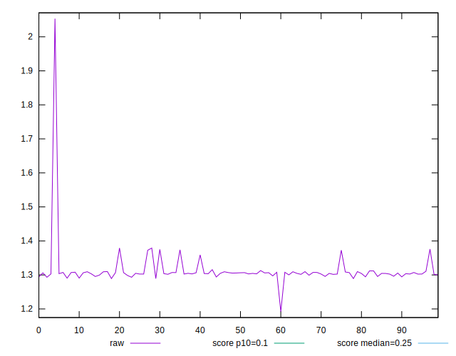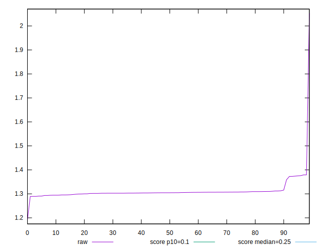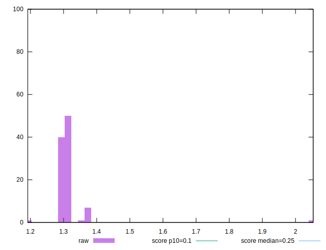
## Score


```yaml
p90min: 0.01
p90max: 0.01
p90range: 0
p90mean: 0.010000000000000007
p90median: 0.01
p90stdev: 6.938893903907228e-18
p90skewness: -1
p90eccentricity: 1
p90discretization: 91
outlandishness: 0.9800999999999997
confidence: 0.0003900279083597566
p90confidence: 3.469446951953614e-18

```

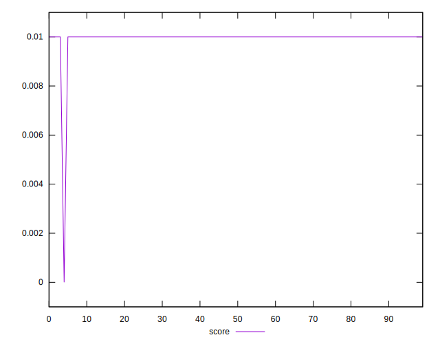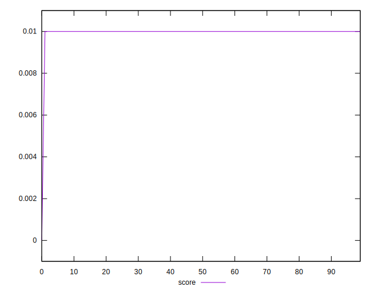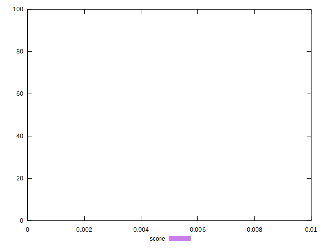
## Raw Estimate

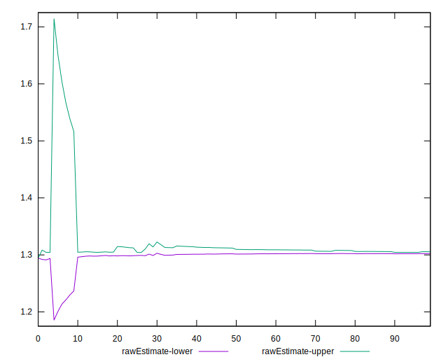
## Score Estimate

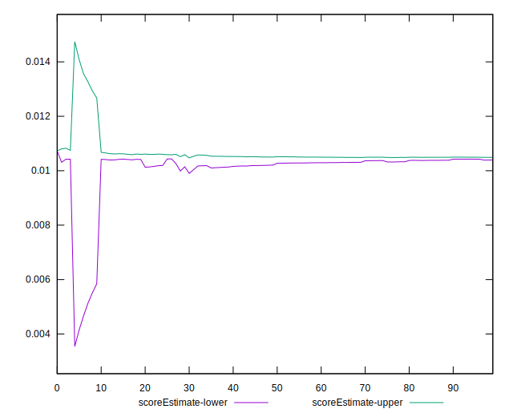
## P Score


```yaml
p90min: 0.008944955021776058
p90max: 0.010888399600877341
p90range: 0.0019434445791012833
p90mean: 0.010445652704511659
p90median: 0.010428405581009714
p90stdev: 0.00023072379594903957
p90skewness: -2.598216611492192
p90eccentricity: 1.0000000000000002
p90discretization: 1.0459770114942528
outlandishness: 0.9655976052989961
confidence: 0.00043126154504503564
p90confidence: 0.00009480904648111535

```

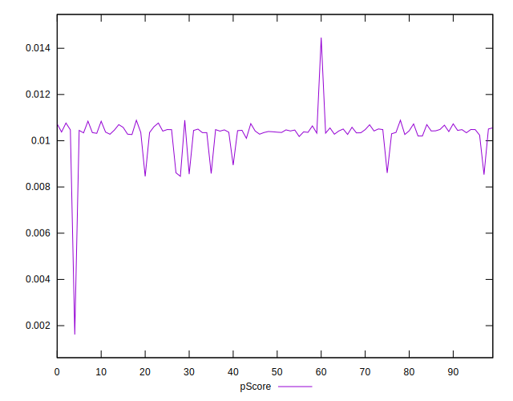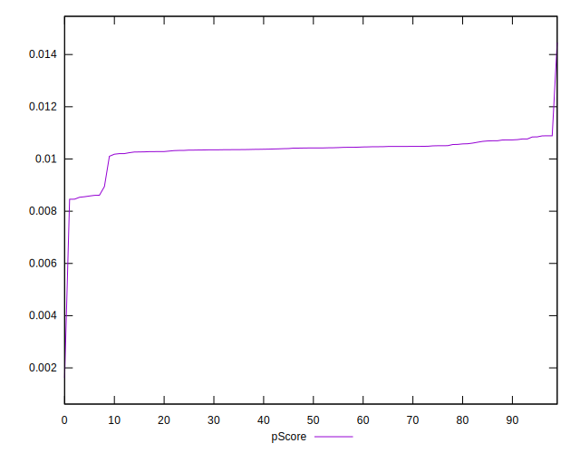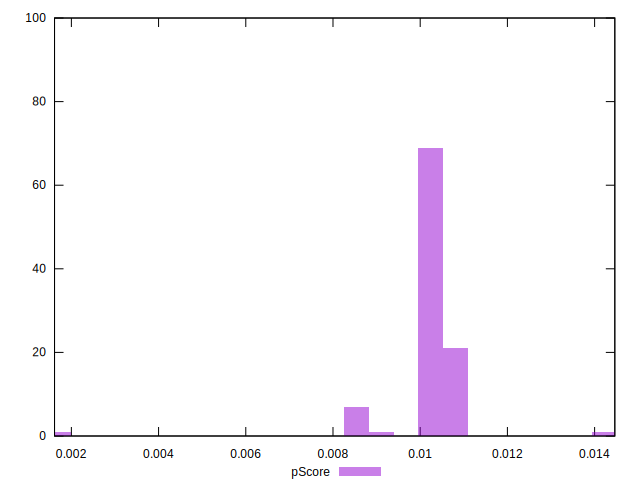
## Score Difference


```yaml
p90min: 0
p90max: 0
p90range: 0
p90mean: 0
p90median: 0
p90stdev: 0
p90skewness: .nan
p90eccentricity: .nan
p90discretization: 91
outlandishness: .nan
confidence: 0
p90confidence: 0

```


## P Score Difference


```yaml
p90min: 0.00010480020168313932
p90max: 0.0016139017118095844
p90range: 0.001509101510126445
p90mean: 0.00047498178901751996
p90median: 0.00043039522164884693
p90stdev: 0.00020645304435490467
p90skewness: 2.156177644548357
p90eccentricity: 1.0000000000000009
p90discretization: 1.0459770114942528
outlandishness: 0.5885843363639374
confidence: 0.00026881954929476424
p90confidence: 0.00008483570668512753

```

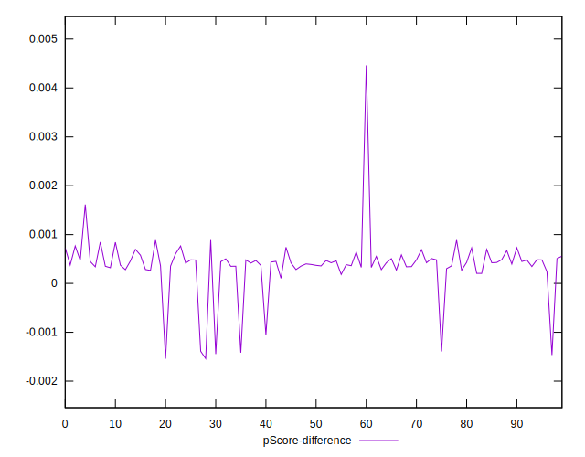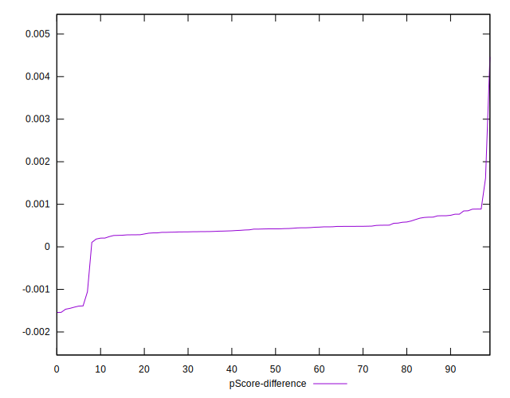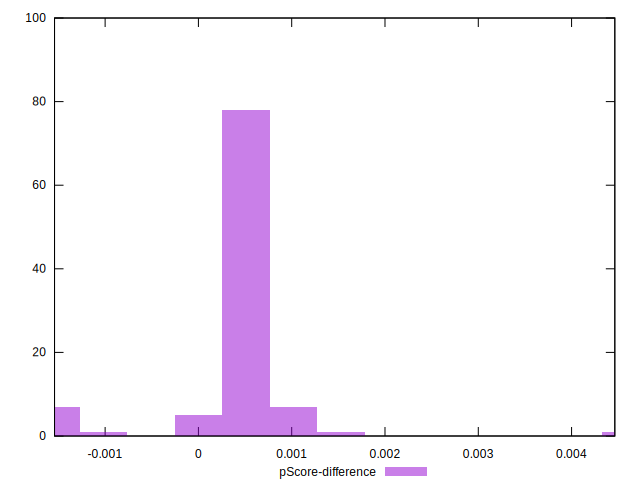